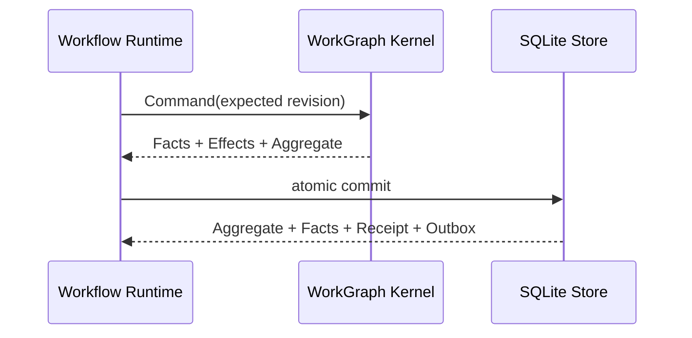

# Checkpoints and Recovery

English | [简体中文](../../zh-CN/09-task-orchestration/04-checkpoint-and-recovery.md)

## Learning Objectives

Understand WorkGraph facts, snapshots, command receipts, effect outbox rows,
fingerprint checks, and resume-only-unfinished semantics.

## Durable Contract

Workflow checkpoints are retired. A Workflow Spec compiles into one durable
WorkGraph, and every lifecycle change is a Kernel command.



The transaction commits the aggregate snapshot, ordered facts, command receipt,
and effect outbox together. The snapshot accelerates reads; facts remain the
rebuild authority. Reusing a Run ID with a different Definition Digest fails
closed.

## Node Commit Windows

```text
Claim Node + create Attempt + queue Effect
 -> bind Runtime/Process execution
 -> validate output and usage
 -> settle Attempt and Node
 -> queue terminal Effect
```

A crash before a transaction commits leaves no partial lifecycle state. A crash
after Claim but before Settlement leaves a leased Attempt; recovery applies the
lease epoch, retry, and effect-idempotency policy. A stale worker cannot settle
after another epoch takes ownership.

Node result bytes and a stable `workgraph://.../nodes/...` result reference are
stored with the settlement fact. Fleet and Hosts only project this state.

## Resume Decision Table

| Durable state | Resume behavior |
| --- | --- |
| succeeded Node | reuse, do not execute |
| failed retryable Node | create a new Attempt |
| active Attempt with live Lease | keep current owner |
| expired Lease | release or reclaim through a fenced command |
| dependency-ready Node | eligible for Claim |
| Definition Digest mismatch | refuse the Run |
| snapshot/fact drift | report drift; repair only the snapshot |

## Audit and Repair

`Store.Audit` compares the snapshot digest with a replay digest in one read
transaction and reports pending Effects. `RepairSnapshot` rebuilds only
`work_runs.aggregate_json`, revision, state, and update time in one transaction.
It never rewrites facts, command receipts, or outbox rows.

## Recovery Layers

WorkGraph recovery restores Run/Node/Attempt/Effect state. Runtime Event recovery
restores child Turn state. Workspace Journal restores file effects. Session
Checkpoints remain a separate user history/fork feature and are not Workflow
execution authority.

## Failure Boundaries

- Revision CAS rejects concurrent stale commands.
- Lease epoch rejects stale settlement.
- Definition Digest drift rejects resume.
- Terminal settlement and terminal outbox insertion are atomic.
- Snapshot repair cannot rewrite durable facts or receipts.
- Recovery does not make an external side effect idempotent.

## Tests and Verification

```bash
go test ./internal/orchestration/kernel ./internal/orchestration/store
go test ./internal/orchestration/workflow -run 'TestDurable|TestSpecDrift'
```

## Hands-On Lab

Fail a Workflow after one Node succeeds, reopen the SQLite Store, resume the
same Run ID, and verify that only the failed Node receives a new Attempt. Then
tamper with the aggregate snapshot and use Audit/Repair to rebuild it from facts.

## Review Questions

1. Why are ordered facts authoritative over the snapshot?
2. Which rows commit atomically with a lifecycle command?
3. Why does a stale Lease epoch reject settlement?
4. What data may snapshot repair change?
5. How are Session Checkpoints different from Workflow recovery?

## Further Reading

- [Leases, Heartbeats, Retries, and Idempotency](./02-lease-heartbeat-retry.md)

## Sources and Verification

| Item | Value |
| --- | --- |
| Catalog ID | `task-checkpoint-recovery` |
| Status | `verified` |
| Last verified | 2026-08-16 |
