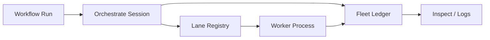

# Lanes, Fleets, and Scheduling

English | [简体中文](../../zh-CN/09-task-orchestration/05-lane-fleet-scheduling.md)

## Learning Objectives

Understand Lane process placement, Fleet durable projection, profile limits,
and their bridge to Workflow execution.

## Responsibilities

- **Lane:** start/stop/status/attach/log for an inline or tmux worker process,
  bound to a worktree and NDJSON control contract.
- **Fleet:** append-only run/task/terminal ledger plus replayed inspection view.
- **Profile:** concurrency, lease timeout, heartbeat alert, and worker settings.
- **Orchestrate Session:** creates Fleet/Lane context around a Workflow Driver.



Lane state is persisted, but a persisted record does not prove the process is
alive; status checks reconcile it. Inline and tmux backends expose explicit
availability. Environment is filtered and secret-shaped variables are refused.

Fleet Ledger serializes concurrent appends into monotonic sequence, repairs a
torn final line, replays current Run/Task state, and retains compatibility with
retired record kinds. Inspection is a projection, not execution authority.

## Control Plane, Placement, and Evidence

| Component | Owns | Does not prove |
| --- | --- | --- |
| Profile | desired limits/timeouts | active enforcement or liveness |
| Lane Registry | process placement/control metadata | Task ownership |
| Worker lease | current Task ownership fence | process progress |
| Fleet Ledger | orchestration audit sequence | authority to execute |
| Workflow checkpoint | node progress | OS process liveness |

Lane `Status` reconciles persisted metadata with the backend. An attach command
is returned only for a backend that can support it. Logs use bounded NDJSON
records so operators can correlate placement without treating arbitrary process
output as control messages.

## Scheduling Layers

Workflow chooses dependency-ready work; Profile bounds desired parallelism;
Worker capacity admits Tasks; repository Claim grants durable ownership; Lane
places a process. Each layer may reduce concurrency, and none may expand the
authority granted by Policy/Task payload.

Fleet sequence provides deterministic inspection under concurrent writers.
Compatibility with retired record kinds is read compatibility, not permission
to create legacy work.

## Failure Boundaries

- Missing tmux fails closed instead of pretending a detached worker exists.
- Worktree binding and command contract are validated.
- Secret environment is rejected.
- Concurrent Fleet append receives distinct sequence.
- Torn tail repair does not excuse committed corruption.
- Profile limits remain configuration, not proof of a live lease.

## Tests and Verification

```bash
go test ./internal/orchestration/lane ./internal/orchestration/fleet
go test ./internal/orchestration/workflow/orchestrate
```

## Hands-On Lab

Start an inline Lane in the test fixture, read NDJSON logs, stop it, then replay
Fleet state and compare process state with projected task state.

## Review Questions

1. What is the difference between Lane and Worker?
2. Why is Fleet inspection not authority?
3. What can a persisted Lane record prove?
4. Which component grants durable Task ownership?
5. Why can scheduling layers reduce but not expand authority?

## Further Reading

- [Subagents, Worktrees, and Topology](./06-subagent-worktree-topology.md)

## Sources and Verification

| Item | Value |
| --- | --- |
| Catalog ID | `task-lane-fleet` |
| Status | `verified` |
| Last verified | 2026-08-06 |
