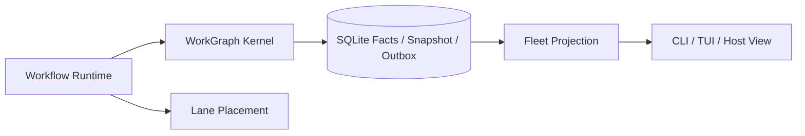

# Lanes, Fleets, and Scheduling

English | [简体中文](../../zh-CN/09-task-orchestration/05-lane-fleet-scheduling.md)

## Learning Objectives

Understand Lane placement, Fleet WorkGraph projection, profile limits, and the
single execution authority.

## Responsibilities

- **Lane:** records durable placement metadata. Explicit Lane CLI operations may
  still start or control inline/tmux processes.
- **Fleet:** reads WorkGraph aggregates and facts, builds Host views, audits
  snapshot drift, and repairs only rebuildable snapshots.
- **Profile:** declares concurrency, lease, heartbeat, and worker settings.
- **Orchestrate Session:** binds a Workflow Run to one WorkGraph controller,
  Budget Ledger, and Lane placement.



Fleet has no append, enqueue, claim, settle, or resume writer. Inspection and
logs are projections of WorkGraph state and ordered facts. `Audit` compares the
snapshot with fact replay; `Repair` cannot modify facts, command receipts, or
outbox rows.

Workflow orchestration uses `Lane.Place`, which is idempotent for the same Run
and placement and fails closed on conflicting placement. It does not start a
dummy process or create another scheduler.

## Control Plane, Placement, and Evidence

| Component | Owns | Does not prove |
| --- | --- | --- |
| WorkGraph Kernel | lifecycle transitions | external process liveness |
| Worker Claim | current Lease/Epoch ownership | future progress |
| Lane Registry | placement and explicit process adapter metadata | lifecycle authority |
| Fleet | read model, audit, snapshot repair | authority to execute |
| Profile | desired limits and timeouts | active Lease ownership |

Task projections may be updated in the same SQLite transaction as WorkGraph
facts, but they cannot transition independently. Hosts read the same Run View:
Run, Node, Attempt, Effect, authority digest, permission digest, Lane ID, and
stable result reference.

## Scheduling Layers

The Kernel derives dependency-ready Nodes. The hierarchical fair selector orders
Workspace/Session/Run candidates. Worker remains the only Claim authority.
Budget admission and profile capacity may reduce concurrency; neither can grant
authority beyond the WorkGraph command and security profile.

## Failure Boundaries

- Missing tmux fails closed for explicit tmux execution.
- Conflicting durable Lane placement is rejected.
- Fleet cannot create or mutate a Run.
- Snapshot drift is visible and repair changes only the snapshot cache.
- Stale Revision or Lease Epoch cannot settle work.
- Profile limits are configuration, not proof of a live Lease.

## Tests and Verification

```bash
go test ./internal/orchestration/lane ./internal/orchestration/fleet
go test ./internal/orchestration/workflow/orchestrate
```

## Hands-On Lab

Run a Workflow with a persistent data directory, inspect it through Fleet, then
reopen the same Run and verify idempotent Lane placement and durable Node
Attempts. Tamper only with the snapshot and verify Audit detects and repairs it.

## Review Questions

1. Which component owns lifecycle transitions?
2. Why is Fleet inspection not authority?
3. When is Lane placement idempotent?
4. Which component grants durable Task ownership?
5. What evidence may snapshot repair modify?

## Further Reading

- [Subagents, Worktrees, and Topology](./06-subagent-worktree-topology.md)

## Sources and Verification

| Item | Value |
| --- | --- |
| Catalog ID | `task-lane-fleet` |
| Status | `verified` |
| Last verified | 2026-08-16 |
