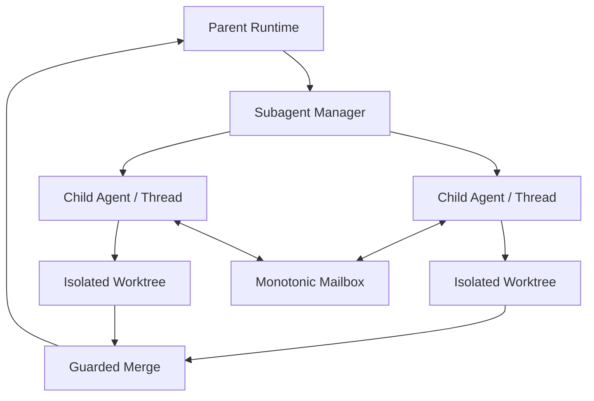

# Subagents, Worktrees, and Topology

English | [简体中文](../../zh-CN/09-task-orchestration/06-subagent-worktree-topology.md)

## Learning Objectives

Understand child-Agent roles, topology, mailbox/control, budgets, isolated
worktrees, write claims, and guarded merge.

## Topology



Manager parses a finite Role set, maps Role to profile/stance, enforces depth
and concurrency budgets, provisions worktrees, records graph edges/status, and
routes Tool execution through a Gate. RuntimeHost owns real child Turns.

Control operations list, wait, follow up, interrupt, complete/fail, and close.
Mailbox delivery is monotonic and ordered. Result records usage, artifacts,
verification status, and write paths.

Writing children use isolated Git worktrees when configured. Path claims detect
overlapping writes. Merge expands the child result into concrete parent file
resources, checks baseline drift, previews/dry-runs, and applies through guarded
file transactions. Serialized strategy may share the host Workspace/Journal;
isolated worktrees must not.

## Authority Inheritance

A child inherits bounded Context and shared accounting, not the parent's full
authority. Role selects a profile/stance; budgets can only narrow remaining
depth, concurrency, tokens, cost, and wall-clock. Child Tool Calls still pass
through its Guard/Policy. Takeover or a writing stance cannot manufacture a
missing Sandbox, Git Workspace, or Approval Host.

Durable graph edges record parent/child identity and status across restart.
Mailbox sequence orders messages, but message delivery does not itself start a
Turn unless the control contract says so.

## Merge as Two-Phase Integration

```text
child settles Result + write paths + baseline
 -> parent expands concrete Resources
 -> check claims and parent baseline drift
 -> preview/dry-run and Approval
 -> guarded atomic apply in parent Workspace
 -> verification and Receipt
```

Child completion is not parent integration. The parent may reject a valid child
result because another child claimed a path or the parent changed since fork.
Only the guarded apply changes parent bytes.

Worktrees isolate filesystem mutations, while write claims coordinate semantic
merge targets. Two branches can independently edit the same path without OS
conflict but still cannot both merge blindly.

## Failure Boundaries

- Unknown role/profile/stance fails before child execution.
- Depth, parallel, token, cost, and wall-clock budgets are enforced.
- Writing stance without a valid Git isolation strategy is rejected.
- Sibling worktrees are not removed during cleanup.
- Overlapping write claims conflict.
- Child self-report is not gate-proven verification.
- Parent drift blocks merge.

## Tests and Verification

```bash
go test ./internal/orchestration/subagent
go test ./internal/adapter/tool/agent
go test ./internal/runtime/app/wire -run 'Test.*(Child|Worktree|Agent)'
```

## Hands-On Lab

Run two writing-child conflict tests. Trace worktree identity, claimed paths,
baseline fingerprints, and the guarded merge decision.

## Review Questions

1. Why is each child a real Runtime Turn?
2. When may a child share the parent Journal?
3. Why are write claims still needed with worktrees?
4. Which authority may a child inherit, and which must be reacquired?
5. At what step do child changes become parent Workspace changes?

## Further Reading

- [Agent Tool](../06-tools-and-execution/02-file-shell-agent-tools.md)

## Sources and Verification

| Item | Value |
| --- | --- |
| Catalog ID | `task-subagent-worktree` |
| Status | `verified` |
| Last verified | 2026-08-06 |
