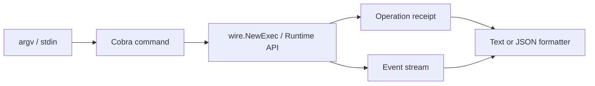

# CLI and Machine-Readable Output

English | [简体中文](../../zh-CN/10-hosts-protocols/01-cli.md)

## Learning Objectives

Understand the CLI command surface, formal JSON output, streaming execution,
configuration precedence, and the Host/Runtime ownership boundary.

## Host Flow



The CLI parses and validates user input, constructs a Session through Wire,
submits Runtime Operations, and renders Events/Receipts. Architecture tests
forbid dependencies on provider, Tool executor, or sandbox implementations.

Formal commands support stable machine-readable output and structured Problem
codes. Human text may evolve; JSON identity, business error codes, and exit
status form the automation contract. Secret references may be shown, never
credential values.

`exec` streams model, Tool, approval, verification, and terminal Events while
supporting persistence/resume. Other command groups inspect config, models,
auth, threads, tasks, workflows, fleet/lane, MCP, skills, plugins, metrics, and
diagnostics without duplicating Runtime logic.

## Three Output Channels

| Channel | Contract |
| --- | --- |
| stdout | requested human or machine result/Event stream |
| stderr | bounded diagnostics and operator guidance |
| exit status | process-level success/failure classification |

Machine mode must keep stdout parseable: diagnostics never interleave with
NDJSON/JSON results. A successful process exit does not manufacture a completed
Turn; terminal Event/Problem remains the business outcome. Broken output writers
are surfaced because silently truncating a receipt breaks automation.

## Idempotency and Resume

CLI-generated identities and explicit idempotency inputs flow into Runtime
Operations. Persistent `exec` resumes from durable Thread/Turn/Event state; it
does not rerun the prompt to recreate missing output. Text and JSON formatters
consume the same Events, so rendering cannot change execution semantics.

Configuration precedence is also provenance: defaults, files, environment, and
explicit flags are resolved before Wire construction, and diagnostics name the
winning source without printing secret values.

## Failure Boundaries

- Invalid flags fail before Session creation.
- Config source/override precedence is explicit.
- Machine errors retain business codes.
- A budget failure cannot render a completed terminal.
- JSON logs are redacted and writer failure is surfaced.
- CLI remains a Host, not an alternate execution engine.

## Tests and Verification

```bash
go test ./internal/host/cli
make cli-smoke
```

## Hands-On Lab

Run a Fixture Turn once as text and once as JSON. Match Operation ID, Event
sequence, terminal state, and receipt fields across both renderings.

## Review Questions

1. Which CLI output is a compatibility contract?
2. Why does CLI construct through Wire?
3. How are secrets represented safely?
4. Why must diagnostics stay off machine-readable stdout?
5. Why does resume replay state instead of resubmitting the prompt?

## Further Reading

- [HTTP/SSE Runtime API](./03-http-sse.md)

## Sources and Verification

| Item | Value |
| --- | --- |
| Catalog ID | `host-cli` |
| Status | `verified` |
| Last verified | 2026-08-06 |
