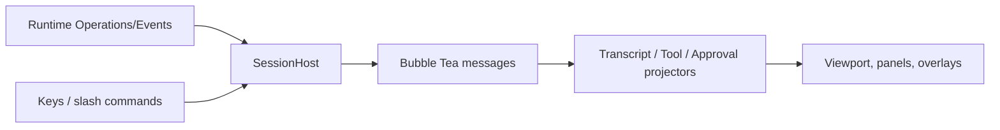

# TUI State Projection

English | [简体中文](../../zh-CN/10-hosts-protocols/02-tui.md)

## Learning Objectives

Understand how Runtime Events become an interactive Bubble Tea model without
moving business logic into the terminal UI.

## Projection Pipeline



`SessionHost` submits Operations, opens a Cursor-based Event stream, pumps
Events, and exposes policy/session services through narrow facades. `Model`
projects output, reasoning, Tool lifecycle, approval queue, input requests,
plans, usage, and terminal receipts.

Live state and settled state are distinct. Streaming Markdown keeps an
incomplete tail, Tool output is bounded, approval cards are FIFO, and the final
receipt supersedes temporary usage glances. Empty/unmeasured panels state that
honestly.

Slash commands mutate Runtime policy or submit operations through Host methods.
Session snapshots persist UI choices and bindings, but CLI-explicit posture
overrides restored preferences.

## Event Reducer Invariants

The TUI is a projection reducer:

```text
(previous UI state, validated Event) -> next UI state + optional paint
```

- Event identity/Cursor makes duplicate delivery harmless.
- Output deltas append only to the matching live Item.
- Tool Call/Result and Approval required/resolved remain paired by identity.
- Terminal Receipt settles temporary cards and accounting.
- Unknown Events remain inspectable without inventing behavior.

Reopening a session pages durable history, then applies live Events after the
replay boundary. UI snapshots restore preferences and bindings, not canonical
Turn truth; transcript/Tool state is rebuilt from Runtime data.

## Backpressure and Rendering

Runtime event consumption and terminal painting have different rates. The Host
continues consuming bounded Events while paint requests coalesce. Streaming
output, pagination, and overlays use explicit caps so a slow renderer does not
become Runtime execution backpressure. A true subscription gap is a protocol
error, not a reason to guess state.

## Failure Boundaries

- Cursor gaps are reported, not silently reset.
- Approval cannot resume until the pending queue is resolved.
- Unknown/unavailable data is not rendered as zero.
- Render work is coalesced and scroll position is preserved.
- TUI panels inspect Fleet/Tasks without creating work.
- UI never executes Tools directly.

## Tests and Verification

```bash
go test ./internal/host/tui/...
make tui-smoke
```

## Hands-On Lab

Trace a Fixture Event sequence through `SessionHost.pump` into transcript,
active Tool card, approval overlay, and final receipt.

## Review Questions

1. Why separate live and settled Tool state?
2. What does the Cursor protect?
3. Why must empty panels distinguish absent from zero?
4. Which TUI state is authoritative after restart?
5. Why are Event consumption and paint scheduling separated?

## Further Reading

- [VS Code Context Bridge](./06-vscode.md)

## Sources and Verification

| Item | Value |
| --- | --- |
| Catalog ID | `host-tui` |
| Status | `verified` |
| Last verified | 2026-08-06 |
