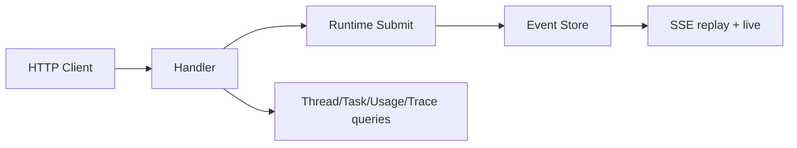

# HTTP/SSE Runtime API

English | [简体中文](../../zh-CN/10-hosts-protocols/03-http-sse.md)

## Learning Objectives

Understand REST submission/read models, SSE replay/live delivery, Problem
responses, and workspace-scoped protocol contracts.

## API Shape



Mutation endpoints create/list Threads and submit start, steer, cancel, retry,
undo, compact, approval, and dynamic Tool Operations. Read endpoints project
Threads, Tasks, Agents, snapshots, usage, traces, and MCP health.

Requests are strictly decoded and bounded. Accepted operations return receipt
identity rather than waiting for all work. SSE begins from a Cursor, replays
durable Events, then continues live without reordering the overlap. Slow or
gapped consumers receive explicit failure semantics.

Problems use stable codes/status and do not expose internal secrets. Workspace
and Thread identity scope all reads and streams. HTTP and ACP execute a shared
protocol contract suite so transport differences do not alter Runtime behavior.

## Submission and Idempotency

HTTP acceptance validates method, content type, body, Workspace/Thread
references, and Operation payload before submission. An idempotency key derives
stable operation identity within its namespace; reusing it with incompatible
content is refused rather than executing a second mutation.

The HTTP status answers transport/admission. The Operation receipt answers what
was accepted. Events answer execution progress and terminal outcome. These
three layers must not be collapsed into one synchronous response.

## Replay-to-Live Handoff

```text
parse requested Cursor
 -> subscribe and establish live boundary
 -> replay durable Events after Cursor
 -> suppress overlap by monotonically advancing Cursor
 -> forward live Events
```

Subscribing around replay prevents the race where an Event lands after the
history query but before live attachment. Cursor, not arrival timestamp, orders
the overlap. `Last-Event-ID` and explicit cursor input are validated as the same
resume contract.

Slow subscribers are bounded and may be dropped. Clients reconnect from their
last processed Cursor; the server does not retain an unbounded private queue.

## Failure Boundaries

- Unknown fields and malformed IDs are rejected.
- Method/content-type/body limits are enforced.
- Cursor gap is explicit.
- Dynamic Tool completion remains catalog/call bound.
- Observability queries cannot mutate Runtime.
- Server shutdown closes subscriptions and active resources.

## Tests and Verification

```bash
go test ./internal/host/runtimeapi/http/...
make api-contract
make protocol-contract
```

## Hands-On Lab

Start a Fixture HTTP server, submit a Turn, page history from Cursor zero, then
attach SSE at the last Cursor and verify no duplicate or missing Event.

## Review Questions

1. Why return an Operation receipt before terminal completion?
2. How does replay-to-live avoid races?
3. What should a Cursor gap cause?
4. What does an HTTP acceptance response not prove?
5. Why is the live subscription established around replay?

## Further Reading

- [ACP Stdio](./04-acp.md)

## Sources and Verification

| Item | Value |
| --- | --- |
| Catalog ID | `host-http-sse` |
| Status | `verified` |
| Last verified | 2026-08-06 |
