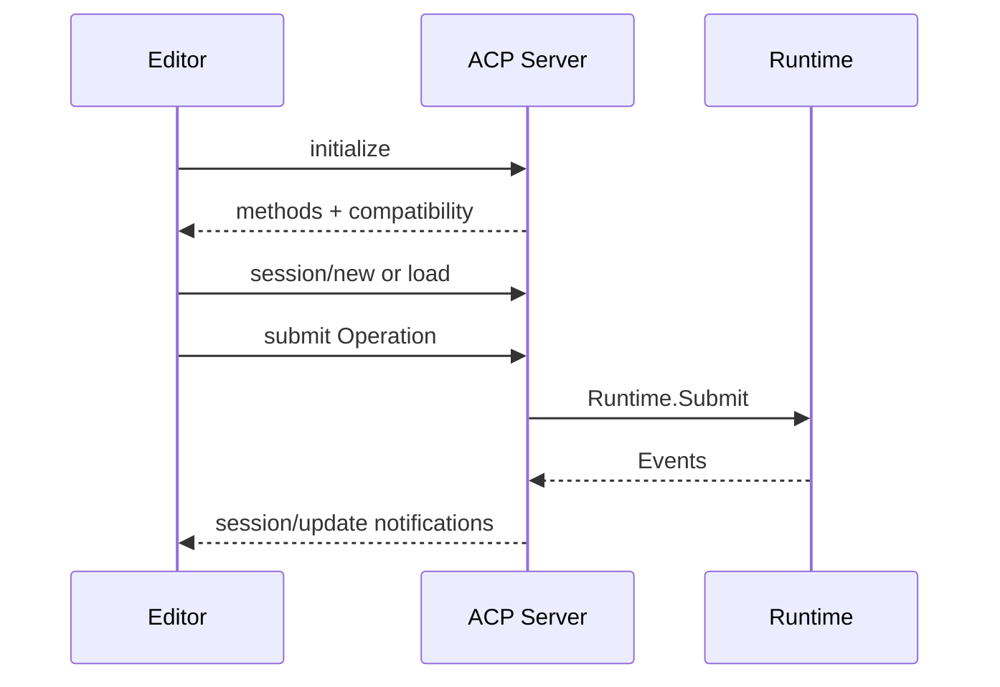

# ACP Stdio and Editor Interoperability

English | [简体中文](../../zh-CN/10-hosts-protocols/04-acp.md)

## Learning Objectives

Understand JSON-RPC framing over stdio, initialization/capability negotiation,
session binding, concurrent calls, notifications, and clean shutdown.

## Transport



ACP uses newline-delimited JSON-RPC frames. A synchronized writer prevents
concurrent response/notification interleaving. Initialization advertises only
implemented methods and binds compatibility. Sessions bind exact Workspace
identity, provider/model selection, Thread, and Event Cursor.

The Server supports Runtime mutations, read queries, dynamic Tool lifecycle,
and Event notifications using the same Operation/Event contracts as HTTP.
Replay pages and live notifications preserve Cursor semantics.

EOF and shutdown are stateful: final half-lines are rejected, active Turns are
cancelled/settled according to protocol, pending calls receive terminal errors,
and resources close deterministically.

## Connection State Machine

```text
connected/uninitialized
 -> initialized with negotiated surface
 -> one or more Workspace-bound sessions
 -> active request/notification/Event flows
 -> draining/shutdown
 -> closed
```

Initialization is connection-scoped; Session binding is Workspace-scoped;
active Turn identity is Thread-scoped. A method valid in one state may be
invalid in another. Request IDs correlate exactly one response, while
notifications intentionally have no response.

## Concurrency and Ordering

Requests may execute concurrently, but the frame writer serializes complete
JSON lines. Per-request response order is not global execution order. Runtime
Event Cursor supplies causal stream order; JSON-RPC IDs only correlate calls.

The Server records the highest forwarded Cursor. After reconnect/restart, the
client pages durable replay and then resumes notifications. Desynchronization
preserves state and reports the Cursor gap instead of clearing the editor view.

Compatibility negotiation advertises implemented methods and required feature
versions. Unknown future Event kinds can remain read-only data, but a missing
required mutation method prevents session use.

## Failure Boundaries

- Requests before initialization are rejected.
- Malformed/oversized frames fail safely.
- Workspace events are visible only to the bound Host Workspace.
- Concurrent requests retain response IDs.
- Unknown methods return JSON-RPC error, not process crash.
- Compatibility manifest must match advertised surface.

## Tests and Verification

```bash
go test ./internal/host/runtimeapi/acp/...
make acp-interop
make protocol-contract
```

## Hands-On Lab

Run binary interop with two concurrent RPC calls and a streaming Turn; verify
response correlation, notifications, replay, and shutdown.

## Review Questions

1. Why synchronize frame writes?
2. What is negotiated during initialize?
3. How does ACP preserve Workspace isolation?
4. What is ordered by RPC ID versus Event Cursor?
5. Why is initialization distinct from Session binding?

## Further Reading

- [VS Code Context Bridge](./06-vscode.md)

## Sources and Verification

| Item | Value |
| --- | --- |
| Catalog ID | `host-acp` |
| Status | `verified` |
| Last verified | 2026-08-06 |
