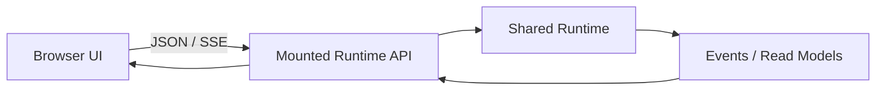

# Web Control Surface

English | [简体中文](../../zh-CN/10-hosts-protocols/05-web.md)

## Learning Objectives

Understand the embedded Web UI, its HTTP API boundary, browser security policy,
and why the Web surface remains a projection/control Host.

## Architecture



The embedded UI serves static assets and calls the mounted HTTP Runtime API.
It creates/loads Threads, submits Operations, follows SSE, renders projections,
and sends approval/input decisions. Provider, Tool, sandbox, and persistence
logic remain behind Runtime/Wire.

Assets are served with restrictive Content Security Policy and explicit content
types. The browser receives only protocol/read-model data; it does not receive
raw credentials or filesystem authority. API routes preserve Workspace scope,
strict decoding, and Problem responses.

The small embedded surface is intentionally not a second application backend.
Adding a Web feature starts by adding or reusing a Runtime operation/read model,
then projecting it in the browser.

## Browser and Deployment Trust Boundaries

| Boundary | Required control |
| --- | --- |
| static asset -> browser | fixed content types, CSP, no attacker HTML |
| browser message/input -> API | strict finite decode and identity checks |
| API -> Runtime | shared Operations, Policy, Approval, Workspace scope |
| Runtime Event -> DOM | safe text/structured rendering, no raw HTML authority |
| network listener -> user | loopback default or authenticated reviewed gateway |

CSP reduces script injection and framing risk; it does not authenticate a
non-loopback deployment, authorize Runtime Operations, or sanitize server data
by itself.

## Projection Recovery

Browser state is disposable. On reconnect it reloads read models, resumes SSE
from a stored Cursor, deduplicates overlap, and treats the terminal Receipt as
settled truth. Pending Approval/Input cards are reconstructed from Runtime
state, not trusted from local browser storage.

Optimistic UI may acknowledge a click, but it cannot mark a Tool, edit, or Turn
successful before the corresponding Runtime Event. Static assets and API
routes are mounted with explicit precedence so fallback routing cannot convert
an API typo into HTML success.

## Failure Boundaries

- CSP blocks arbitrary script origins and unsafe embedding.
- Browser input remains untrusted and bounded.
- UI cannot claim Tool success before terminal Events.
- Network exposure must use the API's authentication/deployment boundary.
- Static routing cannot shadow Runtime API routes.

## Tests and Verification

```bash
go test ./internal/host/webui
go test ./internal/host/runtimeapi/http -run TestServeBinaryContract
```

## Hands-On Lab

Mount Web UI and API in a test server, create a Thread from the page, and trace
the request into the shared Runtime rather than a browser-specific executor.

## Review Questions

1. Why is Web UI not an execution backend?
2. What does CSP protect?
3. Where should a new Web mutation be implemented first?
4. What security property does CSP not provide?
5. Which Web state may be discarded and reconstructed?

## Further Reading

- [Adding a Host](../11-extension-ecosystem/05-adding-host.md)

## Sources and Verification

| Item | Value |
| --- | --- |
| Catalog ID | `host-web` |
| Status | `verified` |
| Last verified | 2026-08-06 |
