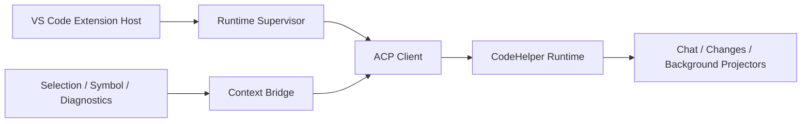

# VS Code Context Bridge, Trust, and Compatibility

English | [简体中文](../../zh-CN/10-hosts-protocols/06-vscode.md)

## Learning Objectives

Understand Runtime supervision, ACP negotiation, exact Workspace identity,
editor-context capture, trust gating, and binary compatibility.

## Integration Path



The Workspace Extension Host discovers/verifies or manages the Runtime binary,
starts it with argv spawning, negotiates protocol/feature compatibility, and
binds the exact local/remote Workspace identity. Crash recovery is bounded and
last-known-good binaries are retained.

Context Bridge captures explicit file, selection, symbol, and diagnostics with
canonical URI, document version, digest, bounded ranges/content, and omission
counts. Runtime revalidates all fields. Stale capture fails rather than silently
editing newer content.

Untrusted Workspaces force read-only posture and cannot choose executables or
approve mutations. Webview uses nonce-only CSP, finite decoded messages, safe
DOM sinks, and read-only Runtime receipts. Edit previews remain bound to Runtime
Plan IDs.

## Supervisor and Session Recovery

```text
discover/verify binary
 -> negotiate version + target + protocol + features
 -> bind exact Workspace identity
 -> create/load Session
 -> page replay from persisted Cursor
 -> attach live notifications
 -> bounded restart on crash
```

The Supervisor may restart a process, but Session recovery decides whether to
load durable state. It never converts a crash into prompt resubmission. Failed
managed updates roll back to a verified last-known-good binary; crash loops are
bounded and surfaced.

Cursor persistence is monotonic per exact Workspace/Session binding. Replay is
paged, filtered Workspace Events still advance the connection Cursor, and live
Events are ordered after in-flight replay. A gap preserves projected state for
diagnosis.

## Multi-root and Remote Identity

Each Workspace root has a separate Host binding containing canonical editor
URI, Runtime path, and remote authority. UI-selected roots cannot forge this
binding. Context capture and commands route through the owning root.

Compatibility includes binary version, OS/architecture target, ACP protocol,
and required features. A binary that launches successfully can still be
incompatible.

## Failure Boundaries

- Local/remote Workspace identities cannot be forged or mixed.
- Protocol, version, target, and required feature must be compatible.
- Runtime launch and stderr diagnostics are bounded.
- Webview messages and context payloads are finite.
- Untrusted Workspace blocks mutation before capture/submit.
- Replay Cursor gaps preserve state for diagnosis.

## Tests and Verification

```bash
cd extensions/vscode
npm run check
npm test
```

## Hands-On Lab

Trace “fix selection” from VS Code capture through ACP `turn.start`, Runtime
digest validation, approval-bound edit plan, and Changes projection.

## Review Questions

1. Why validate editor context again in Runtime?
2. What changes in an untrusted Workspace?
3. Why bind compatibility to target and protocol?
4. Why does process restart not imply prompt resubmission?
5. How does multi-root routing prevent cross-root authority confusion?

## Further Reading

- [Adding a Host](../11-extension-ecosystem/05-adding-host.md)

## Sources and Verification

| Item | Value |
| --- | --- |
| Catalog ID | `host-vscode` |
| Status | `verified` |
| Last verified | 2026-08-06 |
