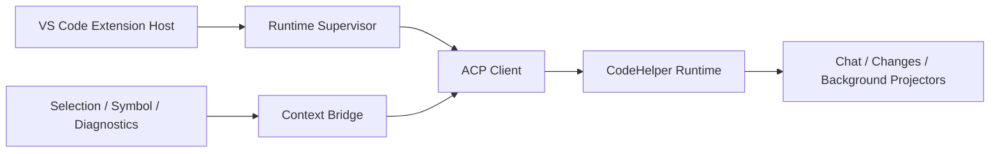

# VS Code Context Bridge, Trust, and Compatibility

English | [简体中文](../../zh-CN/10-hosts-protocols/06-vscode.md)

## Learning Objectives

Understand Runtime supervision, ACP negotiation, exact Workspace identity,
editor-context capture, trust gating, and binary compatibility.

## Integration Path



The local UI Extension Host discovers/verifies or manages the Runtime binary,
starts it with argv spawning, negotiates protocol/feature compatibility, and
binds the exact local Workspace identity. Crash recovery is bounded and
last-known-good binaries are retained.

Context Bridge captures explicit file, selection, symbol, and diagnostics with
canonical URI, document version, digest, bounded ranges/content, and omission
counts. Runtime revalidates all fields. Stale capture fails rather than silently
editing newer content.

Untrusted Workspaces force read-only posture and cannot choose executables or
approve mutations. Webview uses nonce-only CSP, finite decoded messages, safe
DOM sinks, and read-only Runtime receipts. Edit previews remain bound to Runtime
Plan IDs.

## Workbench and Lifecycle Experience

Setup, Repair, and Quickstart are first-class commands backed by Runtime
Readiness. Chat, Changes, Threads, and Approvals are primary navigation;
Agents, Tasks, Jobs, and Usage are collapsed detail views. Native Diff, Quick
Pick, Progress, and Tree View carry platform behavior instead of being
reimplemented in the Chat Webview.

The lifecycle strip distinguishes Setup, Empty, Loading, Streaming, Approval,
Verify, Failure, Recovery, and Completed, including the next available action.
`Ctrl+Enter`/`Cmd+Enter` sends and `Escape` stops. Visible focus, screen-reader
live regions, host theme tokens, forced colors, and reduced motion are tested
contracts rather than optional styling.

## Session Profile Contract

Session Profile is Runtime-owned and durable. VS Code strictly decodes Profile,
Revision, Capability, and prompt-cache reset results over ACP; it does not copy
them into BindingStore or Webview state. Updates use optimistic concurrency and
are rejected while the owning Thread has an active Turn. Only fields advertised
as mutable by the current Runtime may change.

Composer renders Mode, Provider, Model, Thinking, Credential status, and
Approval posture from this projection. Mutable fields use Revision-checked ACP
updates. The current single-route Runtime changes Provider/Model through native
Setup and a bounded restart rather than pretending to support hot switching.

Credential entry stays in a native password InputBox. The value is stored in
VS Code SecretStorage under the exact Workspace/Provider identity; only a
generated environment reference enters `codehelper.toml`, and only the local
Runtime child receives the secret. Webview snapshots contain status, never the
secret or reference. Untrusted Workspaces disable credential and Approval
escalation controls. Runtime read-only startup is also an immutable permission
ceiling when a durable Profile is restored.

## Native Resource Navigation

Runtime-confirmed context receipts, context selections, and Edit Plans become
opaque resource IDs in the Chat projection. The Webview returns only an ID; the
Extension Host resolves it from the current Snapshot, validates its exact
Workspace root and relative path, and invokes fixed APIs for editor ranges,
definitions, diagnostics, Explorer reveal, or Diff.

Arbitrary URI schemes, `command:` values, absolute or traversing paths,
cross-root definitions, stale IDs, and forged Diff identities fail closed.
Path text in model output becomes interactive only when it uniquely matches a
confirmed resource.

## Supervisor and Session Recovery

```text
discover/verify binary
 -> negotiate version + target + protocol + features
 -> bind exact Workspace identity
 -> create/load Session
 -> page replay from persisted Cursor
 -> attach live notifications
 -> bounded restart on crash
```

The Supervisor may restart a process, but Session recovery decides whether to
load durable state. It never converts a crash into prompt resubmission. Failed
managed updates roll back to a verified last-known-good binary; crash loops are
bounded and surfaced.

Cursor persistence is monotonic per exact Workspace/Session binding. Replay is
paged, filtered Workspace Events still advance the connection Cursor, and live
Events are ordered after in-flight replay. A gap preserves projected state for
diagnosis.

## Multi-root and Local Identity

Each local Workspace root has a separate Host binding containing canonical
`file:` editor URI and Runtime path. UI-selected roots cannot forge this
binding. Context capture and commands route through the owning root.

Compatibility includes binary version, OS/architecture target, ACP protocol,
and required features. A binary that launches successfully can still be
incompatible.

## Failure Boundaries

- Only canonical local `file:` Workspace identities are accepted.
- Protocol, version, target, and required feature must be compatible.
- Runtime launch and stderr diagnostics are bounded.
- Webview messages and context payloads are finite.
- Resource navigation cannot supply a URI, command, or cross-root target.
- Untrusted Workspace blocks mutation before capture/submit.
- Replay Cursor gaps preserve state for diagnosis.

## Tests and Verification

```bash
cd extensions/vscode
npm run check
npm test -- experience
```

## Hands-On Lab

Trace “fix selection” from VS Code capture through ACP `turn.start`, Runtime
digest validation, approval-bound edit plan, and Changes projection.

## Review Questions

1. Why validate editor context again in Runtime?
2. What changes in an untrusted Workspace?
3. Why bind compatibility to target and protocol?
4. Why does process restart not imply prompt resubmission?
5. How does multi-root routing prevent cross-root authority confusion?

## Further Reading

- [Adding a Host](../11-extension-ecosystem/05-adding-host.md)

## Sources and Verification

| Item | Value |
| --- | --- |
| Catalog ID | `host-vscode` |
| Status | `verified` |
| Last verified | 2026-08-06 |
