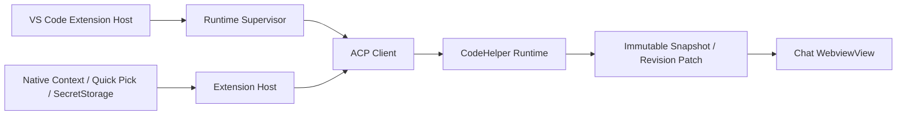

# VS Code Native Agent Chat and Runtime Authority

English | [简体中文](../../zh-CN/10-hosts-protocols/06-vscode.md)

## Learning Objectives

Understand how the native Agent Chat keeps Runtime authority while integrating
Session management, Composer controls, editor context, incremental rendering,
recovery workflows, trust gating, and release evidence.

## Integration Path



The local UI Extension Host discovers/verifies or manages the Runtime binary,
starts it with argv spawning, negotiates protocol/feature compatibility, and
binds the exact local Workspace identity. Crash recovery is bounded and
last-known-good binaries are retained.

The Context Bridge captures explicit File, Selection, Symbol, Diagnostics,
Image, Terminal Output, and Git Diff context. File-backed context carries
canonical URI, document version, digest, bounded ranges/content, and omission
counts. Runtime revalidates workspace membership, content identity, media
signature, and bounds. Terminal and Git Diff context remain explicit native
captures rather than inferred shell access.

Untrusted Workspaces force read-only posture and cannot choose executables or
approve mutations. Webview uses nonce-only CSP, finite decoded messages, safe
DOM sinks, and read-only Runtime receipts. Edit previews remain bound to Runtime
Plan IDs.

## Workbench and Lifecycle Experience

Setup, Repair, and Quickstart are first-class commands backed by Runtime
Readiness. The Chat surface combines a virtualized Session Rail, incremental
Transcript, structured lifecycle cards, and a Composer. Native Diff, Quick
Pick, InputBox, Progress, Tree View, editor navigation, and SecretStorage carry
platform behavior instead of being reimplemented in the Webview.

The lifecycle strip distinguishes Setup, Empty, Loading, Streaming, Approval,
Verify, Failure, Recovery, and Completed, including the next available action.
`Ctrl+Enter`/`Cmd+Enter` sends and `Escape` closes the top overlay before
stopping. IME composition, visible focus, screen-reader live regions, Light,
Dark, High Contrast, forced colors, reduced motion, and approximately 200%
zoom are tested contracts rather than optional styling.

CodeHelper contributes one `WebviewView`. VS Code may move that same view
between Sidebar and Panel. The product does not register or claim a separate
Full Editor Chat.

## Session Profile Contract

Session Profile is Runtime-owned and durable. VS Code strictly decodes Profile,
Revision, Capability, and prompt-cache reset results over ACP; it does not copy
them into BindingStore or Webview state. Updates use optimistic concurrency and
are rejected while the owning Thread has an active Turn. Only fields advertised
as mutable by the current Runtime may change.

Composer renders Mode, Provider, Model, Thinking, Tool allowlist, Credential
status, Approval posture, and the immutable local execution environment from
this projection. Mutable fields use Revision-checked ACP updates. Model
capabilities state whether selection requires Runtime restart; the Host never
pretends a route supports hot switching.

Credential entry stays in a native password InputBox. The value is stored in
VS Code SecretStorage under the exact Workspace/Provider identity; only a
generated environment reference enters `codehelper.toml`, and only the local
Runtime child receives the secret. Webview snapshots contain status, never the
secret or reference. Untrusted Workspaces disable credential and Approval
escalation controls. Runtime read-only startup is also an immutable permission
ceiling when a durable Profile is restored.

## Session Rail and Incremental Transcript

Runtime owns Session summaries, status, search matches, Profile, active Thread,
lineage, checkpoints, and lifecycle transitions. The Rail can create, switch,
rename, pin, archive, duplicate, delete, search, and filter Sessions, but each
mutation is a typed Runtime request with Revision checks. Durable summary data
is distinct from transient search matches with stable Turn IDs.

The Host sends one Full Snapshot for hydration, visibility recovery, Session
switch, or stale-revision resync. Subsequent changes are finite, typed Patches
whose `baseRevision` must match the Webview Store. Patch application is atomic;
a stale Patch changes no state and requests a new Snapshot.

Transcript identity uses Session, Turn, Tool Call, Approval, and Input Request
IDs rather than rendered text. A bounded virtual window retains the full
Transcript in state while limiting DOM nodes. Rendering restores expanded
cards, focus, and relative scroll anchors after each Patch.

## Chat Projection

The Chat projection consumes generated Event Traits and dispatches through
domain modules: stream, tool, interaction, evidence, terminal, and snapshot.
`projector/index.ts` owns Sequence and Turn identity.
`turn-projector.ts` switches exhaustively over the generated Event Class union,
so adding a class without a domain decision fails TypeScript compilation.
The root `projector.ts` is only a compatibility re-export.

Traits come from the Protocol manifest, not Host-local classification. A new
Event Kind is either handled or explicitly ignored by a domain module. It
cannot be silently reclassified in the Host, and adding it without Traits
fails Schema and TypeScript generation.

## Checkpoints, Plans, and Turn Recovery

Checkpoints are immutable Runtime artifacts. Restore is state-only: it rebuilds
the verified model-visible history and Profile baseline without replaying Tool,
Command, Network, or file side effects. Fork creates explicit parent
Session/Thread/Checkpoint lineage that survives restart.

Structured Plan Artifacts can be implemented in the current Session, a new
Profile-preserving Session, or a Checkpoint Fork. The Webview never reconstructs
an implementation prompt from display text; Runtime validates the Plan,
Profile Revision, destination, and lineage.

Retry and Continue submit ACP `turn/recover` and create new Turns. Retry reuses
the original model-visible request; Continue may append guidance. Neither path
copies or replays completed side effects.

## Native Resource Navigation

Runtime-confirmed context receipts, context selections, and Edit Plans become
opaque resource IDs in the Chat projection. The Webview returns only an ID; the
Extension Host resolves it from the current Snapshot, validates its exact
Workspace root and relative path, and invokes fixed APIs for editor ranges,
definitions, diagnostics, Explorer reveal, or Diff.

Arbitrary URI schemes, `command:` values, absolute or traversing paths,
cross-root definitions, stale IDs, and forged Diff identities fail closed.
Path text in model output becomes interactive only when it uniquely matches a
confirmed resource.

## Supervisor and Session Recovery

```text
discover/verify binary
 -> negotiate version + target + protocol + features
 -> bind exact Workspace identity
 -> create/load Session
 -> page replay from persisted Cursor
 -> attach live notifications
 -> bounded restart on crash
```

The Supervisor may restart a process, but Session recovery decides whether to
load durable state. It never converts a crash into prompt resubmission. Failed
managed updates roll back to a verified last-known-good binary; crash loops are
bounded and surfaced.

Cursor persistence is monotonic per exact Workspace/Session binding. Replay is
paged, filtered Workspace Events still advance the connection Cursor, and live
Events are ordered after in-flight replay. A gap preserves projected state for
diagnosis.

## Multi-root and Local Identity

Each local Workspace root has a separate Host binding containing canonical
`file:` editor URI and Runtime path. UI-selected roots cannot forge this
binding. Context capture and commands route through the owning root.

The extension is a local UI Extension and accepts only local `file:`
workspaces. Remote SSH, Dev Containers, Codespaces, and remote extension-host
authority are outside the product boundary. Local single-root and multi-root
workspaces remain supported.

Compatibility includes binary version, OS/architecture target, ACP protocol,
and required features. A binary that launches successfully can still be
incompatible.

## Failure Boundaries

- Only canonical local `file:` Workspace identities are accepted.
- Protocol, version, target, and required feature must be compatible.
- Runtime launch and stderr diagnostics are bounded.
- Webview messages and context payloads are finite.
- Resource navigation cannot supply a URI, command, or cross-root target.
- Untrusted Workspace blocks mutation before capture/submit.
- Replay Cursor gaps preserve state for diagnosis.
- Stale Transcript Patches do not partially mutate Webview state.
- Restore, Fork, Retry, and Continue cannot replay historical side effects.

## Tests and Verification

```bash
make vscode-check
make vscode-runtime-integration
make vscode-integration
make vscode-rosetta-integration
make vscode-rc
```

## Hands-On Lab

Trace one native journey from context capture through ACP `turn.start`, Runtime
receipt, incremental Patch, and resource navigation. Then trace a canceled Turn
through Retry or Continue and prove the new Turn does not replay side effects.

## Review Questions

1. Why validate editor context again in Runtime?
2. What changes in an untrusted Workspace?
3. Why bind compatibility to target and protocol?
4. Why does process restart not imply prompt resubmission?
5. How does multi-root routing prevent cross-root authority confusion?
6. Why must a stale Patch request a Snapshot instead of applying partially?
7. Why are Restore and Retry separate Runtime operations?
8. Why does the root Projector avoid classifying Events itself?

## Further Reading

- [Adding a Host](../11-extension-ecosystem/05-adding-host.md)

## Sources and Verification

| Item | Value |
| --- | --- |
| Catalog ID | `host-vscode` |
| Status | `draft` |
| Last verified | Not yet verified |
