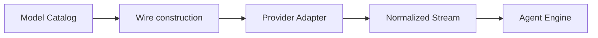

# Adding a Provider

English | [简体中文](../../zh-CN/11-extension-ecosystem/01-adding-provider.md)

## Learning Objectives

Add a Provider adapter without leaking wire-specific behavior into the Engine
or weakening credentials, capability, streaming, and failure contracts.

## Extension Steps

1. Define catalog Models with stable provider/model IDs, wire protocol,
   capabilities, limits, pricing provenance, and credential references.
2. Implement `provider.Provider.Stream(ModelRequest)` and normalized `Stream`.
3. Encode normalized Messages/Tools into the remote protocol.
4. Decode text, reasoning, Tool fragments, usage, terminal state, and errors.
5. Use governed HTTP client for credentials, limits, timeout, retry, and dumps.
6. Register construction in `internal/runtime/app/wire`.
7. Add Hermetic streaming/error fixtures before live smoke.



The adapter owns remote protocol quirks; the Engine sees only normalized
requests/events. Capabilities must be declared conservatively and probed
observations may tighten them.

## Provider Identity and Construction

Provider ID, Model ID, wire protocol, endpoint, credential reference, and
capability/pricing provenance form the resolved route. The human display name
is not identity. Wire resolves this route once for a Session purpose and injects
the adapter; Provider code must not read arbitrary Host configuration later.

```text
catalog declaration
 -> route/capability validation
 -> credential reference resolution at use
 -> governed client construction
 -> normalized Stream
```

Catalog metadata is declarative evidence, probe output is observed evidence,
and a live response is request evidence. A probe may narrow an unsupported
capability; widening authority requires an explicit trust policy.

## Stream Commit Point

Before meaningful output, a transient transport failure may be retryable under
the request policy. After text, reasoning, Tool fragments, or usage has been
accepted, transparent retry risks duplicate output or Tool calls. The adapter
must preserve the failure phase and partial-output fact.

Provider cancellation closes response bodies and decoder work. Terminal state,
usage, and finish reason are emitted once; EOF without a valid terminal is not
silently converted to success.

## Failure Boundaries

- Raw credentials remain references until HTTP use.
- Unknown capability/limit fails before request.
- Tool calls execute only after complete validated assembly.
- Partial meaningful stream is not blindly retried.
- Usage remains per sample/call.
- Debug dumps redact headers and bodies according to policy.

## Tests and Verification

```bash
go test ./internal/adapter/provider/...
go test ./internal/adapter/model
go test ./internal/runtime/app/wire -run 'Test.*Model'
```

## Hands-On Lab

Implement a Fixture-only protocol decoder for text, Tool call, usage, and one
malformed frame; verify normalization without network access.

## Review Questions

1. Which behavior belongs in adapter rather than Engine?
2. Why start with a conservative capability catalog?
3. When is Provider retry unsafe?
4. Which fields make a resolved Provider route stable?
5. What event marks the stream retry boundary?

## Further Reading

- [Provider Failures](../04-model-and-provider/06-provider-failures.md)

## Sources and Verification

| Item | Value |
| --- | --- |
| Catalog ID | `extension-provider` |
| Status | `verified` |
| Last verified | 2026-08-06 |
