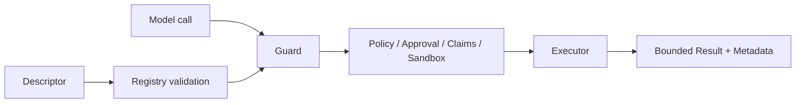

# Adding a Governed Tool

English | [简体中文](../../zh-CN/11-extension-ecosystem/02-adding-tool.md)

## Learning Objectives

Implement a Tool with complete schema, resource, capability, sandbox,
parallelism, result, and test contracts.

## Extension Checklist

1. Implement the Executor with `typed.Define`: a typed `Spec` with `Decode`,
   `Validate`, `Run`, `Encode`, and optional `Metadata`.
2. Use a strict object schema with `additionalProperties: false`.
3. Declare visibility, capability, access, resource templates, parallel policy,
   sandbox requirement, availability, and aliases.
4. Encode model content and structured Runtime metadata through the
   `tool/result` builders (`Success`, `Text`, `Fail`, `Unavailable`); the
   Registry applies output limits and Handle routing.
5. Mark precondition errors only before any side effect.
6. For mediated file writes, implement `EditPlanner`, atomic commit, and
   read-before-edit semantics.
7. Register in Adapter/Wire; never call from a Host directly.



Resource resolution must enumerate every possible effect before Policy. If a
Tool cannot describe a write path from normalized arguments, it must refuse the
call or use a trusted argument expander.

## Typed Construction Kit

`typed.Define[I, O]` is the standard way to build an Executor. The Spec
separates `Decode` (strict JSON, unknown fields rejected), `Validate`
(precondition checks that run before any effect), `Run`, `Encode`, and
`Metadata`. `tool.ValidateDescriptor` fails construction before the Tool is
wired into a catalog; `typed.ReadTool`/`WriteTool`/`ProcessTool` supply the
correct capability, access, and sandbox requirements for the effect class. The
`tool/result` builders encode model content and keep metadata structured and
JSON-compatible; the Registry remains responsible for bounding and routing the
result.

## Registration, Snapshot, and Binding

Registry validates descriptors and assigns source/revision identity. A Catalog
Snapshot is the immutable model-visible view. Sampling binds the selected Tool
name to that snapshot; execution uses `ExecuteBound` so replacement or
revocation between sampling and execution fails instead of running new code
under an old model decision.

```text
register descriptor/executor
 -> validate identity/schema/effect contract
 -> publish catalog generation
 -> bind model sample to generation/revision
 -> Guard revalidates bound call
 -> execute exact authorized implementation
```

Aliases resolve to one canonical identity. Re-registration after revocation
creates a new revision; stale Executor handles remain fenced.

## Effect and Result Contract

Descriptor claims are an upper bound, not documentation. Resource expansion
turns normalized arguments into concrete files, commands, hosts, or services
before Policy. Guard compares declared and observed effects.

Model content is bounded feedback; structured metadata, handles, Journal
changes, and Verification are Runtime evidence. Returning “success” text cannot
override a failed process, unobserved write, or revoked binding.

## Failure Boundaries

- Tool cannot construct or disable its own sandbox.
- Capability must match real effects.
- Executor output cannot self-authorize.
- Partial side effects cannot be labeled precondition failure.
- Result handles are used for oversized output.
- Actual writes are observed by Guard, not trusted from result text.

## Tests and Verification

```bash
go test ./internal/adapter/tool
go test ./internal/adapter/tool/guard
go test ./internal/adapter/tool/typed ./internal/adapter/tool/result
```

## Hands-On Lab

Add a read-only Fixture Tool with `typed.ReadTool`/`typed.Define` and one file
resource, then write tests showing invalid schema, traversal, and unadvertised
catalog binding fail before Execute.

## Review Questions

1. Why is Resource Resolver part of Descriptor?
2. When may a Tool return `ErrPrecondition`?
3. Why must Host code not invoke Executor directly?
4. Why bind a sampled Tool to catalog revision?
5. Which result fields are feedback versus Runtime evidence?

## Further Reading

- [Tool Guard Pipeline](../06-tools-and-execution/03-tool-guard-pipeline.md)

## Sources and Verification

| Item | Value |
| --- | --- |
| Catalog ID | `extension-tool` |
| Status | `draft` |
| Last verified | Not yet verified |
