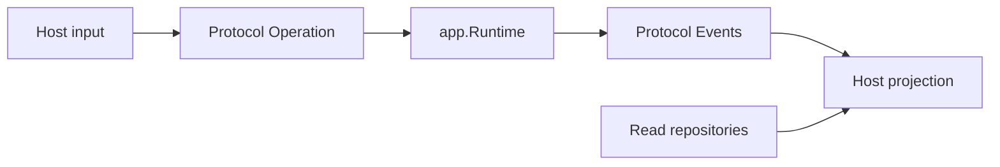

# Adding a Host Without Duplicating Runtime

English | [简体中文](../../zh-CN/11-extension-ecosystem/05-adding-host.md)

## Learning Objectives

Build a new UI or transport as an Operation submitter and Event/read-model
projector while preserving the single Runtime.

## Host Contract



1. Choose existing Operations/read models; add protocol shape only when the
   Runtime lacks the behavior.
2. Construct dependencies in Wire or connect through HTTP/ACP.
3. Validate and bound host-specific input.
4. Submit Operations with idempotency identity.
5. Replay Events from Cursor, then consume live.
6. Project unknown Events safely and terminal Problems honestly.
7. Close subscriptions/resources deterministically.
8. Run shared protocol contract scenarios.

Hosts may own presentation state, transport framing, user interaction, and
platform context capture. They must not sample models, execute Tools, resolve
credentials, construct sandbox backends, or implement a second Turn loop.

## Extension Decision Test

Before adding a Host endpoint or command, classify the behavior:

| Behavior | Owner |
| --- | --- |
| new business mutation | Runtime Operation/Agent loop |
| new durable query | projection/repository + transport DTO |
| new presentation/control | Host |
| new platform context | Host capture + Runtime revalidation |
| new execution capability | governed Adapter/Tool |
| new construction choice | Wire |

If two Hosts need the behavior, it cannot live only in one Host. Shared
protocol contract scenarios test semantic parity across HTTP and ACP; the same
pattern should be applied to every formal transport.

## Compatibility and Unknown Data

A Host declares protocol version, methods, required features, and limits. It
must fail before mutation when required behavior is absent. Additive unknown
Events may be retained as generic read-only records; unknown Operations cannot
be guessed.

Transport DTOs may differ in framing, but Operation/Event identity, one
terminal outcome, Cursor replay, Workspace scope, Approval binding, and Problem
codes remain invariant.

Host shutdown first stops admission, then drains or cancels active interaction,
closes subscriptions, and finally releases the shared Session. It must not
close Runtime resources still owned by another Host.

## Failure Boundaries

- Workspace/Thread identity is explicit.
- Slow consumer/cursor gap has defined behavior.
- Host restart replays rather than reruns.
- Approval/Input decisions remain request-bound.
- Unknown Event is preserved or safely ignored, not misclassified.
- Host-only state cannot become Runtime authority.

## Tests and Verification

```bash
go test ./internal/host/runtimeapi/contract ./internal/runtime/app
make protocol-contract
```

## Hands-On Lab

Implement an in-memory test Host that starts a Turn, pages replay, cancels, and
projects one unknown Event without importing any Adapter executor.

## Review Questions

1. What state may a Host own?
2. Why replay after restart instead of rerunning?
3. When should protocol be extended?
4. How do you decide whether behavior belongs in Host, Runtime, or Adapter?
5. Which semantics must remain equal across transports?

## Further Reading

- [CodeHelper System Architecture](../02-codehelper-overview/02-system-architecture.md)

## Sources and Verification

| Item | Value |
| --- | --- |
| Catalog ID | `extension-host` |
| Status | `verified` |
| Last verified | 2026-08-06 |
