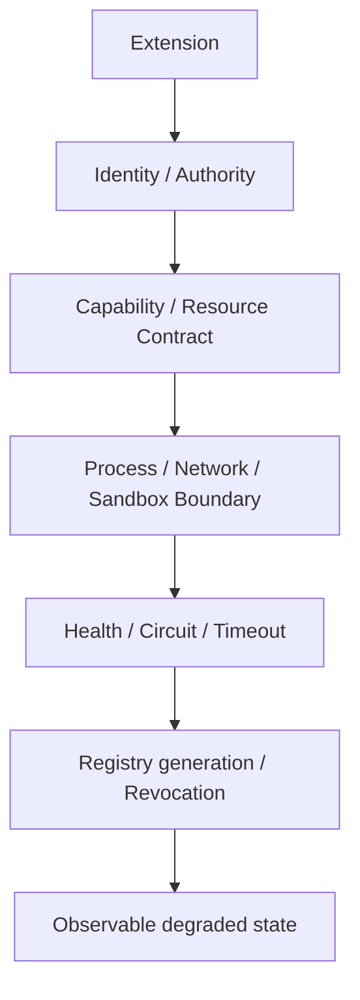

# Extension Failure and Isolation

English | [简体中文](../../zh-CN/11-extension-ecosystem/06-failure-isolation.md)

## Learning Objectives

Design extension failure domains, stable error categories, revocation, timeout,
resource cleanup, and degraded operation.

## Isolation Layers



MCP isolates each server connection and circuit; a failed server does not hide
healthy catalogs. Probe calls test recovery without replaying business calls.
Plugin authority can be revoked, canceling in-flight work and invalidating
loaded generations. Skills fail during bounded discovery/resolution before
context injection. Hooks are timeout/cancellation bounded and fail closed.

Stable error categories separate unavailable, circuit-open, stale catalog,
dependency conflict, signature/tamper, and policy denial. Recoverable categories
may be returned to the model; security and unknown failures remain terminal.

Degraded mode must be explicit: unavailable descriptors, health snapshots,
issues, lifecycle receipts, and logs explain what is missing. Silent removal
makes models and operators infer capabilities that no longer exist.

## Unified Extension Lifecycle

```text
discovered -> validated -> authorized -> active(generation)
           -> draining -> disabled/revoked
           -> failed/quarantined -> probe/revalidate -> active(new generation)
```

Validation proves shape/integrity; authorization grants bounded capability;
activation publishes one generation. Every in-flight call binds that identity.
Disable stops new admission and may drain; security revoke immediately wins,
cancels calls, removes authority, and fences cached handles.

## Failure Domain Matrix

| Failure | Containment | Recovery |
| --- | --- | --- |
| Provider request | one sample/route | retry only before meaningful output |
| Tool executor | one bound call/Turn | feedback or terminal by effect phase |
| MCP transport | one server circuit/source | probe/reconnect/new generation |
| Skill resolution | one dependency plan | repair manifest/lock, reload |
| Plugin tamper/revoke | one plugin generation | verified rollback/update |
| Hook timeout | one lifecycle callback | kill process tree; apply failure policy |
| Host disconnect | one presentation/transport | Cursor replay, never rerun |

Bulkheads need both resource and authority isolation: separate timeouts,
processes/connections, output limits, catalog sources, cancellation, and
generation fences.

## Feedback and Observability

Model feedback includes only stable, actionable, sanitized categories and
whether retry is safe. Operator records retain extension identity, source,
generation, transition, bounded cause, and affected calls. Unknown, tamper, and
partial-effect failures are never converted into retry advice.

Health is not authority. A healthy process with revoked generation cannot run;
an unhealthy optional extension does not make unrelated Runtime functions
unavailable.

## Failure Boundaries

- Extension cannot widen declared capability at runtime.
- Revocation wins over cached/loaded authority.
- Process groups and transports close on cancellation.
- Retry is bounded and never duplicates meaningful work.
- One source reconcile cannot replace another source's Tools.
- Error/log output is bounded and redacted.

## Tests and Verification

```bash
go test ./internal/adapter/mcp -run 'Test(Pool|Circuit)'
go test ./internal/adapter/plugin
go test ./internal/adapter/skill ./internal/adapter/hooks
```

## Hands-On Lab

Fail one MCP server, revoke one running Plugin, and introduce one Skill lock
drift. Compare catalog visibility, active cancellation, and model feedback.

## Review Questions

1. Why expose unavailable capability instead of silently hiding it?
2. What must revocation invalidate?
3. Which extension failures are safe model feedback?
4. What is the difference between disable, drain, and security revoke?
5. Why must isolation include generation fencing as well as processes?

## Further Reading

- [Feeding Tool Failures Back](../06-tools-and-execution/06-failure-feedback.md)

## Sources and Verification

| Item | Value |
| --- | --- |
| Catalog ID | `extension-failure-isolation` |
| Status | `draft` |
| Last verified | Not yet verified |
