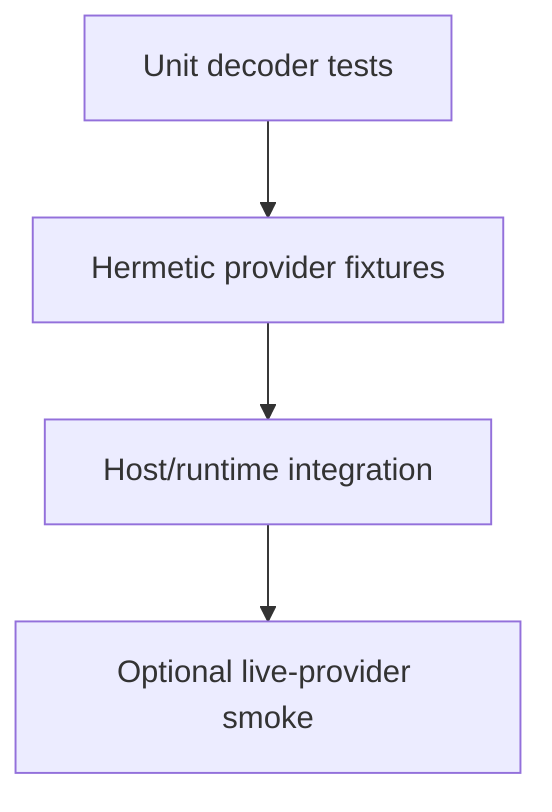

# Hermetic Fixtures and Live-Provider Smoke

English | [简体中文](../../zh-CN/12-engineering-practice/01-fixtures-and-smoke.md)

## Learning Objectives

Choose deterministic Fixtures for correctness and a minimal live smoke for
provider/environment confidence without confusing the two.

## Test Pyramid



A Provider Fixture defines expected prompt/model and replayable SSE frames.
Fixtures cover text, Tool calls, malformed calls, cancellation, editor context,
subagents, workflows, and multi-sample routes without network or credentials.

Live smoke performs one bounded real request. It validates credential,
endpoint, TLS, current remote protocol, and account availability, but is not a
deterministic regression test. It never stores the secret and stays outside
default verification.

## Fixture Fidelity Contract

A useful Fixture fixes inputs, protocol bytes, timing/control points, and
expected normalized Events. It should preserve remote quirks that exercise the
adapter without copying private production traffic.

| Fixture property | Why it matters |
| --- | --- |
| explicit model/prompt | catches wrong routing and request encoding |
| complete raw frames | tests framing, fragments, terminal and usage |
| deterministic fault point | reproduces disconnect, malformed data, timeout |
| normalized assertions | tests adapter contract rather than UI text |
| bounded synthetic content | remains reviewable and secret-free |

Golden data is updated only after explaining the semantic change. Regenerating
until a test passes destroys its value as independent evidence.

## Smoke Decision Table

| Result | Interpretation |
| --- | --- |
| Fixture fails, live passes | local regression or stale Fixture |
| Fixture passes, live fails | credential/network/provider/environment issue |
| Both fail identically | investigate shared encoding/contract first |
| Both pass | local contract plus current endpoint reachability |

Even when both pass, no claim is made about all models, regions, rate limits,
long streams, or future remote behavior.

## Failure Boundaries

- Fixture mismatch is a code/contract failure.
- Live auth/rate/network failure is environment evidence, not automatically a regression.
- Fixture prompts must match declared `expected_prompt`.
- Recorded streams contain no real credentials or private responses.
- Live smoke uses least privilege, timeout, and bounded output.

## Verification

```bash
go test ./internal/adapter/provider/... ./internal/host/cli
make live-model-smoke  # optional, requires credential
```

## Review Questions

1. What can live smoke prove that a Fixture cannot?
2. Why is live smoke excluded from default CI?
3. What makes a Fixture reproducible?
4. When is a golden Fixture update legitimate?
5. What does “Fixture and live smoke both pass” still not prove?

## Sources and Verification

| Item | Value |
| --- | --- |
| Catalog ID | `practice-fixtures-smoke` |
| Status | `verified` |
| Last verified | 2026-08-06 |
