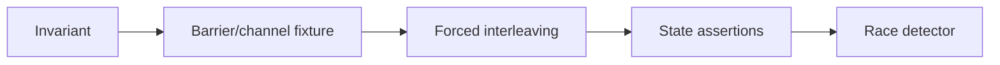

# Concurrency Tests and Race Detection

English | [简体中文](../../zh-CN/12-engineering-practice/03-concurrency-and-race.md)

## Learning Objectives

Test interleavings deterministically and use the race detector as evidence
without relying on sleeps as synchronization.

Concurrency risks include submit/close races, strict Event sequence, one
terminal per Operation, Tool claim conflicts, catalog replacement during load,
lease takeover, automation ticks, CAS locks, Hook state, and child budgets.



Tests coordinate with channels, fake clocks, leases, and explicit barriers.
Timeouts bound a test but do not establish ordering. Assertions target durable
invariants, not scheduler luck. `-race -p 1` limits environment pressure while
covering the whole tree.

## Start from a Linearization Point

For each concurrent operation, name the instant at which it takes effect:

| Operation | Linearization evidence |
| --- | --- |
| Runtime submit | accepted Operation receives unique sequence/accounting |
| Tool claim | claim table grants one compatible owner |
| Task claim | transactional queued-to-running lease transition |
| catalog replace | generation compare-and-swap |
| Automation tick | unique Automation/slot insertion |
| Event append | durable sequence/evidence commit |

Tests pause immediately before/after that point and force competitors through
the same window. Assert safety (never two owners/terminals) and liveness (winner
can finish; loser is released or receives a bounded error).

## Cancellation and Cleanup Protocol

Cancellation is not complete when Context closes. The test waits for child
processes, claims, leases, goroutines, transports, and temporary worktrees to
settle. Leak checks need an observable completion channel or repository state,
not a sleep.

Run the same deterministic test repeatedly without Race for ordering bugs, then
with Race for unsynchronized memory access. Deadlock and starvation require
timeouts, progress assertions, and load/fairness experiments.

## Failure Boundaries

- Flaky TempDir cleanup is separated from behavioral failure and rerun exactly.
- Race-free does not prove deadlock freedom or protocol ordering.
- Atomic counters do not make compound state atomic.
- Cancellation tests wait for cleanup before asserting.

## Verification

```bash
go test -race -p 1 ./...
go test ./internal/runtime/app -run 'TestRuntimeConcurrent|TestRuntimeSubmitCloseRace'
```

## Review Questions

1. Why are sleeps weak synchronization?
2. What does `-race` not prove?
3. Which invariant detects duplicate execution?
4. What is a linearization point?
5. Why is Context cancellation not sufficient cleanup evidence?

## Sources and Verification

| Item | Value |
| --- | --- |
| Catalog ID | `practice-concurrency-race` |
| Status | `verified` |
| Last verified | 2026-08-06 |
