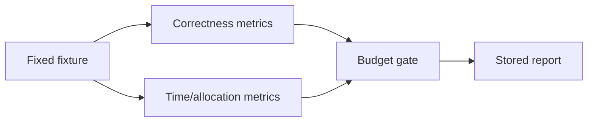

# Benchmarks and Performance Budgets

English | [简体中文](../../zh-CN/12-engineering-practice/04-benchmark-and-performance.md)

## Learning Objectives

Use deterministic scenario benchmarks and explicit budgets to detect regressions
without turning noisy timings into correctness claims.

The Hermetic coding suite covers context truncation, compaction, working set,
evidence, index degradation, edit transactions, and verification gates. Each
task defines assertions, not just elapsed time. Catalog benchmarks measure
large dynamic Tool sets with allocation data. VS Code gates bound 10k stream
deltas, 1000 background rows, Runtime readiness, and Electron interaction.



Compare like-for-like hardware/runtime and retain raw reports. A faster result
that violates completion, evidence, or verification is a failure.

## Measurement Protocol

Record source revision, dirty state, OS/architecture, Go/Node version, CPU,
power mode, fixture version, warmup, sample count, concurrency, and command.
Compare distributions or repeated samples, not one favorable run.

| Metric | Typical risk |
| --- | --- |
| wall/CPU time | latency and throughput regression |
| allocations/bytes | GC pressure and catalog/context scaling |
| peak concurrency | violated scheduler or resource budget |
| output/context size | truncation and transport/UI pressure |
| correctness counters | fast but incomplete execution |

Microbenchmarks isolate algorithms; scenario benchmarks include Runtime
interactions; end-to-end gates include process/UI startup. A result from one
layer cannot be substituted for another.

## Budget Governance

A budget includes metric, percentile/sample rule, fixture scale, environment
class, and failure action. Raise it only with a causal explanation, before/after
raw evidence, correctness parity, and explicit review. Optimize the dominant
phase shown by Trace/profile data rather than the most visible loop.

Performance work must retain bounds: caches need invalidation and capacity,
parallelism needs cancellation and admission, and deferred loading must preserve
catalog authority.

## Failure Boundaries

- Warmup and sample count are explicit.
- Network/live providers are excluded.
- Empty/unmeasured phases are not zero.
- Intentional budget changes require review and evidence.

## Verification

```bash
make bench
make catalog-bench
make vscode-performance
```

Verification on macOS arm64 on 2026-08-06: catalog scale benchmarks passed for
100, 500, and 1000 Tools. The coding suite passed 18/23 scenarios; five
verification-gate scenarios failed closed because the local Seatbelt probe
reported `strength=none`. Do not disable sandbox enforcement to turn that
platform limitation into a passing result. VS Code projector budgets passed;
Electron/runtime-ready budgets remain environment-acquired gates.

## Review Questions

1. Why combine correctness and timing assertions?
2. What makes a benchmark Hermetic?
3. When may a budget be raised?
4. What metadata makes two benchmark reports comparable?
5. Why can a microbenchmark not replace an end-to-end gate?

## Sources and Verification

| Item | Value |
| --- | --- |
| Catalog ID | `practice-benchmark` |
| Status | `verified` |
| Last verified | 2026-08-06 |
