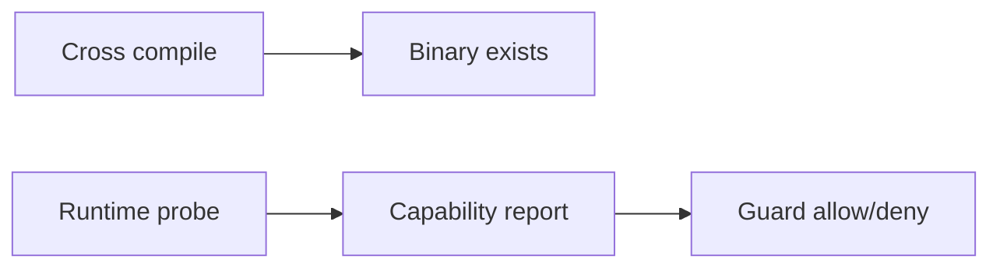

# Cross-Platform Builds and Capability Probing

English | [简体中文](../../zh-CN/12-engineering-practice/05-cross-platform.md)

## Learning Objectives

Separate compile support from runtime capability and make platform degradation
explicit.

`cross-build` compiles Linux amd64/arm64 and Windows amd64 without claiming
those binaries passed runtime sandbox tests. Platform files implement process
groups, filesystem identity, locks, and Workspace safety. Sandbox `Probe`
reports backend and strength; consequential Tools call `RequireStrong` and fail
closed when only partial capability exists.



VS Code binds a local `file:` Workspace identity and packages target-specific
binaries. Remote editor environments are outside the extension's product
scope.

## Three Levels of Platform Evidence

| Level | Evidence |
| --- | --- |
| buildable | target compiles with generated files and dependencies |
| runnable | binary starts and core protocol smoke passes on target |
| supported | security, persistence, process, path, upgrade, and Host matrices pass |

Documentation and release manifests must name the level. Cross compilation
alone cannot promote a target to supported.

## Platform Abstraction Review

OS-specific code should sit behind narrow contracts for process groups,
signals, locks, secure file open, canonical paths, sandbox backend, and editor
Workspace identity. The common caller consumes capability/result semantics,
not platform command strings.

Every fallback is classified:

- equivalent implementation may continue;
- weaker but observable behavior is allowed only for non-consequential paths;
- missing required security capability fails closed;
- unknown capability is not treated as available.

Cross-platform tests include compile matrices plus native runners for runtime
facts. Windows path/link behavior, Unix process trees, Linux Landlock, macOS
Seatbelt, remote URI authority, and target package contents need native
evidence.

## Failure Boundaries

- Successful compile is not runtime support evidence.
- Unsupported strong sandbox cannot silently downgrade.
- Path canonicalization and file identity are OS-specific.
- Platform-limited tests are reported with target/backend.

## Verification

```bash
make cross-build
go test ./internal/security/sandbox ./internal/platform/process
```

## Review Questions

1. What does cross-build prove?
2. Why probe sandbox at runtime?
3. Why distinguish editor URI from Runtime path?
4. What separates runnable from supported?
5. When may a platform fallback continue?

## Sources and Verification

| Item | Value |
| --- | --- |
| Catalog ID | `practice-cross-platform` |
| Status | `draft` |
| Last verified | Not yet verified |
