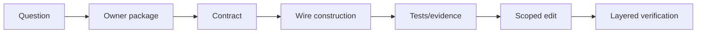

# Reading and Changing a Large Agent Codebase

English | [简体中文](../../zh-CN/12-engineering-practice/07-reading-codebase.md)

## Learning Objectives

Navigate by ownership and contracts, choose evidence before edits, and scale
verification to risk.

## Working Method

1. Read `AGENTS.md`, README, architecture, nearest tests, Makefile, and status.
2. Locate the stable contract: Protocol, Descriptor, Repository, or interface.
3. Follow construction in `internal/runtime/app/wire`.
4. Trace one success path and one failure path.
5. Read tests for ordering, persistence, security, and platform assumptions.
6. Make the smallest ownership-aligned change.
7. Add focused tests, then broaden based on blast radius.
8. Run docs/book and diff checks; update bilingual facts together.



Search by symbols and Event/Tool IDs before reading whole directories. Treat
generated protocol, compatibility, and navigation files through repository
commands. Preserve unrelated worktree changes.

## Hypothesis and Evidence Ledger

Before editing, write the claim being changed, its owner, expected invariants,
and disconfirming evidence:

| Field | Example |
| --- | --- |
| claim | replacing a catalog entry fences prior calls |
| owner/contract | Tool Registry generation binding |
| success evidence | new call resolves new revision |
| failure evidence | stale bound call is rejected |
| side effects | catalog Event and in-flight handles |
| required gates | package, Race, protocol/docs if exposed |

This prevents an Agent from treating the first plausible code path as truth.
Update the ledger when source or tests contradict the hypothesis.

## Change Loop

```text
observe -> hypothesize -> locate authority -> reproduce
 -> edit smallest owner -> focused verify -> adversarial verify
 -> inspect diff -> update bilingual docs/evidence
```

Reproduction should preserve identity, inputs, environment, and failure phase.
For static defects, a focused test is the reproduction. For runtime defects,
collect sanitized Event/Receipt/Trace/Journal evidence before adding
instrumentation.

Review the final diff for authority expansion, new secret paths, unbounded
inputs/outputs, retry after partial effects, cleanup ownership, generated-file
drift, and unintended public compatibility.

## Verification by Blast Radius

Local implementation changes start with the package. Shared interfaces add all
implementers and contract tests. Protocol/persistence/security changes add
schema, replay, failure injection, Race, and Host gates. Release changes test
artifact bytes and install/rollback, not just scripts.

## Failure Boundaries

- Do not move business loops into Hosts.
- Do not bypass Guard/Policy/Sandbox/Journal.
- Do not infer behavior from names without tests/source.
- Do not broaden refactors while fixing a narrow contract.
- Report environment-limited validation honestly.

## Verification

```bash
go test ./path/to/changed/package
make docs-check
make book-check
git diff --check
```

## Review Questions

1. Where does construction belong?
2. How do you select test breadth?
3. Which files must be regenerated by commands?
4. What evidence would disconfirm your implementation hypothesis?
5. Which review questions detect accidental authority expansion?

## Sources and Verification

| Item | Value |
| --- | --- |
| Catalog ID | `practice-reading-codebase` |
| Status | `verified` |
| Last verified | 2026-08-06 |
