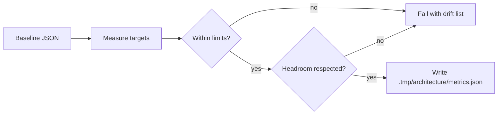

# Architecture Metrics and the Regression Ratchet

English | [简体中文](../../zh-CN/12-engineering-practice/08-architecture-ratchet.md)

## Learning Objectives

After this chapter, the reader can:

- explain why structural budgets need a monotonic ratchet;
- name every metric the ratchet measures and its target kind;
- run the measurement and the ratchet locally;
- change a threshold only through the relaxation and retirement contract.

## Problem Background

A governed Agent runtime grows by many small changes. Tests catch behavior
regressions, but they do not catch slow structural decay: a package absorbing
more internal dependencies, hot files growing past readability, and protocol
events dispatched from an ever-growing list of switch sites. Without explicit
structural budgets, the architecture drifts until one refactor becomes the
whole team's problem.

## Core Concepts

- **Target**: a package, file, or repository-wide scope that the ratchet measures.
- **Metric**: a countable property of a target, such as lines or dependencies.
- **Limit**: the current maximum allowed value in the baseline.
- **Baseline**: `docs/architecture-metrics-baseline.json`, the committed contract
  with schema version 1 and requirement id `ARCH-RATCHET-001`.
- **Relaxation**: a documented reason that allows a limit to increase.
- **Retirement**: a documented reason for removing a target or a metric.
- **Headroom**: how far below the limit the measured value may fall before the
  limit itself is considered stale.

## CodeHelper Design

Two complementary contracts guard the architecture. `docs/hotspot-baseline.json`
binds responsibility to Package Symbols and Owner Files and fails on misplaced
responsibility, unreviewed internal dependencies, hotspot growth, and deleted
test assets. `docs/architecture-metrics-baseline.json` constrains measurable
shape: direct internal package fanout, production lines, Options and Mutex
fields, hot file and function size, and duplicated protocol event switch sites.

The ratchet command `scripts/architecturemetrics` measures every target, fails
on drift, and optionally writes a measured report. The Makefile exposes
`make architecture-metrics` (measure only) and `make architecture-ratchet`
(measure plus enforce); the ratchet is part of `make verify` and of
`architecture-freeze`.

## Metrics

| Metric | Target kind | Meaning | Headroom |
| --- | --- | --- | --- |
| `internal_fanout` | package | distinct internal packages imported | 0 |
| `production_lines` | package | lines in non-test Go files | 100 |
| `options_fields` | package | fields in `*Options` structs | 0 |
| `mutex_fields` | package | `sync.Mutex` / `sync.RWMutex` fields | 0 |
| `lines` | file | total lines of the file | 20 |
| `max_function_lines` | file | lines of the longest function | 5 |
| `event_switch_sites` | repository | switch statements dispatching protocol events | 0 |

Discrete counts get no headroom: a limit equal to the measured value is the
steady state. Line counts keep headroom so normal edits do not churn the
baseline, while the ratchet still notices when a limit has silently become
stale.

## Ratchet Rules

Limits are monotonic: they may only decrease. Increasing a limit requires a
non-empty `relaxations` reason for that metric; removing a target or a metric
requires an explicit `retirements` reason. Stale entries fail the ratchet, so
a temporary allowance cannot silently become a permanent exception. When
`ARCHITECTURE_BASE_REF` is set (default `origin/main`), the command reads the
baseline at that ref and verifies monotonicity and the retirement bookkeeping
between revisions.

## Execution Flow



The command validates the baseline itself first: schema version, requirement
id, unique target ids, supported kinds, safe paths, non-negative limits, and
consistent relaxations and retirements. Measurement errors and stale headroom
are reported as one sorted drift list, and the command exits non-zero.

## Code Map

| Concern | Source | Why it matters |
| --- | --- | --- |
| Measurement and enforcement | `scripts/architecturemetrics/main.go` | AST-based counters for packages, files, and the repository |
| Threshold contract | `docs/architecture-metrics-baseline.json` | Single source of truth for limits |
| Make targets | `Makefile` | `architecture-metrics`, `architecture-ratchet`, `architecture-freeze` |
| Tests | `scripts/architecturemetrics/main_test.go` | Baseline validation, drift, headroom, and ratchet cases |

## Failure Modes and Security Boundaries

- A target whose path disappears fails measurement instead of passing silently.
- Removing a metric from a limit without a retirement fails the ratchet.
- A stale relaxation or retirement fails even when all limits are met.
- Baseline paths are validated to stay inside the repository; absolute or
  `..` paths are rejected.

## Tests and Verification

```bash
go test ./scripts/architecturemetrics
make architecture-ratchet
make book-check
```

The ratchet needs no network and no live provider; it is Hermetic. The measured
report is written to `.tmp/architecture/metrics.json` and is not tracked.

## Review Questions

1. Why are limits monotonic instead of self-updating?
2. What is the difference between a relaxation and a retirement?
3. When does the headroom check fail, and what does it prevent?
4. How does the `ARCHITECTURE_BASE_REF` comparison enforce the contract between revisions?

## Sources and Verification

| Item | Value |
| --- | --- |
| Catalog ID | `practice-architecture-ratchet` |
| Status | `draft` |
| Last verified | Not yet verified |
