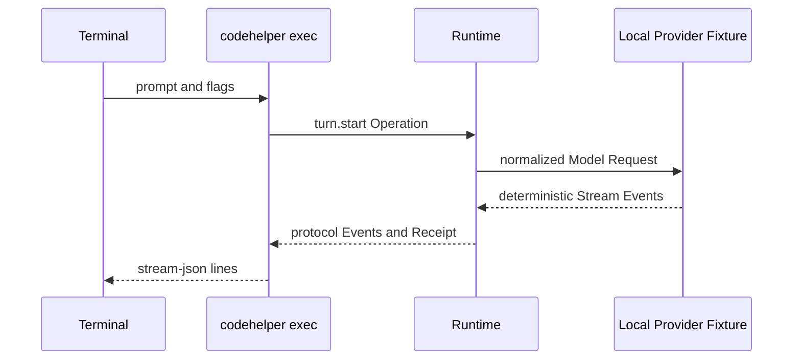

# Build and Trace the First Agent Turn

English | [简体中文](../../zh-CN/13-hands-on-labs/01-first-agent-turn.md)

## Learning Objectives

You will build CodeHelper, run a network-free Turn through the real Runtime,
read its event stream, map events back to source, and distinguish fixture
evidence from a live-provider test.

## Prerequisites

- Go 1.26 or newer, Git, and Make;
- a local clone of CodeHelper;
- the four foundational conceptual chapters in the core reading path;
- no API key or network access.

## Why Start with a Fixture?

A live Provider adds credentials, network, rate limits, model changes, and
cost. Those variables obscure the Runtime behavior this lab teaches.

The fixture starts a local deterministic HTTP server but still exercises:

- CLI parsing and Host projection;
- Runtime Operation/Event lifecycle;
- model route and normalized Provider stream;
- Agent Engine and context;
- receipts, usage, and terminal state.

It is hermetic at the Provider boundary, not a mocked replacement for the
whole application.

## Lab Topology



## Step 1: Inspect the Working Tree

```bash
git status --short
go version
```

The lab does not intentionally modify tracked files. Existing changes belong
to the user and must not be reset.

## Step 2: Build

```bash
make build
./bin/codehelper version
```

`make build` compiles `cmd/codehelper` and injects version, commit, build date,
Go version, OS, and architecture metadata.

## Step 3: Inspect Runtime Capability

```bash
./bin/codehelper doctor
./bin/codehelper sandbox status
```

Capability output is evidence about this machine. It does not grant permission
and does not guarantee that a strong Sandbox is available.

## Step 4: Run the Turn

```bash
tmp="$(mktemp -d)"
./bin/codehelper exec \
  --provider-fixture ./testdata/providers/openai \
  --provider openai \
  --model gpt-fixture \
  --workspace . \
  --data-dir "$tmp/state" \
  --output-format stream-json \
  "say hello"
rm -rf "$tmp"
```

The temporary data directory isolates durable state from normal development
sessions. The command should exit successfully and print one JSON Event per
line.

## Step 5: Read the Event Stream

Event names may include:

- `turn.started`: resolved Provider, Model, mode, posture, and workspace;
- `output.delta`: incremental model-visible answer;
- `usage`: input/output accounting from the fixture;
- `turn.receipt`: context, route, budget, latency, and verification evidence;
- `turn.completed`: the unique successful terminal Event.

Use `jq` when installed:

```bash
tmp="$(mktemp -d)"
./bin/codehelper exec \
  --provider-fixture ./testdata/providers/openai \
  --provider openai \
  --model gpt-fixture \
  --workspace . \
  --data-dir "$tmp/state" \
  "say hello" >"$tmp/events.ndjson"

jq -r '.kind' "$tmp/events.ndjson"
jq -c 'select(.kind == "turn.receipt")' "$tmp/events.ndjson"
rm -rf "$tmp"
```

Do not assume fields from this chapter; inspect the actual event and compare it
with `internal/runtime/protocol/message.go`.

## Step 6: Map Facts to Source

| Observed fact | Source entry |
| --- | --- |
| CLI flags and output format | `internal/host/cli/exec.go` |
| Operation/Event shape | `internal/runtime/protocol/message.go` |
| Queue and sequence | `internal/runtime/app/runtime.go` |
| Turn adaptation and receipt | `internal/runtime/app/application.go`, `receipt.go` |
| Model/Tool state machine | `internal/runtime/agent/engine/engine.go` |
| Fixture server | `internal/adapter/provider/fixture` |

Search by Event kind rather than reading files linearly:

```bash
rg 'EventTurnStarted|EventExecutionReceipt|EventTurnCompleted' internal/runtime
```

## Step 7: Run Focused Tests

```bash
go test ./internal/host/cli -run 'TestRunMachine'
go test ./internal/runtime/protocol -run TestOperationTaggedUnionRoundTrip
go test ./internal/runtime/app -run TestRuntimeConcurrentSubmitHasStrictSequenceAndUniqueTerminal
go test ./internal/runtime/agent/engine -run TestEngineExecutesToolAndFeedsResultOnce
```

Together these validate Host output, protocol encoding, lifecycle ordering, and
the iterative tool loop.

## Expected Result

The lab is successful when:

- the binary reports build metadata;
- the fixture Turn exits zero without an API key;
- events share stable Operation/Thread/Turn identity;
- a Receipt is present;
- exactly one terminal Event is present;
- focused tests pass;
- `git status --short` shows no new tracked modification caused by the lab.

## Failure Diagnosis

| Symptom | Likely cause | Action |
| --- | --- | --- |
| fixture directory not found | command is outside repository root | run from the repository root |
| unknown model/route | Provider or Model flags differ from fixture | use `openai` and `gpt-fixture` |
| malformed NDJSON | non-machine output mixed into stdout | keep `--output-format stream-json` |
| Sandbox unavailable | platform cannot satisfy a requested strong boundary | inspect `sandbox status`; do not bypass silently |
| test cleanup error | temporary process or Git handle still open | rerun focused test and inspect process lifecycle |

## Cleanup

The examples remove their temporary directory. If interrupted:

```bash
find "${TMPDIR:-/tmp}" -maxdepth 1 -type d -name 'tmp.*' -mtime +1
```

Review candidates before deleting them. The lab does not modify the local
DeepSeek credential Runbook.

## From Fixture to Live Provider

Only after the fixture path works should you configure a credential reference
and run a live model. A live call validates network/provider compatibility; it
does not replace deterministic Runtime tests.

For the repository owner's macOS setup:

```bash
make deepseek-init
```

Use the maintained [local DeepSeek guide](../../../en/deepseek-local.md) and
never place a raw key in tracked documentation or command output.

## Review Questions

1. Which real Runtime components remain active when a Provider Fixture is used?
2. Why is a Receipt stronger evidence than assistant prose?
3. Which extra variables enter when moving from Fixture to live Provider?

## Further Reading

- [Turn lifecycle](../02-codehelper-overview/05-turn-lifecycle.md)
- [Model, Context, and Tool](../02-codehelper-overview/06-model-context-and-tool.md)
- [Getting started](../../../en/getting-started.md)

## Sources and Verification

| Item | Value |
| --- | --- |
| Catalog ID | `lab-first-turn` |
| Status | `verified` |
| Last verified | 2026-08-06 |
