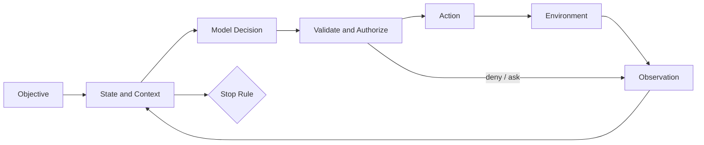

# 从 Chatbot 到 Agent

简体中文 | [English](../../en/01-agent-engineering/01-from-chatbot-to-agent.md)

## 学习目标

读完本章后，你可以：

- 区分 Text Generator、Chatbot、Assistant 与 Agent；
- 将 Agent 理解为反馈控制循环，而不是一段更长的 Prompt；
- 识别 Environment、Action、Observation、State、Objective 与 Stop Rule；
- 理解自主性如何同时扩大价值和故障面；
- 将这些概念映射到 CodeHelper Runtime。

## 1. 能力阶梯

LLM 将输入 Token 序列映射为下一个 Token 的概率分布，产品能力来自模型周围的系统。

| 系统 | 输入 | 可影响对象 | 状态 | 停止条件 |
| --- | --- | --- | --- | --- |
| Text Generator | 单次 Prompt | 无 | 无 Durable State | Response 结束 |
| Chatbot | Message | 对话 | Message History | 回答结束 |
| Assistant | Message/Context | 委托 API | Session | Task Response |
| Agent | Objective/Observation | 通过 Action 影响环境 | Explicit Task State | Goal、Budget、Deny、Failure、Cancel |

判断边界的关键不是 UI 是否像聊天。无气泡的 CLI 可以是 Agent；只返回文本的精美 Chat UI
仍不是 Agent。

## 2. 最小 Agent 模型

在第 \(t\) 步，Agent 接收 Observation \(o_t\)，更新 State \(s_t\)，选择 Action
\(a_t\)，再从 Environment 获得下一条 Observation：

```text
s(t+1) = update(s(t), o(t))
a(t)   = policy(objective, s(t), available_actions)
o(t+1) = environment(a(t))
```

对 Coding Agent：

- **Objective**：修复 Parser Test；
- **Environment**：Repository、Process、Diagnostics、Remote Service；
- **Observation**：File、Search Hit、Command Output、Tool Failure；
- **Action**：Read、Search、Edit、Execute、Ask、Delegate；
- **State**：Working Set、Plan、Evidence、Approval、Change、Budget；
- **Stop Rule**：Verified、Blocked、Denied、Canceled、Exhausted。

Model 可以参与选择 `a(t)`，但周围系统必须拥有其余环节。



## 3. 为什么必须是闭环

Chatbot 可能错一次；Agent 会基于错误 Observation 选择下一步、修改 Environment，并在多步
中放大错误。因此工程系统必须提供：

1. **Grounding**：Observation 来自可检查 Source；
2. **Control**：Action Proposal 必须验证和授权；
3. **Memory**：Current Fact 与 Old/Assumed Fact 分离；
4. **Termination**：Success/Failure 由外部标准判断，而非模型自信。

自主性不是开关，而是在 Budget 和 Stop Policy 下委托 Authority。

## 4. Coding Agent 的完整循环

以“重命名配置字段且不破坏调用方”为例：

1. 检查 Repository Structure；
2. 定位 Definition/Reference；
3. 理解 Contract 和 Affected Test；
4. 选择或提出 Edit；
5. 必要时获取 Approval；
6. Transactional Apply；
7. Focused Verification；
8. Repair、Revert 或报告 Evidence。

模型说“已重命名且测试通过”不等于 4-7 真正发生。工程化 Agent 必须分离 Claim 与 Receipt。

## 5. CodeHelper 映射

CodeHelper 把外部请求称为 `Operation`，可观察事实称为 `Event`。Turn 具有稳定的
Thread/Turn/Item Identity。Application Runtime 接收并排序 Operation；Agent Engine
执行 Model/Action Loop；Provider/Tool 是 Environment Adapter。

| Agent 概念 | CodeHelper Owner |
| --- | --- |
| Objective | `StartTurnPayload` |
| Stable Identity | `internal/runtime/protocol` |
| State/Termination | `internal/runtime/app` |
| Decision/Action Loop | `internal/runtime/agent/engine` |
| Model Proposal | `internal/adapter/provider` |
| Environment Action | Governed Tool Executor |
| Authorization | Tool Guard、`internal/security` |
| Evidence | Event、Receipt、Journal、Trace |

Host 只提交 Operation、投影 Event，不实现第二套 Agent Loop。

## 6. 常见误解

**“Agent 就是带 Tool 的 LLM。”** Tool 只增加可能的 Action，不提供 State、
Authorization、Recovery、Termination。

**“模型越强，工程越少。”** 更好的动作选择不会自动让 Side Effect 幂等，也不会解决
Approval Race。

**“自主性越高越好。”** 路径明确时 Workflow 更好；后果重大且意图模糊时 Human
Approval 更好。

**“Reasoning Text 就是 Agent State。”** Reasoning 是模型输出；Runtime State 必须
Typed、Bounded、Reconstructable。

## 7. 故障分析

| 故障 | 根本工程问题 |
| --- | --- |
| 修改错误文件 | Resource Identity 是否 Grounded/Checked？ |
| 重复执行命令 | Action 是否 Idempotent/Fenced？ |
| 无限循环 | Budget/Terminal Rule 是否强制？ |
| 信任恶意仓库文本 | Data 与 Instruction 是否分离？ |
| 声称测试通过但未运行 | Verification 是否有 Evidence？ |
| Cancel 后仍运行 | 谁拥有 Cancellation/Child Process？ |

即使由模型触发，这些仍是系统故障。

## 8. 源码实验

```bash
sed -n '457,478p' internal/runtime/protocol/message.go
sed -n '1706,1755p' internal/runtime/protocol/message.go
go test ./internal/runtime/app -run TestRuntimeApprovalPauseResumeE2E
```

从测试中识别 Objective、State Owner、Observation、Terminal Event 与 Evidence。测试名
漂移时先运行 `go test -list 'E2E|EndToEnd' ./internal/runtime/app`。

## 9. 复习问题

1. Agent 与多轮 Chatbot 的本质差异是什么？
2. 闭环中哪些部分不能委托给模型文本？
3. 为什么 Autonomy、Authority、Intelligence 是三个维度？
4. 什么证据可以证明 Coding Task 完成？

## 下一章

[LLM、Token、Context Window 与 Sampling](./02-llm-token-and-context.md)解释闭环内部
概率模型的能力与限制。

## 事实来源与验证

| 项目 | 值 |
| --- | --- |
| Catalog ID | `agent-from-chatbot-to-agent` |
| 状态 | `verified` |
| 最后验证 | 2026-08-06 |
