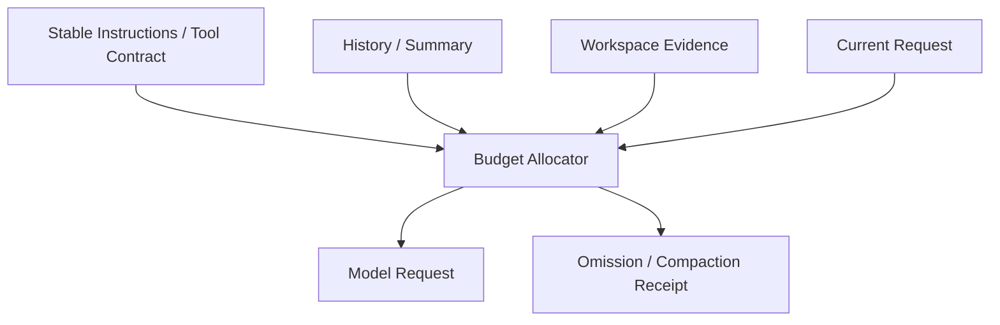

# LLM、Token、Context Window 与 Sampling

简体中文 | [English](../../en/01-agent-engineering/02-llm-token-and-context.md)

## 学习目标

理解模型是概率序列组件，能够计算 Agent Turn 的实际 Context Budget，并区分 Model
Limit 与 Runtime Guarantee。

## 1. 模型计算什么

给定 Token \(x_1...x_n\)，Autoregressive LLM 估计：

```text
P(x(n+1) | x(1), ..., x(n))
```

生成过程不断选择下一个 Token。模型本身不知道 File、Tool、Permission、Time、Cost，
也不知道 Action 是否成功；这些事实必须进入输入或作为 Observation 返回。

工程上可抽象为：

```text
ModelRequest(messages, tools, limits) -> Stream(text, reasoning, tool calls, usage)
```

CodeHelper 使用 `provider.ModelRequest` 和 `provider.Stream` 归一化；Adapter 再翻译成
OpenAI Chat/Responses、Anthropic 或 Fixture Wire Format。

## 2. Token 是预算单位

Token 不是字符或单词。Tokenization 随模型、语言、Identifier、Whitespace、Unicode、
JSON 和源码变化。因此：

- Character Count 只是估计；
- Tool Schema 和重复 Prefix 会占用 Token；
- 大 Tool Result 会与 Source/History 竞争；
- Output/Reasoning 必须预留同一 Request Limit。

Provider Usage 是可用时的计费 Evidence；Estimated Token 只是 Planning Data。

## 3. Context Window 是共享预算

模型上限为 \(W\) 时：

```text
input + reserved_output + provider_overhead <= W
```

Agent Input 不只是 User Prompt：

```text
system instructions
+ conversation/history
+ workspace/editor context
+ repository map/evidence
+ tool descriptors
+ prior tool results
+ memory/compaction summaries
```

只截尾可能丢失当前问题，只截头可能丢失安全约束。因此 Context Engineering 需要
Priority、Lifecycle、Provenance 与 Explicit Omission。



## 4. Sampling 与确定性

Logit 常通过 Temperature \(T\) 转为 Probability：

```text
P(i) = exp(logit(i) / T) / sum(exp(logit(j) / T))
```

低 Temperature 使分布更尖锐，高 Temperature 更分散。Top-p 只保留一定概率质量。
Provider Default、Model Version、Parallelism、Float Kernel 和 Hidden Reasoning 仍可造成
差异；`temperature=0` 不是 Transactional Guarantee。

工程应对方式：

- 用 Recorded Fixture 测试 Protocol Parsing；
- Action 前验证 Model Output；
- Side Effect 使用 Idempotency/Fencing；
- 从 Environment 验证 Outcome；
- 测试不要依赖精确措辞。

## 5. Message、Role 与 Tool Call

Message 是 Structured Input，不是 Security Boundary。Repository File 即使进入 Message，
其中的指令仍是不可信数据。Role Precedence 帮助模型理解意图，但不授权 OS Action。

Tool Call 也是 Generated Data：

```json
{"name":"file_edit","arguments":{"path":"config.go","old":"A","new":"B"}}
```

执行前必须验证 Tool Identity、Catalog Generation、JSON Schema、Resource Claim、
Capability、Policy、Approval 与 Sandbox。

## 6. Capability 是多维的

Model Selection 不能只看名称或 Context Size，还需考虑：

- Text、Image、Reasoning、Tool；
- Streaming Protocol 与 Usage；
- Input/Output/Tool Count Limit；
- Parallel Tool Call；
- Structured Output；
- Latency、Rate Limit、Price、Data Policy。

CodeHelper 依据 Requested Capability 和 Catalog Evidence 解析 Route；未知能力不会从
Model Name 猜测。

## 7. 故障模式

| 现象 | 可能原因 | Runtime 响应 |
| --- | --- | --- |
| 忽略关键文件 | Context Competition | Provenance/Omission Receipt |
| Tool JSON 不完整 | Stream Interrupt/Limit | Assemble 后 Validate |
| 相同 Prompt 不同 | Sampling/Provider Drift | Fixture/Outcome Verification |
| Request 被拒 | Limit/Capability Mismatch | Call 前 Route Validation |
| 成本异常 | Schema/History Growth | Usage/Budget |
| 恶意文件改变行为 | Instruction/Data 混淆 | Trust Boundary/Action Guard |

## 8. 源码导读

```bash
sed -n '126,190p' internal/adapter/provider/types.go
sed -n '417,435p' internal/adapter/provider/types.go
go test ./internal/runtime/agent/promptcontext
go test ./internal/adapter/provider/openai -run 'Test.*Stream'
```

Adapter 证明 Provider 发出了什么；Budget 决定请求可包含什么；两者都不授权 Tool Effect。

## 9. 实用准则

1. 保留 Current Intent 和 Hard Constraint；
2. Source Evidence 优先于重复叙述；
3. 发送满足任务的最小 Tool Catalog；
4. 可压缩旧交互，但不伪造缺失事实；
5. 预留 Output/Tool Result 容量；
6. Usage、Truncation、Compaction 必须可观察。

## 10. CodeHelper Token 效率案例

CodeHelper T0-T6 的 Canonical DeepSeek 实测给出一个重要的计量结论。在保持相同
Prompt 与 Model Family 时，累计 Input P50 从 394,163 降至 157,507，Reasoning
P50 从 7,838 降至 4,709，Sample Count 从 12 降至 9，第三个 Sample 后 Cache
Share 达到 93.86%。

这些收益不代表所有门禁都通过。Uncached Input 从 64,520 降至 32,634，降幅
49.42%，未达到 60% 目标。因此有效报告必须分别展示 Cumulative Input、Uncached
Input、Cache Share、Reasoning 与 Sample Count。Incremental Protocol 的 Transport
Byte 降幅是另一个独立指标，不能报告成 Token 降幅。

## 11. 复习问题

1. 为什么 Context Window 不是 Model Memory？
2. 为什么 `temperature=0` 仍可能产生不同结果？
3. Coding Agent 的 Context 由哪些输入竞争？
4. 为什么有效 Tool Call 仍未获得授权？

## 下一章

[ReAct、Planning、Tool Calling 与 Reflection](./03-react-planning-and-tools.md)
解释如何将 Sampling 变为有界 Action Loop。

## 事实来源与验证

| 项目 | 值 |
| --- | --- |
| Catalog ID | `agent-llm-token-context` |
| 状态 | `draft` |
| 最后验证 | 尚未验证 |
