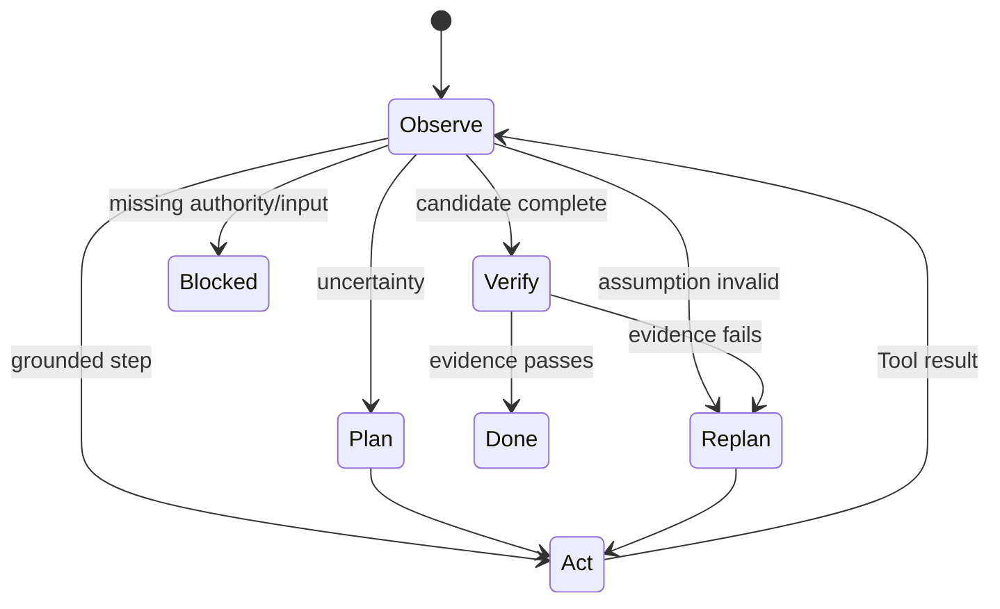

# ReAct、Planning、Tool Calling 与 Reflection

## 学习目标

理解 Agent 的主要控制模式、典型失败，并理解 CodeHelper 如何把 Model Proposal 转化为
受治理的 Observation。

## 1. ReAct 是 Observation Loop

```text
observe -> decide -> act -> observe result -> decide again
```

ReAct 的核心不是展示私有 Reasoning，而是把 Environment Result 反馈给下一次 Decision：

```text
Objective: 修复 Parser Regression
Observation: Failing Test 指向 EOF
Action: 搜索 Parser 与 Test
Observation: Scanner 丢失无换行的最终 Token
Action: 读取 Function/Caller
Observation: Contract 允许 EOF-terminated Token
Action: 提出 Edit
Observation: Edit 获批并应用
Action: 运行 Focused Test
Observation: Test Pass
Stop: Objective Verified
```

每个 Action 都应减少不确定性或推进可验证计划。

## 2. Plan 是控制产物

有效 Plan 不是装饰性文字，而是外化：

- Decomposition/Dependency；
- Pending/In-progress/Completed；
- 每步 Expected Evidence；
- Approval/User Input Point；
- Replan Trigger。

多文件、模糊、长任务需要 Plan；简单 Read 不需要五步 Plan。Plan 也不能授权自身 Action。



## 3. Tool Calling 有两层 Contract

**Model Contract** 描述 Model 可请求的 Name、Description、Input Schema。
**Execution Contract** 还需定义：

- Capability/Resource Access；
- Catalog Identity/Generation；
- Parallelism Policy；
- Sandbox Requirement；
- Availability/Limit；
- Result/Truncation/Error。

因此 Prompt-visible Tool Description 不能成为 Authority。CodeHelper 的
`tool.Descriptor` 同时承载两类字段，`Guard.ExecuteBound` 在 Policy/Execution 前完成
Resolve/Validate。

## 4. Reflection 必须基于 Evidence

有效 Reflection 比较 Evidence 与 Objective：

```text
发生了什么变化？
什么仍未证明？
哪个假设失败？
最便宜的下一条 Observation 是什么？
应该 Repair、Revert、Ask 还是 Stop？
```

没有新 Evidence 时反复要求模型“再想想”，通常只增加 Cost/Confidence。Reflection 应由
Tool Failure、Contradiction、Verification Failure、Compaction、Denial、Unexpected
Diagnostic 等事件触发。

## 5. Tool Result 的三个受众

1. **Model**：下一决策需要的 Bounded Content；
2. **Runtime**：Structured Metadata、Evidence、Change、Diagnostic；
3. **Operator**：调查所需 Receipt/Log。

Runtime 不应解析模型可见 Prose 来猜测变更。大 Output 应 Truncate 并提供 Handle，而非
静默丢弃。

## 6. Parallelism 与 Ordering

只有 Resource/Policy 不冲突时才能并行。两个 Search 可并发，重叠路径的 Edit 必须串行
或拒绝；Model Call Order 不是 Lock。

Scheduler 必须保证 Unique Call ID、Bounded Concurrency、Deterministic Association、
Cancellation、Conflict-aware Serialization，以及每个 Call 唯一 Observation。

## 7. 反模式

| 反模式 | 问题 | 修正 |
| --- | --- | --- |
| 未读先改 | 基于猜测 | Read-before-edit |
| Plan 不更新 | 失去控制状态 | 每次 Transition 更新 |
| Retry 所有错误 | 重复 Side Effect/循环 | Typed Retry |
| 无新数据 Reflection | 只有叙事 | 获取 Observation 或 Stop |
| 直接执行 Tool JSON | Schema 被当 Authority | Guard/Policy |
| 只看 Exit 0 | 语义目标可能失败 | Targeted Verification |
| 全部并行 | Resource Conflict | Descriptor/Claim |

## 8. 源码导读

```bash
sed -n '138,180p' internal/adapter/tool/tool.go
sed -n '278,340p' internal/adapter/tool/guard/guard.go
go test ./internal/runtime/agent/engine \
  -run 'Test.*(ProposedPlan|ToolFailure|Scheduler)'
go test ./internal/adapter/tool/guard \
  -run 'TestAliasDeferredUnknownAvailabilityAndSandboxFailClosed'
```

Rejected/Failed Tool 是下一条 Observation，不自动构成 Bypass/Retry 理由。

## 9. 设计练习

针对“升级 Dependency 并修复 Caller”，写出：

1. 前三条必要 Observation；
2. 带 Evidence Completion Criteria 的 Plan；
3. 每个 Tool 的 Resource Claim；
4. 可并行调用；
5. Approval Point；
6. Verification/Rollback。

若 Plan 在观察前假定 File/Command 存在，应显式标记并增加 Discovery。

## 10. 复习问题

1. 什么使 Plan 成为控制产物？
2. 为什么 Model/Execution Tool Contract 不同？
3. Reflection 何时提高可靠性？
4. 为什么不能只按 Call Order 决定并发？

## 下一章

[Agent、Workflow 与 Automation 的边界](./04-agent-workflow-boundaries.md)解释何时适合
Adaptive Loop，何时应使用 Deterministic Orchestration。

## 事实来源与验证

| 项目 | 值 |
| --- | --- |
| Catalog ID | `agent-react-planning-tools` |
| 状态 | `draft` |
| 最后验证 | 尚未验证 |
