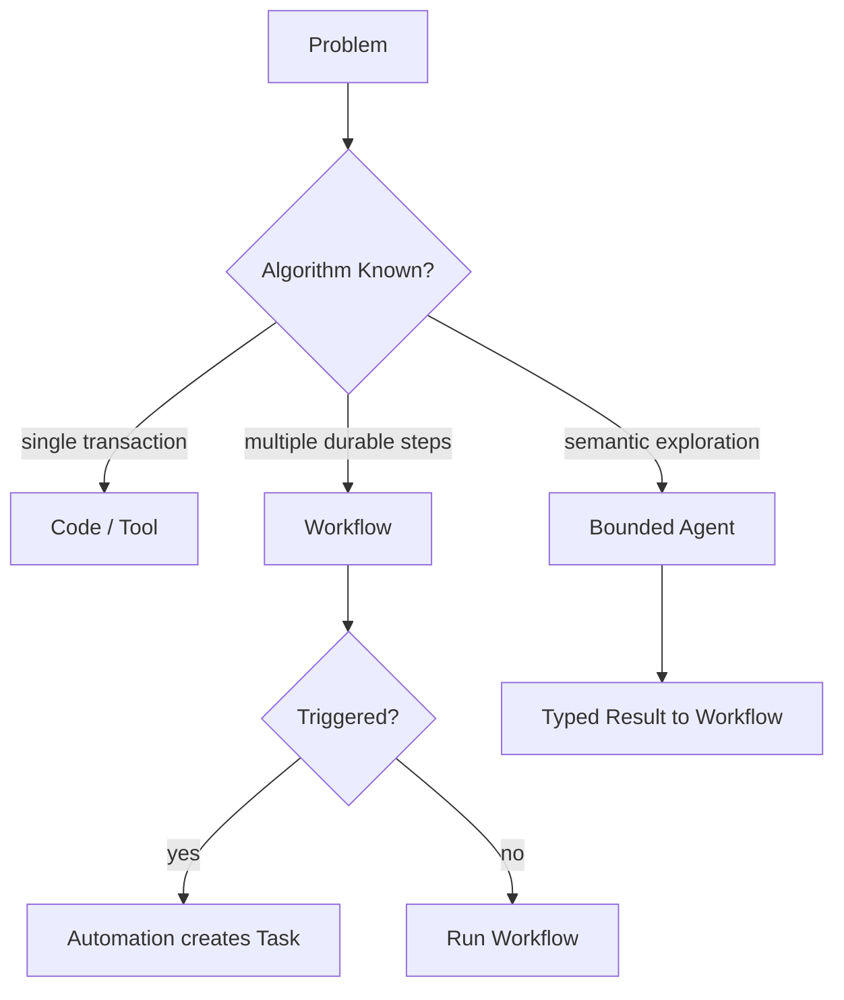

# Agent、Workflow 与 Automation 的边界

简体中文 | [English](../../en/01-agent-engineering/04-agent-workflow-boundaries.md)

## 学习目标

能够在 Adaptive Agent、Deterministic Workflow、Scheduled Automation 与普通代码之间
选择，并在组合时保留 Authority/Recovery Boundary。

## 1. 四种不同机制

| 机制 | 适用情况 | Control Flow | 主要风险 |
| --- | --- | --- | --- |
| Function/Script | Input/Algorithm 已知 | Deterministic Code | Implementation Defect |
| Workflow | Step/Dependency 已知 | DAG/State Machine | Recovery/Idempotency |
| Automation | Trigger/Repeated Operation 已知 | Schedule/Event → Task | Duplicate/Stale Run |
| Agent | Next Step 依赖语义 Observation | Model/Action Loop | Uncertainty 下错误 Action |

Parser 或 State Machine 足够时使用 Agent，会增加 Cost、Nondeterminism、Attack Surface；
开放式 Repository Investigation 强行写成 Workflow，则产生脆弱分支。

## 2. 选择顺序

1. Ordinary Typed Code 能完整解决吗？
2. Step 已知但 Long-running/Recoverable？使用 Workflow。
3. 是否由 Schedule/Event 重复触发？使用 Automation 创建 Task。
4. Next Step 是否需要 Semantic Interpretation？在 Bounded Step 内使用 Agent。



常见的最佳结构是 Hybrid：Deterministic Orchestration 拥有 Progress/Recovery，Agent
只负责一个 Bounded Semantic Step。

## 3. Determinism 的层次

Static Graph 不代表整个 Workflow Deterministic，External Effect、Clock、Retry、Agent
Node 仍可变化。应确定化：

- Node Identity/Dependency；
- Input/Output Schema；
- Checkpoint/Transition；
- Retry Classification/Backoff；
- Idempotency/Fencing；
- Terminal/Compensation。

Nondeterminism 只存在于声明过的 Node，并记录 Input、Output、Route、Usage、Evidence。

## 4. Task、Worker 与 Lease

Long-running Work 需要 Durable Ownership：

- **Task**：Desired Work/Lifecycle；
- **Worker**：Claim/Execute；
- **Lease**：Worker 消失后 Expire；
- **Heartbeat**：证明 Ownership；
- **Generation/Fencing Token**：拒绝 Stale Completion；
- **Retry Policy**：分类可重试 Failure。

即使只在单机，这也是 Distributed-systems Control，不是 Model Reasoning。

## 5. Automation 只是 Trigger

Automation 将 RRULE/Event 映射到 Task/Workflow，必须定义 Timezone、Missed Run、
Dedup Slot、Overlap Policy、Enabled State、Catch-up Bound、Workspace/Authority、
Observability/Cancellation。

Schedule 不授予新 Permission；触发的工作仍通过同一 Guard/Policy。

## 6. Human Interaction

以下情况应暂停等待 Human：

- Intent Ambiguous 且 Consequence 不同；
- Policy 要求 Approval；
- Credential/External Decision 缺失；
- Destructive Recovery 无法安全推断。

不要要求用户重复 Workspace 已提供的事实。Input Request 是 Durable Protocol State，
不是藏在 Worker 内的 Blocking Terminal Prompt。

## 7. Failure/Recovery Matrix

| Failure | Agent-only | Workflow-owned |
| --- | --- | --- |
| Model Timeout | Budget 内 Retry/Re-route | Node Retryable |
| Process Crash | In-memory Plan 丢失 | Checkpoint 重建 |
| Duplicate Trigger | 可能重复 Action | Slot/Idempotency 拒绝 |
| Stale Worker | 难检测 | Lease Generation 拒绝 |
| Approval Pending | Loop Block | Explicit Paused State |
| Partial Effect | Model 猜测 | Journal/Compensation |
| Graph Changed | Prompt Drift | Compatibility Fail |

## 8. CodeHelper 边界

Agent Loop 位于 `internal/runtime/agent`。Durable Task、Worker、Automation、Workflow、
Lane、Fleet、Subagent 位于 `internal/orchestration`。Host 只提交 Command、展示 State。

这避免把未追踪 Agent Loop 嵌入 Worker/Host，也避免让模型用 Prose 实现 Lease、Retry、
Checkpoint、DAG。

## 9. 验证

```bash
go test ./internal/orchestration/task ./internal/orchestration/worker
go test ./internal/orchestration/workflow/...
go test ./internal/orchestration/automation
sed -n '1,220p' internal/orchestration/workflow/spec.go
sed -n '1,220p' internal/orchestration/task/repository.go
```

观察 Typed State/Invariant，而非 Prompt Convention。

## 10. 架构练习

设计“每个工作日检查 Dependency Alert 并准备安全修复”：

- Automation 为每个 Slot 创建 Deduplicated Task；
- Workflow 加载 Alert、分组 Repository、Checkpoint；
- Agent 调查每个 Bounded Repository Problem；
- Guard 控制 Read/Write/Network/Approval；
- Deterministic Verification/Review 决定完成；
- Worker Crash 从最新 Checkpoint 恢复。

说明哪些 Failure Retry Node、Restart Agent Step、Require Human 或 Terminate Workflow。

## 11. 复习问题

1. Workflow 何时优于 Agent？
2. Static DAG 为什么不等于完全确定？
3. Lease Generation 保护什么？
4. Automation 能否授予 Authority？
5. Bounded Agent Node 应返回到哪里？

## 下一章

[为什么 Agent 需要受治理的 Runtime](./05-why-governed-runtime.md)将 Model、Action Loop
与 Orchestration Boundary 统一到本地控制面。

## 事实来源与验证

| 项目 | 值 |
| --- | --- |
| Catalog ID | `agent-workflow-boundaries` |
| 状态 | `verified` |
| 最后验证 | 2026-08-06 |
