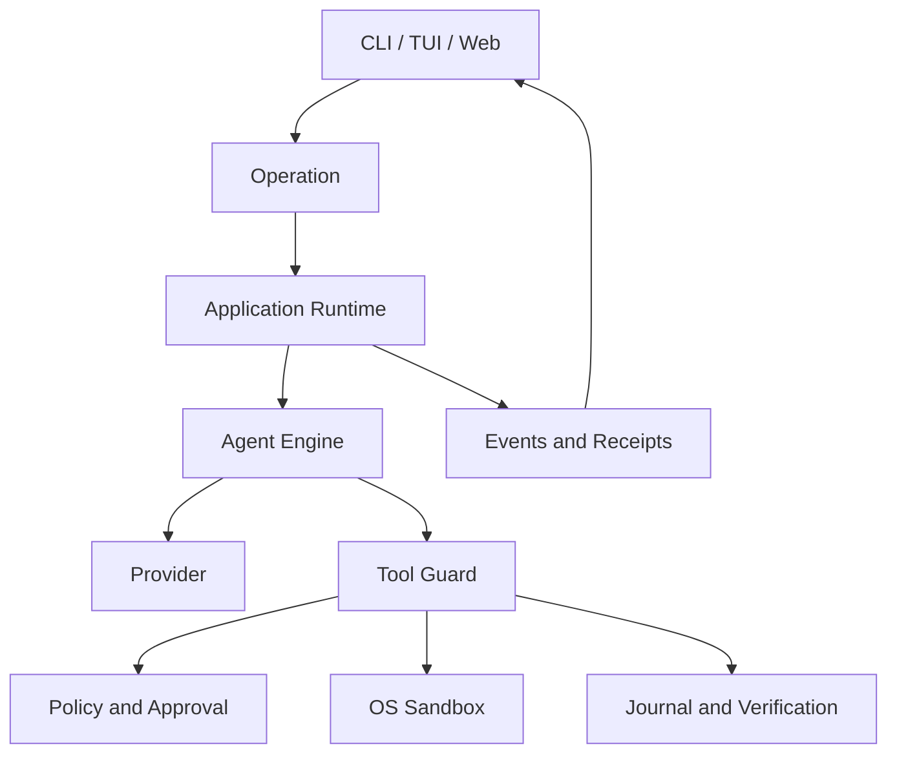

# 为什么 Agent 需要受治理的 Runtime

## 学习目标

理解为什么 Coding Agent 不能只是 LLM API 循环，识别 Runtime 必须拥有的权限边界，
并区分模型智能与执行可靠性。

## 前置知识

先完成前四章；无需预先阅读 CodeHelper 源码。本章将前述概念统一映射到 Runtime。

## 综合：从概率输出到受控工作

前四章建立了四条约束：

| 前置概念 | 对 Runtime 的要求 |
| --- | --- |
| Agent 是反馈闭环 | State Transition/Stop Rule 不能只存在于 Prose |
| Model Output 是概率性的 | Action/Outcome 必须 Validate/Verify |
| Tool Call 是 Proposal | Authorization 必须位于 Model 外部 |
| Workflow 拥有 Durable Progress | Retry、Lease、Checkpoint、Agent Step 边界显式 |

因此需要三条相互独立的控制线：

1. **Authority**：以什么 Identity，可以对哪个 Resource 做什么；
2. **State**：什么已接受、观察、完成、暂停、取消；
3. **Evidence**：什么证明 Action 与 Outcome。

缺少任一条，系统可能很智能，但在运行上不可信。

## 问题背景

Chatbot 把消息映射为消息；Coding Agent 还会读取仓库、启动进程、修改文件、访问服务，
并连续执行多个步骤。能力增加后，会出现模型自身无法通过“生成更好的文本”解决的问题：

- 谁验证 Tool 名称、Schema 和 Resource Claim？
- Tool 可以访问哪些文件和网络地址？
- Approval 在取消后到达时怎么办？
- 中断的编辑能否恢复？
- 多个 Client 如何观察同一个 Turn？
- 什么证据能证明 Verification 确实运行过？
- Retry 会不会重复产生副作用？

最小演示循环通常只是：

```text
发送消息 -> 收到 Tool Call -> 执行 Tool -> 追加结果 -> 重复
```

Runtime 的职责是把缺失的身份、权限、状态和证据问题确定性地解决在模型之外。

## 核心概念

**智能**选择可能的下一步动作；**权限**决定动作是否可以影响现实；**执行**产生效果；
**证据**记录发生了什么。这四者不能混为一体。

受治理 Runtime 需要统一管理：

- Operation、Turn、Item、Call 和 Workspace Identity；
- 状态转换与唯一 Terminal Outcome；
- Model Route 和有界 Context；
- 类型化 Tool Discovery 与 Execution；
- Policy、Approval、Constitution 和 Sandbox；
- Event、Journal、Receipt、Usage 和 Trace；
- Cancellation、Retry、Recovery 和 Concurrency。

模型输出、仓库内容和远端 Tool Output 都是不可信输入。

## CodeHelper 设计

CodeHelper 在所有 Host 与有副作用实现之间放置一套共享 Runtime：



这样，Host 不能通过建立自己的 Tool 路径获得额外权限；同一个 Operation 从终端、
编辑器或 API 发起时，也具有相同的安全和持久化语义。

## 执行流程

1. Host 创建类型化 Operation。
2. `internal/runtime/app` 验证、接收、排序并分发。
3. `internal/runtime/agent` 组装 Context 并调用 Provider。
4. Model 请求的 Tool 通过类型化 Registry 解析。
5. `internal/adapter/tool/guard` 检查 Resource 与 Policy。
6. 获批工作在要求的 Sandbox 和 Journal 边界内执行。
7. Runtime 产生有序 Event 和最终 Receipt。
8. 不同 Host 根据相同事实构建各自 UI Projection。

模型不直接拥有进程、文件系统、Approval Cache、Event Cursor 或 Durable Task Lease。

## 代码地图

| 关注点 | 源码 | 意义 |
| --- | --- | --- |
| Operation/Event | `internal/runtime/protocol` | 所有 Host 的共享契约 |
| Lifecycle | `internal/runtime/app` | 排序、取消、Terminal State |
| Model/Tool Loop | `internal/runtime/agent` | 多步骤推理与行动 |
| Action Boundary | `internal/adapter/tool/guard` | 单一 Policy 与 Evidence 路径 |
| Hard Control | `internal/security` | Policy、Constitution、Permission、Sandbox |
| Durable Fact | `internal/persist` | Restart 与 Audit 不依赖内存 |
| Evidence | `internal/observability` | Usage、Trace、Diagnostics、Verification |

## 实现导读

`app.Runtime` 管理 Operation Queue、Active Turn、Subscriber、Terminal Event、
Pending Approval 和 Idempotency Record。它通过 `Engine` Interface 支持 Start、
Cancel、Steer、Approval、Input、Compact、Fork 和 Revert，而不依赖具体 Provider。

`agent/engine.Engine` 管理 Model/Tool 状态机，产生 `calling_model`、
`running_tools`、`awaiting_approval`、`verifying` 等状态。Tool Call 进入
`Guard.ExecuteBound` 后，只有通过资源验证和 Policy 才会运行 Executor。

核心边界是：智能编排属于 Agent Engine，授权与副作用属于 Guard 和 Platform。

## 设计取舍与替代方案

直接函数调用的单进程 Demo 更小，但会让 UI 与实现耦合，使 Restart 语义偶然化，并让
新功能形成额外权限路径。远端控制面可以统一策略，却把本地源码和执行权移过网络边界。
CodeHelper 选择本地单 Runtime，并通过协议服务多种 Host。

治理会增加 Validation、Approval、Journal 和 Verification 成本。收益是失败可观察、
权限可限制、运行可恢复。

## 失败模式与安全边界

- 未知或 Malformed Operation 被明确拒绝。
- Operation Queue 满时返回可重试的 Resource Exhausted。
- 缺少 Grant、未知 Capability 或 Policy 不可用时拒绝执行。
- Approval 无人响应时过期，不转化为隐式允许。
- Strong Sandbox 不可用时 Fail Closed。
- Cancellation 产生 Terminal Event 并释放资源。
- 相同 Idempotency Key 绑定不同内容时发生 Conflict。
- Slow Subscriber 可以被移除而不阻塞 Runtime。

Runtime 不证明任意生成代码是安全的；代码审查、测试与备份仍然必要。

## 测试与验证

```bash
go test ./internal/runtime/app \
  -run 'TestRuntime(ConcurrentSubmitHasStrictSequenceAndUniqueTerminal|CancelActuallyCancelsActiveTurn|UnsupportedOperationIsExplicitlyRejected)'

go test ./internal/adapter/tool/guard \
  -run 'Test(PendingApprovalExpiresFailClosed|AliasDeferredUnknownAvailabilityAndSandboxFailClosed)'
```

## 动手实验

```bash
make build
./bin/codehelper exec \
  --provider-fixture ./testdata/providers/openai \
  --provider openai \
  --model gpt-fixture \
  --workspace . \
  --output-format stream-json \
  "say hello"
```

观察输出是带 Operation/Turn Identity 的 Event Stream，而不是原始 Provider Response。
Fixture Contract 明确要求输入 `say hello`。

分别记录一条控制线的实例：

- Authority：Tool Descriptor、Policy Decision 或 Approval Event；
- State：Operation、Ordered Event 或 Terminal Outcome；
- Evidence：Usage、Verification Event、Receipt 或 Journal Entry。

## 复习问题

1. 为什么 Model 生成 Tool Call 不等于授权？
2. Host 直接执行 Tool 会重复哪些职责？
3. 什么证据能区分“模型声称测试过”和真正的 Verification？

## 延伸阅读

- [架构手册](../../../zh-CN/architecture.md)
- [安全手册](../../../zh-CN/security.md)
- [系统架构](../02-codehelper-overview/02-system-architecture.md)
- [构建并追踪第一个 Agent Turn](../13-hands-on-labs/01-first-agent-turn.md)

## 事实来源与验证

| 项目 | 值 |
| --- | --- |
| Catalog ID | `agent-why-governed-runtime` |
| 状态 | `draft` |
| 最后验证 | 尚未验证 |
