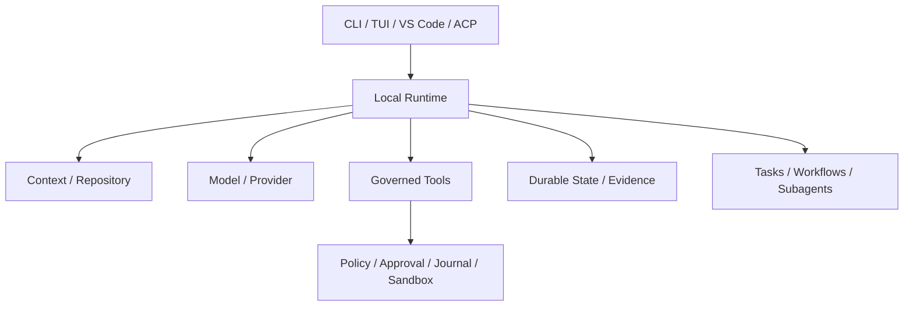

# 项目定位、价值与非目标

简体中文 | [English](../../en/02-codehelper-overview/01-positioning-and-non-goals.md)

## 学习目标

准确说明 CodeHelper 是什么、服务谁、拥有哪些工程问题，以及它有意不作出哪些诱人但
不严谨的承诺。

## 1. 一个项目，两项交付

CodeHelper 同时是：

1. 被 Terminal、Editor、API、Worker、Orchestration 共享的**本地受治理 Coding Agent
   Runtime**；
2. 所有结论都连接同一套 Source、Test、Fixture、Failure Mode 的**可执行 Agent 工程
   知识书籍**。

Runtime 是书籍研究的产品；书籍是 Runtime 的持续维护学习界面。两者都不是对方的演示
包装。

## 2. 项目解决什么

CodeHelper 从 Raw Model Call 结束的位置开始：

```text
engineering objective
  -> repository evidence / bounded context
  -> model route / streaming
  -> governed tool proposal
  -> approval / policy / sandbox
  -> durable state / recoverable effect
  -> verification / receipt / usage / trace
```

项目负责这条路径在所有 Host 上的一致性，但不负责保证任意 Model Output 或外部 Service
永远正确。

## 3. 主要用户

| 用户 | 价值 | 必须保持的边界 |
| --- | --- | --- |
| 个人开发者 | 本地分析、编辑、验证、Resume | Repository/Credential 由用户控制 |
| 团队/平台工程师 | Protocol、Policy、Observability、Integration | 多 Host 只有一条 Authority Path |
| Extension 作者 | Provider、Tool、MCP、Skill、Plugin、Hook、Host | 不建立第二控制面 |
| Agent 学习者 | 概念对应真实 Source/Test/Lab | 区分 Fact、Tradeoff、Roadmap |
| Coding Agent | Machine-readable Rule、Ownership、Evidence | Instruction 不成为 Authority |

## 4. 产品原则

### 本地控制权

Source 与 Execution 留在 Workspace；Network Access 显式，Listening Service 默认本地。

### 一个 Runtime，多种 Host

CLI、TUI、VS Code、ACP、Worker、Child Agent 共享 Operation/Event。
只有 Host-side Execution 的功能在架构上不完整。

### Evidence 优先

Read、Search、Tool Call、Approval、Change、Verification、Usage、Trace 形成可检查数据；
Model Prose 不能替代 Evidence。

### Fail Closed

Unknown Capability、Strong Sandbox 不可用、Stale Catalog、Missing Authority 都明确失败，
不会为了“看起来成功”而静默降级。

### 通过受治理边界扩展

新能力通过 Adapter/Wire 接入，不绕过 Runtime。



能力数量不如共享语义重要：一条 Guarded Path 上的少量 Tool，比大量 Host Shortcut 更可信。

## 5. 明确的非目标

CodeHelper 不是：

- Hosted Source-code SaaS 或远端 Repository Owner；
- 带 Chat UI 的 Unrestricted Shell；
- Generated Code 正确或安全的证明；
- CI、Review、Backup、Incident Response 的替代品；
- 所有 OS 具有相同 Sandbox Strength 的承诺；
- 未发布 Pre-release Format 的兼容承诺；
- 宣称某 Model/Provider 普遍最优的 Benchmark；
- 移除 Human Accountability 的自治组织；
- 要求所有问题都用 Agent 解决的 Framework。

非目标防止 Marketing Language 稀释 Engineering Contract。

## 6. Trust 与责任

| CodeHelper 提供 | 用户/Operator 仍负责 |
| --- | --- |
| Bounded Context/Provenance | 判断 Evidence 是否充分 |
| Tool Validation/Authorization | 授予合适 Workspace/Credential |
| Journal/Revert | Backup 与 Consequential Change Review |
| Verification/Receipt | 选择有意义的 Project Check |
| Durable State/Replay | Retention 与 Sensitive Data |
| Extension Integrity | 选择可信 Publisher/Service |

Governance 降低并暴露风险，不消除责任。

## 7. 成熟度与兼容性

仓库是 Initial Development Baseline。Public Contract 显式 Versioned，但 Stable Release
前 Internal API 与未发布 Persisted Format 仍可变化。当前优先级是 Correctness、
Documentation、Cross-platform Evidence、Repeatable Release。

Roadmap 不得写成 Shipped Behavior；Catalog Status 与 Executable Test 比愿景 Prose 更强。

## 8. 评估 Feature Request

1. 它加强单一本地 Runtime，还是创建第二路径？
2. 谁拥有 State/Authority？
3. 能否表达为 Stable Operation、Event、Read Model？
4. Consequential Effect 是否经过 Guard/Platform？
5. Failure、Cancel、Replay、Recovery 能否测试？
6. 什么 Evidence 区分成功与 Model Claim？
7. 它属于 Runtime、Adapter、Orchestration、Host 还是 Presentation？

Ownership 模糊时不应开始实现。

## 9. 源码实验

```bash
make build
./bin/codehelper version
./bin/codehelper doctor
tmp="$(mktemp -d)"
./bin/codehelper exec \
  --provider-fixture ./testdata/providers/openai \
  --provider openai --model gpt-fixture \
  --workspace . --data-dir "$tmp/state" \
  --output-format stream-json "say hello"
rm -rf "$tmp"
```

将输出分类为 Capability、Environment Fact、Runtime Event、Evidence、Terminal Result。
这些都不能证明任意生成程序正确。

## 10. 复习问题

1. CodeHelper 为什么是 Runtime 而非 Chat Application？
2. 多 Host 共享 Authority Path 的收益是什么？
3. 哪些责任仍属于用户？
4. 非目标为什么是架构的一部分？
5. 书籍如何避免脱离实现？

## 下一章

[CodeHelper 全局架构](./02-system-architecture.md)将定位映射到 Layer/Dependency。

## 事实来源与验证

| 项目 | 值 |
| --- | --- |
| Catalog ID | `overview-positioning` |
| 状态 | `verified` |
| 最后验证 | 2026-08-06 |
