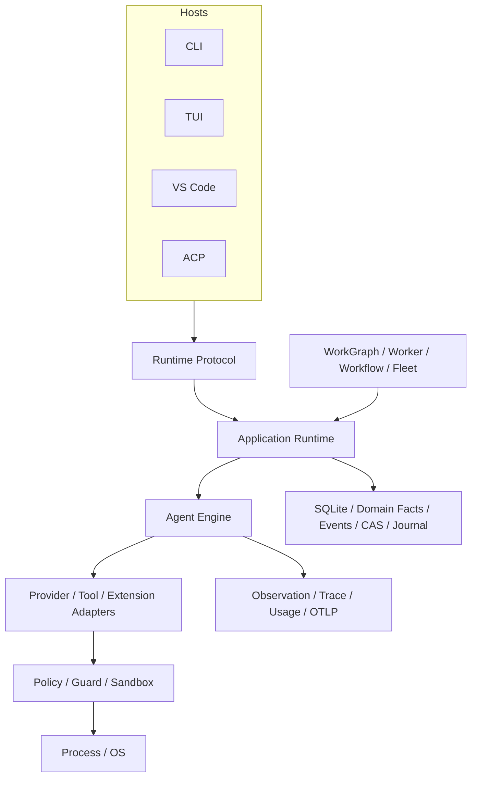

# CodeHelper 全局架构

简体中文 | [English](../../en/02-codehelper-overview/02-system-architecture.md)

## 学习目标

理解主要分层、依赖方向、Runtime Protocol，以及 CodeHelper 为什么让多种 Host 共享
同一个执行核心。

## 前置知识

阅读[为什么 Agent 需要受治理的 Runtime](../01-agent-engineering/05-why-governed-runtime.md)。

## 问题背景

Coding Agent 会逐渐拥有 CLI、TUI、编辑器、HTTP Client、后台 Worker 和 Child Agent。
如果每个入口分别构造 Provider、执行 Tool 或保存 State，安全、取消、恢复和证据语义
必然分叉。因此架构需要定义权限与依赖方向，而不只是列出目录。

## 同一系统的三个视图

不要只靠一张 Package Diagram 理解 CodeHelper：

| 视图 | 问题 | 路径 |
| --- | --- | --- |
| Control | 谁可请求并授权 Effect？ | Host → Operation → Runtime → Guard → Platform |
| Data | Fact 如何流动和持久化？ | Provider/Tool → Event/Receipt → Event Log/SQLite → Projection |
| Construction | 谁选择 Concrete Implementation？ | Config → `runtime/app/wire` → Interface/Adapter |

正确 Change 必须同时符合三种视图。例如新 Tool 需要 Construction Path、经过 Guard 的
Control Path，以及通过 Event/Receipt 的 Evidence Path；只实现 Executor 不完整。

## 核心概念

- **Host** 把用户或 Client I/O 转换为 Operation 和 Event。
- **Runtime** 管理 Lifecycle、Agent Execution 与共享契约。
- **Adapter** 连接外部 Model、Tool 和扩展生态。
- **Security** 决策并实施权限。
- **Persistence/Observability** 保存事实与证据。
- **Orchestration** 调度持久或多步骤工作。
- **Platform** 实现 OS Process 与 Sandbox 能力。

## CodeHelper 设计



图中的箭头不是“上层可任意调用所有下层”。Host 可以使用 Protocol 和 Application
Facade，但不能直接依赖 Tool、Provider、Agent Engine 或 Sandbox 实现。

受支持的产品 Host 是 CLI、TUI、VS Code 和 ACP。Provider HTTP、MCP HTTP/SSE 与本地
Fixture Listener 是集成 Transport，不是产品 Host。Root `web`/`serve`、Embedded UI、
Pairing/QR 和 REST/SSE 不属于受支持的产品面。

## Package 分层

| 层 | 路径 | 职责 |
| --- | --- | --- |
| Entry | `cmd/codehelper` | Process Startup 与 CLI Root |
| Host | `internal/host` | Presentation 与 Transport Adapter |
| Runtime | `internal/runtime` | Protocol、Lifecycle、Agent Loop、Wiring |
| Adapter | `internal/adapter` | Provider、Tool、MCP、Skill、Plugin、Hook |
| Security | `internal/security` | Policy、Permission、Constitution、Sandbox |
| Orchestration | `internal/orchestration` | WorkGraph、Worker、Automation、Workflow、Lane、Fleet、Subagent |
| Persistence | `internal/persist` | SQLite、Event、CAS、Session、Journal |
| Observability | `internal/observability` | 版本化 Observation、Trace、Usage、Diagnostics、Verification、OTLP |
| Platform | `internal/platform` | Process 与 OS Integration |
| VS Code | `extensions/vscode` | Editor UI 与 ACP Client |

VS Code 是 Local UI Extension，Webview 与 Extension Host 之间有物理边界。Webview 只接收
Immutable Projection 并提交 Finite Intent；Extension Host 拥有 VS Code API、Local
Workspace Identity、SecretStorage、Native Control 与 ACP Transport；Runtime 是
Session、Profile、Tool Policy、Lifecycle、Artifact 与 Execution 的唯一 Owner。
产品只支持 Local `file:` Single-root/Multi-root；Remote SSH、Dev Container、Codespaces
不属于该产品面。

## 硬依赖规则

1. `runtime/protocol` 不依赖实现 Package。
2. Host 提交 Operation，不执行 Provider 或 Tool。
3. Turn 业务循环留在 `runtime/agent`。
4. 构造逻辑留在 `runtime/app/wire`。
5. 有后果的 Tool 经过 `adapter/tool/guard`。
6. UI State 是 Projection，不是 Runtime Truth。
7. 持久副作用在 Owner Boundary 内使用 Transaction 或 Journal。

`internal/host/cli/architecture_test.go` 会解析 Import；CLI 直接依赖执行实现时测试失败。
架构边界因此是可验证属性。

`testdata/contracts/hotspot-baseline.json` 冻结 TUI、Engine、Config、Protocol 的职责和文件体积
边界。Characterization、Golden、Schema Drift 和 Race Test 在职责演进时保护行为。

## Runtime Protocol

```text
Operation -> ordered Events -> Projection
                     \-> Receipt
```

`internal/runtime/protocol` 定义 Operation/Event Tagged Union，生成的
`docs/protocol/runtime-protocol.schema.json` 被 ACP 和 VS Code 共用。ACP 封装同一模型，
而不是定义另一个 Runtime。

Event 包含 Sequence、Operation、Thread、Turn 和 Item Identity，使 Host 可以按 Cursor
重连，并区分 Output、Tool、Approval、Verification 与 Terminal Outcome。

## Construction Boundary

`runtime/app/wire` 可以了解具体实现。`NewExec` 是组合根：创建仅用于构造期的
`buildState`，并执行封闭的 Module 序列：

```text
config -> provider -> persistence -> platform -> builtin tools
       -> extension contributors -> security -> extension plan
       -> orchestration -> observability -> agent -> runtime
       -> background services
```

每个 Module 只拥有一个构造边界，仅向后续 Module 发布必要结果。Runtime、Engine 和
Session Service 都不得持有 `buildState`。Persistence 拥有 Content、Job Log 与
SQLite 基础；Platform 拥有 Process、Sandbox 与 Repository Index；Orchestration
拥有 Task/Automation Repository、Workflow Executor、Scheduler 构造、Subagent 与
Child Worktree/Toolset。Provider 发布所选 Provider/Model Catalog，Security 发布
Permission Store 与 Guard Factory。

Builtin 与 Extension Tool 共享同一个 Registry。Plugin、Skill、Memory、Dynamic
Tool、Hook 和 MCP Contributor 注册 Typed Contract，只接收显式 Capability，并返回
有界 Receipt。随后 Source Resolution 生成 Digested Extension Plan；Runtime
Lifecycle 拥有 Generation 与每个 Process、Connection、Subscription、Lease、Timer、
Tool Registration。Task/Automation 注册归 Orchestration，而非 Extension Contributor
Chain。

Runtime 构造具有 Prepared 状态：`RuntimeModule` 只构造 Facade 并恢复静态 Durable
State，不接受 Operation；`BackgroundModule` 依次执行 MCP 初次 Refresh、启动
Runtime 的 Terminal Outbox/Pending Turn Recovery、启动 MCP Prewarm、协调
Automation，最后启动 Worker Scheduler。任一步失败都会终止构造并由 ResourceStack
回滚；Runtime Recovery 成功前不会启动后台 Worker。

构造与关闭共享 `assembly.ResourceStack`，部分构造失败按注册逆序回滚，不泄漏资源。

构造与业务循环分离，避免 Dependency Injection 代码成为第二套 Runtime。

### Runtime 所有权表

| Owner | Source | Boundary |
| --- | --- | --- |
| Composition | `runtime/app/wire` | 构造 Concrete Module，不拥有业务循环 |
| Durable Assembly | `runtime/app/persistence` | 组合 Repository 与 Recovery |
| Chat Merge | `runtime/app/chatmerge` | Preview 并 Journal-apply 隔离 Worktree Change |
| Operation | `runtime/app` | Dispatch、Reservation、Event Hub、Terminal Commit |
| Turn | `runtime/agent` | Coordinator、Scope、Effect、Control、Verification |
| Work Lifecycle | `orchestration/kernel`、`orchestration/store` | Run/Node/Attempt/Lease/Effect Transition 与 Atomic Fact |
| Extension Lifecycle | `runtime/extension`、`runtime/app/extension` | Plan、Generation、Effect Ownership、Control Receipt |
| Observation Plane | `observability/observation`、`observability/router` | Privacy Admission、Evidence Routing、Exporter Isolation |
| Go Projection | `runtime/eventview` | Go Host 共享的 Typed Event Interpretation |
| VS Code Projection | `extensions/vscode/src/chat/projector` | Exhaustive Generated Event Class Dispatch |

该所有权拆分删除了两条意外控制路径。持久 ACP 是唯一
`host --adapter acp` 实现；预发布的一次性 Envelope Adapter 不再转发到 `exec`。
Chat Merge 与 Durable Repository 行为成为可独立测试的 Service，不再混在 `wire`
构造逻辑中。

## Persistence 与 Orchestration

SQLite 保存关系 Projection 与 WorkGraph/Turn Fact；Runtime Event Log 保存 Host-facing
Lifecycle Evidence；CAS 保存不可变 Payload；Snapshot 加速恢复；Workspace Journal
记录 Edit Before-image。独立 Observation Journal 保存通过 Privacy Admission 的因果
证据，用于 Semantic Replay/OTLP，但不获得执行权威。

Task、Workflow、Automation、Background Command、Verification 与 Agent Work 编译为
统一 Durable WorkGraph。Worker 是唯一 Claim Authority；Fleet 是 Read/Audit
Projection，Lane 是 Placement。所有执行最终回到 Runtime、Guard 与 Sandbox。

## 设计取舍与替代方案

Monolith 初期更简单，但会隐藏 Owner 并产生循环。每个 Host 一套 Runtime 会降低 UI
局部复杂度，却造成语义分叉。CodeHelper 接受更多 Interface 与 Adapter，以换取统一
权限路径和可测试边界。

Protocol 会增加版本管理成本；显式契约仍优于终端、插件和 Engine 之间的隐式耦合。

## 失败模式与安全边界

- Host 专属执行路径会绕过统一 Guard。
- Host 直接依赖 Provider 会让模型行为受 Presentation 影响。
- `wire` 中的业务逻辑难以在不构造全部依赖时测试。
- 把 Projection 当事实会破坏 Replay 与 Recovery。
- 绕过 Persistence Owner 写入会分裂关系状态与 Event/Journal。
- Extension 直接执行会形成未治理控制面。
- 把 Webview State 当成 Session Truth 会破坏 Revision、Replay 与 Recovery Contract。

## 测试与验证

```bash
go test ./internal/host/cli -run TestCLIDoesNotDependOnExecutionImplementations
go test ./internal/runtime/protocol -run TestTheCommittedSchemaMatchesThisBuild
go test ./internal/runtime/app -run TestRuntimeUnsupportedOperationIsExplicitlyRejected
```

## 动手实验

按顺序定位 `OperationStartTurn`、`Runtime.Submit`、`EngineAdapter.StartTurn`、
`Engine.RunForTurn`（沿 `prepareTurnSpec`/`SnapshotTurnSpec` 到冻结的
`TurnSpec`，再进入 `internal/runtime/agent/turnexec` 的 `turnexec.Scope`）、
`Guard.ExecuteBound` 和 `wire.NewExec` 调用点，再运行 Architecture Test，
确认源码路径与架构图一致。

## 复习问题

1. 为什么 `wire` 可以依赖具体实现而 Host 不可以？
2. 为什么 Provider/MCP HTTP Transport 不是 CodeHelper 产品 Host？
3. 半完成 Edit 的恢复应由哪个持久化组件负责？
4. 新 Capability 的 Control、Data、Construction Path 分别是什么？

## 延伸阅读

- [架构手册](../../../zh-CN/architecture.md)
- [Turn 生命周期](./05-turn-lifecycle.md)
- [Guard、Approval、Constitution 与 Sandbox](../07-security-governance/03-approval-constitution-sandbox.md)

## 事实来源与验证

| 项目 | 值 |
| --- | --- |
| Catalog ID | `overview-system-architecture` |
| 状态 | `draft` |
| 最后验证 | 尚未验证 |
