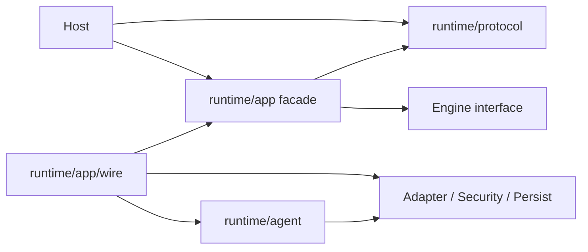

# Package 所有权与依赖方向

## 学习目标

能够定位 Change Owner，区分 Contract、Construction、Execution，并拒绝形成替代 Authority
Path 的 Dependency Shortcut。

## 1. Ownership 是正确性工具

Package 拥有其强制的 Invariant、可修改 State、导出 Vocabulary、Failure Classification
及对应 Test。Ownership 不只是目录组织；逻辑放错层会绕过 Policy、复制 Lifecycle
State，或让 Restart Behavior 依赖 UI Process。

## 2. 顶层 Ownership

| Concern | Owner | 不得变成 |
| --- | --- | --- |
| Process Entry | `cmd/codehelper` | Business Logic Container |
| CLI/TUI/API | `internal/host` | Provider/Tool Executor |
| Protocol/Lifecycle | `internal/runtime` | Vendor Transport |
| Integration | `internal/adapter` | Policy Authority |
| Policy/Isolation | `internal/security` | UI Preference |
| Scheduling | `internal/orchestration` | Second Agent Engine |
| Durable Data | `internal/persist` | Arbitrary Global Store |
| Usage/Trace/Verify | `internal/observability` | Execution Authority |
| OS Behavior | `internal/platform` | Product Policy |
| Editor | `web` | Runtime Reimplementation |

## 3. Runtime 内部边界

| Package | 拥有 |
| --- | --- |
| `protocol` | Transport-neutral Operation/Event |
| `app` | Acceptance、Sequence、Active Turn、Subscription、Control |
| `agent` | Context 与 Model/Tool Business Loop |
| `app/wire` | Concrete Construction/Capability Composition |
| `app/chatmerge` | 隔离 Chat Baseline、Digest-bound Preview、Journaled Apply |
| `app/persistence` | Durable Repository 组合与 Persistent Runtime Recovery |



`wire` 可以依赖具体实现，因为 Construction 是其职责；这不意味着它可以拥有 Turn
Business Decision。它构造 `app/chatmerge` 与基于 `app/persistence` 的 Runtime，
但自身不执行 Merge、Journal 或 Git 逻辑。

## 4. Adapter 边界

- `model`：Catalog、Capability、Limit、Pricing、Route；
- `provider`：Normalized Request/Stream、Vendor Wire；
- `tool`：Descriptor、Registry、Executor、Guard；
- `mcp`：External Protocol/Discovery；
- `skill`：Manifest/Dependency Resolution；
- `plugin`：Signed Distribution/Lifecycle；
- `hooks`：Bounded Lifecycle Callback；
- `lsp`、`memory`：Specialized Integration。

Adapter 负责 Translate/Execute 已声明 Contract，不决定产品 Authority。来自 MCP/Plugin
的 Consequential Tool 仍进入 Guard。

## 5. Security、Platform 与 Guard

| Layer | 问题 |
| --- | --- |
| Descriptor/Registry | Call 声明什么 Capability/Resource？ |
| Policy/Permission/Constitution | 当前 Identity/Posture 是否允许？ |
| Guard | Identity、Schema、Resource、Approval、Claim、Journal、Execution 是否正确组合？ |
| Platform/Sandbox | OS 边界实际允许访问什么？ |

Policy 放在 Tool/Host 会变成可选；Product Policy 放入 Platform 会让 OS Code 拥有 User
Intent。Guard 是 Composition Boundary。

## 6. Persistence 与 Observability

Persistence 拥有 SQLite Projection、Ordered Event Log、CAS、Session/Snapshot、
Workspace Journal/Recovery。Observability 派生 Usage/Cost、Trace/Latency、
Diagnostics/Verification、Telemetry/Report。

Observability 可以报告失败，但不应秘密改变 Authority；Persistence 可恢复 State，但不应
发明 Business Transition。

## 7. Orchestration

Orchestration 拥有 Durable WorkGraph、Task Projection、Worker Lease/Retry、
Automation、Workflow DAG Compiler、Lane Placement、Fleet Projection 与 Subagent。
它通过显式 Adapter 启动 Runtime Operation，不直接调用 Provider/Tool Executor。

## 8. Change 放置示例

| Change | Primary Owner | 相关 Contract |
| --- | --- | --- |
| Event Field | `runtime/protocol` | Schema/Transport/Projection |
| Turn Cancel | `runtime/app` | Engine/Persistence |
| Context Source | `runtime/agent` | Receipt/Budget |
| OpenAI Frame | `adapter/provider/openai` | Normalized Stream |
| File Tool | `adapter/tool/file` | Descriptor/Guard/Journal |
| Approval Rule | `security/policy` | Guard/Protocol |
| Chat Merge 策略 | `runtime/app/chatmerge` | Journal/Guard/Baseline |
| Worker Retry | `orchestration/task` | Persist/Executor |
| SQLite Table | `persist/state/sqlite` | Repository/Schema |
| Web Command | `web` | Web Transport/Trust |

Cross-cutting 不等于 Ownerless。先选定一个 Invariant Owner，再围绕其 Contract 适配。

## 9. 禁止的依赖气味

- Host Import Provider/Tool/Sandbox；
- Tool 自行决定 Broad Permission；
- `wire` 实现 Retry/Turn State Machine；
- `wire` 执行 Chat Merge Plan 或 Journaled Apply 逻辑；
- Engine 直接写 SQLite Table；
- Projection/UI State 授权 Action；
- Orchestration 直接调用 Provider；
- Web Host 信任 Browser 提交的 Workspace Identity；
- Protocol Import Host/Adapter。

它们可能局部方便，却破坏系统保证。

## 10. 追踪 Change

1. 从 Stable Contract/User-visible Event 开始；
2. 找到验证 Invariant 的 Package；
3. 在 `runtime/app/wire` 找 Construction；
4. 查 Host Projection/Read Model；
5. 编辑前读 Nearest Test；
6. 搜索越界 Direct Import；
7. Generated File 使用仓库命令。

```bash
rg 'type Engine interface|type Operation struct|type Descriptor struct' internal
rg 'internal/adapter/(provider|tool)|internal/security/sandbox' internal/host
go test ./internal/host/cli -run TestCLIDoesNotDependOnExecutionImplementations
go test ./internal/runtime/app/wire -run TestOnlyWireConstructsPlatformBackend
```

## 11. 复习问题

1. 为什么 `wire` 拥有 Construction 而非 Behavior？
2. 新 Tool 的 Authorization 由谁拥有？
3. 为什么 Projection 不能授权？
4. Workflow Retry 应位于哪里？
5. Architecture Test 如何将规则变为 Evidence？

## 下一章

[Operation、Event、Receipt 与 Projection](./04-runtime-vocabulary.md)定义这些边界间传递
的契约。

## 事实来源与验证

| 项目 | 值 |
| --- | --- |
| Catalog ID | `overview-package-ownership` |
| 状态 | `draft` |
| 最后验证 | 尚未验证 |
