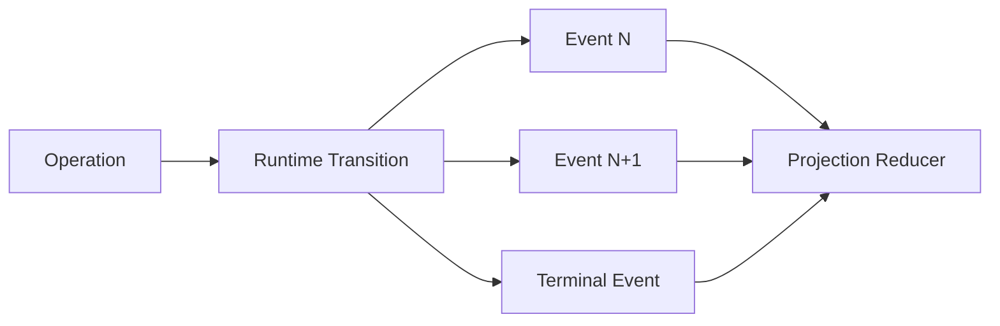

# Operation、Event、Receipt 与 Projection

简体中文 | [English](../../en/02-codehelper-overview/04-runtime-vocabulary.md)

## 学习目标

准确使用 CodeHelper Protocol 词汇，理解 Identity/Durability Rule，不再混淆 Command、
Fact、Evidence 与 Query State。

## 1. 四种角色

```text
Operation:  请求 Runtime 尝试状态转换
Event:      Runtime 处理产生的不可变事实
Receipt:    工作如何执行的结构化证据
Projection: 从 Durable Fact 派生的查询状态
```

示例：

```text
Operation  turn.start
Events     turn.started -> output.delta* -> usage -> turn.receipt -> turn.completed
Receipt    route / context / tools / changes / verification / latency / cost
Projection thread title / latest turn / pending approvals / task status
```

Operation 是 Intent，不是 Success；Event 是 Fact，不是 Command；Receipt 是 Evidence，
不是 Authority；Projection 是 View，不是 Source of Truth。

## 2. Operation

`protocol.Operation` 包含 Version、Unique ID、Tagged Kind、UTC CreatedAt、Typed Payload。
Operation 可 Start/Cancel/Steer Turn、Decision Approval、Reply Input、Compact/Fork
Thread、Revert Turn。

Validation 只说明结构有意义；Runtime Acceptance 还应用 Queue、Identity、Lifecycle、
Idempotency。Accepted Operation 仍可能失败或取消。

## 3. Event

`protocol.Event` 包含 Sequence Cursor、Event/Operation ID、Thread/Turn/Item ID、
Tagged Kind、Timestamp、Typed Data。

Event 表达 Output、Reasoning、Tool State、Usage、Approval、Diagnostics、Compaction、
Agent Status、Receipt、Terminal Outcome。



Sequence 建立 Replay Order；Timestamp 是 Evidence，但不能替代 Cursor Ordering。

## 4. Identity 层级

| Identity | Scope | 用途 |
| --- | --- | --- |
| Workspace | Repository Authority | Path/Session/Permission |
| Session | User-facing Collection | Thread Organization |
| Thread | Conversation Lineage | Compact/Fork/Replay |
| Turn | One Agent Interaction | Terminal/Usage/Verify |
| Item | Visible/Interactive Unit | Tool/Approval/Card |
| Operation | Requested Transition | Idempotency/Correlation |
| Call/Request | Tool/Approval Interaction | Decision/Result Binding |
| Event | Immutable Fact | Dedup/Replay |

Identity 不是装饰。一个 Request 的 Approval 不能授权另一个 Call；一个 Workspace 的 Event
不能投影为另一个 Workspace 的事实。

## 5. Terminal Semantics

Turn 必须且只能结束于 `turn.completed`、`turn.failed`、`turn.canceled` 之一。没有 Output
不是 Terminal；Process Exit 也不一定是 Terminal Event。Runtime 必须在 Cancel/Close
Race 中对每个 Accepted Operation 记账。

Host 应 Generic Render 未知未来 Event 并保留 Envelope，但必须理解 Lifecycle Terminal。

## 6. Receipt

`turn.receipt` 的 `ExecutionReceiptData` 汇总：

- Context Section、Truncation、Budget；
- Route、Model、Provider、Usage、Cost；
- Tool Catalog/Attempt；
- Read、Change、Line Stat、Rollback Conflict；
- Approval/Sandbox；
- Diagnostics/Verification；
- Latency；
- Skill 与 Evidence Fact/Risk。

Receipt 回答“在什么约束下发生了什么”，不授予未来 Permission，也不替代详细 Event/
Journal。

## 7. Projection

```text
projection(next) = reduce(projection(current), event)
```

Projection 包括 Thread List、Latest Turn、Pending Approval、Usage Rollup、VS Code Tree/
Chat。它应当在规定范围可 Rebuild、Duplicate Delivery 下 Idempotent、按 Cursor/Version
排序、按 Workspace/Thread Scope，并只优化 Read。

Projection 与 Durable Event 冲突时应 Repair/Rebuild Projection，不能用方便的 View
覆盖 Fact。

## 8. Persistence 与 Replay

CodeHelper 组合 Ordered Event Log 与 SQLite Projection。Commit Boundary 防止 Projection
声称未 Durable Record 的 Event。Replay 从 Cursor 分页，Gap 必须显式。

Restart 时 Reconstruction 判定 Completed、Failed、Reverted、Interrupted；它不是
Re-execution，Replay `tool.start` 绝不能再次运行 Tool。

## 9. Idempotency/Concurrency

`SubmitWithKey` 将 Idempotency Key 绑定 Canonical Operation Content：

- Same Key + Same Content：Duplicate/No-op；
- Same Key + Different Content：Conflict；
- No Key：Distinct Operation。

Submission Idempotency 不自动使所有 Side Effect 幂等；Tool、Task、Workflow、External API
仍需要各自 Fencing/Reconciliation。

## 10. 常见错误

| 错误 | 后果 |
| --- | --- |
| Submit 当成功 | UI 过早完成 |
| Timestamp 排序 | Concurrent Event 乱序 |
| 只按 Tool Name Approval | 绑定错误 Call |
| Replay 时执行 | 重复 Side Effect |
| Projection 授权 | Stale UI State 控制执行 |
| 丢弃 Unknown Event | Forward Evidence 丢失 |
| 两个 Terminal | Lifecycle/Usage Ambiguous |

## 11. 源码验证

```bash
sed -n '457,478p' internal/runtime/protocol/message.go
sed -n '1361,1450p' internal/runtime/protocol/message.go
sed -n '1706,1765p' internal/runtime/protocol/message.go
go test ./internal/runtime/protocol
go test ./internal/runtime/app \
  -run 'TestRuntime(ConcurrentSubmitHasStrictSequenceAndUniqueTerminal|ReplayEventsPagesWithoutSubscribing|ReplayEventsSurfacesCursorGap)'
go test ./internal/persist/state \
  -run 'TestStore(RecoversProjectionAndPreservesSequenceGaps|RejectsCommittedProjectionWithoutDurableEvent)'
```

## 12. 复习问题

1. Operation Acceptance 为什么不代表成功？
2. Replay 时 Sequence 为什么强于 Timestamp？
3. Receipt 证明什么、不授权什么？
4. Projection 为什么必须可重建且无 Authority？
5. Replay 为什么不能执行 Tool？

## 下一章

[一次 Agent Turn 的完整生命周期](./05-turn-lifecycle.md)将词汇应用于端到端 Interaction。

## 事实来源与验证

| 项目 | 值 |
| --- | --- |
| Catalog ID | `overview-runtime-vocabulary` |
| 状态 | `draft` |
| 最后验证 | 尚未验证 |
