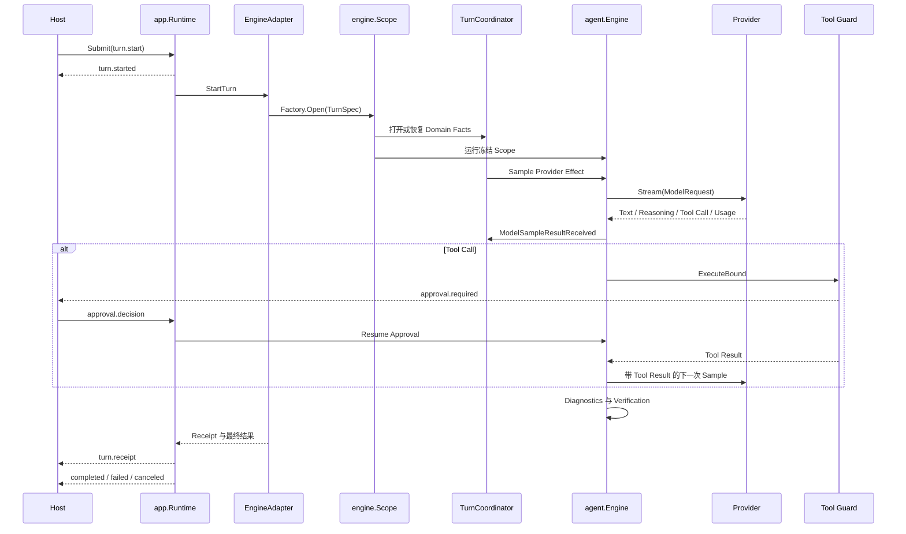

# 一次 Agent Turn 的完整生命周期

## 学习目标

能够从 Operation 创建开始，追踪 Context、Model Streaming、Tool、Verification、
Receipt，直到唯一 Terminal Event。

## 前置知识

阅读 [CodeHelper 全局架构](./02-system-architecture.md)。

## 问题背景

“发送 Prompt 并打印文本”不是完整 Lifecycle。真实 Turn 可能产生 Reasoning Stream、
请求多个 Tool、等待 Approval、接收 Steering、压缩 History、执行 Verification、
失败、取消，或者在 Client 重连后继续被观察。这些状态必须独立于具体 UI。

## 核心概念

- **Operation** 请求状态转换。
- **Turn** 是由 `turn.start` 开始的 Agent Interaction。
- **Item** 为 Output、Tool、Approval 和 Input 提供稳定 UI Identity。
- **Event** 是带 Monotonic Cursor 的不可变事实。
- **Receipt** 汇总 Context、Change、Budget、Route、Latency 与 Check Evidence。
- **Terminal Event** 只能是 Completed、Failed 或 Canceled 之一。

Operation 被接受与 Turn 成功完成是两个时刻。

## Phase 与 Waiting Invariant

| Phase | Runtime 可产生 | 不代表 |
| --- | --- | --- |
| Accepted/Queued | 稍后 Reject/Start | Model Call 成功 |
| Calling Model | Delta、Usage、Tool Proposal | Tool 已授权 |
| Running Tools | Tool State/Result | Task 语义完成 |
| Awaiting Approval/Input | Durable Request Identity | Implicit Permission |
| Verifying | Verification Event/Receipt | Verdict 前成功 |
| Terminal | 唯一 Completed/Failed/Canceled | 后续 Turn Output |

Waiting 是显式 State，不是匿名阻塞 Goroutine。Approval/Input Reply 绑定 Request、Call、
Turn、Workspace Identity；Late/Duplicate Decision 会被拒绝，而不是应用到当前等待者。

## Lifecycle



## 1. 创建并验证 Operation

`protocol.NewOperation` 创建 Operation ID、确定 Tagged-union Kind、设置 UTC 时间并验证
Payload。`StartTurnPayload` 包含 Thread、Turn、Item、Prompt、Context、Idle State 和
可选 Workspace Identity。

未知 Kind/Field 被严格拒绝。Host 可以补齐空 Identity，但不能覆盖 Client 已提供的值。

## 2. 接收与排序

`app.Runtime.SubmitWithKey` 验证 Operation、生成 Idempotency Canonical Form 并入队。
相同内容的重复提交是 No-op；同 Key 不同内容被拒绝。

Runtime Loop 分发 Operation、分配 Event Sequence、记录 Durable Lifecycle 并发布给
Subscriber。有界 Queue/Buffer 防止单个 Caller 消耗无限内存。

## 3. 绑定 Workspace 与 Context

`EngineAdapter.StartTurn` 验证 Workspace Identity，解析 Editor Context，并区分用于 UI
的 Display Prompt 和 Model-visible Context，同时创建 Receipt Recorder。

Agent Engine 在一个 `TurnSpec` 中冻结 Identity、Request、Session Profile、Route、
Policy、Limit、Prompt Prefix、Tool Catalog、Skill、MCP Health 与 Extension。
Engine Scope Factory 打开强类型 Scope；Sampling 不得重新读取这些可变来源。Repo Map、
Working Set 与 Evidence 仍从 Scope-local State 在 Tool Result 后重新渲染。

## 4. Sample 与 Stream

Engine 构建包含 Route、Message、Limit、Reasoning、Native Search 和 Tool Definition
的 `provider.ModelRequest`。Provider Adapter 将不同厂商协议规范化为统一 Stream。

调用 Provider 前，`DurableEffectDispatcher.Start` 先向 `TurnCoordinator` 提交
`EffectStarted`；Coordinator 将对应 Domain Fact 持久化后才允许执行。完整 Sample
以一个被保留的 `ModelSampleResultReceived` Command 返回。若 Result 的持久化接收
失败，可以重交同一个 Command，而不会再次调用 Provider。

Text、Reasoning、Citation、Usage 和 Tool Call 先成为 Engine Event，再转换为 Runtime
Event；Host 不直接拥有 Provider Stream。Protocol Event 是面向 Host 的 Projection，
有序 Domain Fact 才是 Turn 状态机的权威记录。

## 5. Tool 执行与继续

Tool Call 在执行前绑定到曾向 Model 展示它的 Catalog Snapshot。被替换或撤销的同名
Executor 不能获得旧 Call 的权限。

Guard 验证 Argument/Resource、评估 Policy、等待 Approval、获取 Resource Claim、
记录 Write、在要求的 Sandbox 中执行并返回 Result。Result 作为 Tool Message 进入下一次
Sample，直到 Model 完成、Budget/Step Gate 停止、Verification 失败或 Context 取消。

## 6. Verification 与终止

Changed Path 可以触发 Diagnostics 和 Verify Check。Hard Failure 可使 Turn 失败并回滚
Journaled Edit。Scope 先为 Usage/Latency 冻结带 Digest 的
`TerminalMeasurementSnapshot`，再为 History、Cost、Working Set、Evidence、Failures
与 Compaction 准备 `SessionDelta`。Receipt、Measurement-derived Trace 与 Terminal
Envelope 都引用同一 Measurement。Runtime 将它们与 Frozen Kernel State、Ordered
Domain Fact、Final Output、Operation Receipt、Terminal Event 与 Projection Outbox
原子提交。Engine 只在 Durable Commit 成功后幂等 Apply。

Lifecycle 中通过 Privacy Admission 的 `ObservationEnvelope` 会关联 Provider、Tool、
Approval、Verification、Process 与 Terminal Evidence。Critical Evidence 同步写入，
低优先级使用有界 Queue。Observation/Exporter Failure 只更新 Health，不改变 Turn 的
Completed/Failed/Canceled 业务结果。

## Control Operation

- `turn.cancel`：取消 Active Context；
- `turn.steer`：向当前或下一 Turn 增加输入；
- `approval.decision`：解析指定 Pending Request；
- `input.reply`：恢复 Interaction；
- `thread.compact`：按 Budget 压缩 History；
- `thread.fork`：创建独立 History；
- `turn.revert`：回退允许的 Workspace Effect。

Cancel/Steer 进入 Scope 的有界 Mailbox。Approval/Input 必须匹配唯一未解决 Request ID；
Overflow、Late、Duplicate、Kind Mismatch 都返回结构化错误。

## 代码地图

| 阶段 | 源码 |
| --- | --- |
| Operation/Event | `internal/runtime/protocol/message.go` |
| Queue/Cursor/Terminal | `internal/runtime/app/runtime.go` |
| Engine Adapter | `internal/runtime/app/extension/engine_adapter.go` |
| Turn Lifecycle/Control | `internal/runtime/agent/engine` |
| 权威 Reducer、Coordinator 与 Effect | `internal/runtime/agent/turnkernel` |
| Model/Tool Executor | `internal/runtime/agent/engine` |
| Receipt | `internal/observability/receipt/receipt.go` |
| Frozen Terminal Measurement | `internal/runtime/agent/turnkernel/measurement.go` |
| Observation Evidence | `internal/observability/observation`、`internal/observability/router` |
| Durable Runtime Assembly | `internal/runtime/app/wire/persistent_runtime.go` |
| Turn Domain Fact 与 Lease | `internal/persist/state/turnstate` |

## 设计取舍与替代方案

只输出文本无法表达 Approval、Tool、Usage 和 Recovery；把可变状态放在 UI 会让另一个
Host 失去权威事实。CodeHelper 选择更丰富的 Event Model，以获得跨 Host Replay。

## 失败模式与安全边界

- Cursor Gap 明确提供 Recovery Cursor。
- Slow Subscriber 被确定性移除。
- Unsupported Operation 产生 Rejection。
- Workspace Identity Drift 在使用 Editor Context 前失败。
- Catalog 在 Sample 与 Execution 之间变化时拒绝 Tool。
- Approval Request/Call Identity 不匹配时拒绝。
- Verify Hard Failure 可以 Rollback 并使 Turn 失败。
- Cancel/Close Race 会对每个 Accepted Operation 记账。

## 测试与验证

```bash
go test ./internal/runtime/protocol \
  -run 'Test(OperationTaggedUnionRoundTrip|EditorContextValidationFailsClosed)'
go test ./internal/runtime/app \
  -run 'TestRuntime(ConcurrentSubmitHasStrictSequenceAndUniqueTerminal|CancelActuallyCancelsActiveTurn|ToolAndApprovalGetOwnedItemIDs)'
go test ./internal/runtime/agent/engine \
  -run 'Test(EngineExecutesToolAndFeedsResultOnce|VerifyGateHardFailureFailsTurnAndRollsBack)'
go test ./internal/runtime/agent/turnkernel \
  -run 'Test(TurnCoordinator|DurableEffectDispatcher|Phase4R)'
```

## 动手实验

```bash
make build
./bin/codehelper exec \
  --provider-fixture ./testdata/providers/openai \
  --provider openai \
  --model gpt-fixture \
  --workspace . \
  --output-format stream-json \
  "say hello"
```

识别 Identity、`turn.started`、Output、Receipt 与 Terminal Event。随后运行
`TestEngineExecutesToolAndFeedsResultOnce`，在不依赖平台 File Write 的情况下检查
Tool Branch。修改 Prompt 前先阅读 `testdata/providers/openai/fixture.json`。

## 复习问题

1. 为什么 Operation Accepted 不代表 Turn 成功？
2. 为什么 Tool Call 除名称外还需要 Catalog Identity？
3. 哪个 Event 告诉重连 Host 不会再有 Output？
4. Approval Waiting 为什么必须表达为 Protocol State？

## 延伸阅读

- [Model、Context 与 Tool](./06-model-context-and-tool.md)
- [Runtime Protocol Schema](../../../protocol/runtime-protocol.schema.json)

## 事实来源与验证

| 项目 | 值 |
| --- | --- |
| Catalog ID | `overview-turn-lifecycle` |
| 状态 | `verified` |
| 最后验证 | 2026-08-17 |
