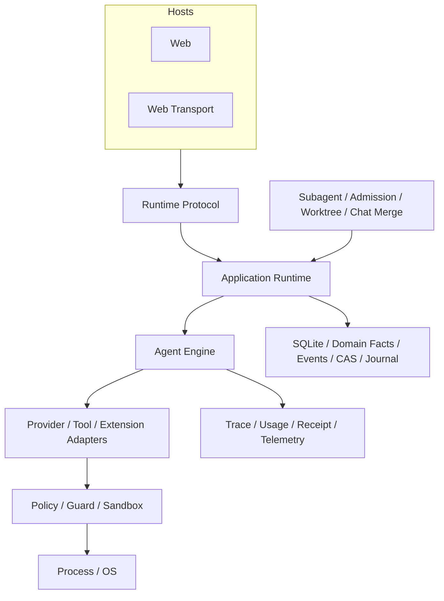

# QCode 全局架构

## 学习目标

理解主要分层、依赖方向、Runtime Protocol，以及 QCode 如何让主 Agent 与
Subagent 共享同一个执行核心。

## 前置知识

阅读[为什么 Agent 需要受治理的 Runtime](../01-agent-engineering/05-why-governed-runtime.md)。

## 问题背景

Coding Agent 会逐渐拥有 Web 和 Child Agent。若这些入口分别构造
Provider、执行 Tool 或保存 State，安全、取消、恢复和证据语义必然分叉。因此架构
需要定义权限与依赖方向，而不只是列出目录。

## 同一系统的三个视图

不要只靠一张 Package Diagram 理解 QCode：

| 视图 | 问题 | 路径 |
| --- | --- | --- |
| Control | 谁可请求并授权 Effect？ | Host → Operation → Runtime → Guard → Platform |
| Data | Fact 如何流动和持久化？ | Provider/Tool → Event/Receipt → Event Log/SQLite → Projection |
| Construction | 谁选择 Concrete Implementation？ | Config → `runtime/app/wire` → Interface/Adapter |

正确 Change 必须同时符合三种视图。例如新 Tool 需要 Construction Path、经过 Guard 的
Control Path，以及通过 Event/Receipt 的 Evidence Path；只实现 Executor 不完整。

## 核心概念

- **Host** 把用户或 Client I/O 转换为 Operation 和 Event。
- **Runtime** 管理 Lifecycle、Agent Execution 与共享契约。
- **Adapter** 连接外部 Model、Tool 和扩展生态。
- **Security** 决策并实施权限。
- **Persistence/Observability** 保存事实与证据。
- **Orchestration** 管理 Subagent 协作、预算与隔离工作区。
- **Platform** 实现 OS Process 与 Sandbox 能力。

## QCode 设计



图中的箭头不是“上层可任意调用所有下层”。Host 可以使用 Protocol 和 Application
Facade，但不能直接依赖 Tool、Provider、Agent Engine 或 Sandbox 实现。

受支持的产品 Host 只有 Web。Web Host 在单一 `qcode` 进程中通过
loopback HTTP/WebSocket 连接 Embedded UI 与共享 Runtime；Provider HTTP、MCP HTTP/SSE
与本地 Fixture Listener 是集成 Transport，不是产品 Host。远程绑定、Pairing/QR 和
公网 REST/SSE 不属于受支持的产品面。

## Package 分层

| 层 | 路径 | 职责 |
| --- | --- | --- |
| Entry | `cmd/qcode` | Process Startup 与 Web Host |
| Host | `internal/host` | Presentation 与 Transport Adapter |
| Runtime | `internal/runtime` | Protocol、Lifecycle、Agent Loop、Wiring |
| Adapter | `internal/adapter` | Provider、Tool、MCP、Skill |
| Security | `internal/security` | Policy、Permission、Constitution、Sandbox |
| Orchestration | `internal/orchestration` | Subagent、Admission/Budget、Worktree、Chat Merge |
| Persistence | `internal/persist` | SQLite、Event、CAS、Session、Journal |
| Observability | `internal/observability` | Trace、Usage、Receipt、Diagnostics、Verification、Telemetry |
| Platform | `internal/platform` | Process 与 OS Integration |
| Web | `web` | Browser UI、Projection 与 Web Transport Client |

Web Browser 只接收 Immutable Projection 并提交 Finite Intent；loopback Web Host 负责
Origin/Host Fence、Capability Token、Owner Lease 与本地 Workspace 接入，但不执行
Provider、Tool 或 Agent Loop。Runtime 是 Session、Profile、Tool Policy、Lifecycle、
Artifact 与 Execution 的唯一 Owner。产品只支持 Local `file:` Workspace；Remote SSH、
Dev Container 和 Codespaces 不属于该产品面。

## 硬依赖规则

1. `runtime/protocol` 不依赖实现 Package。
2. Host 提交 Operation，不执行 Provider 或 Tool。
3. Turn 业务循环留在 `runtime/agent`。
4. 构造逻辑留在 `runtime/app/wire`。
5. 有后果的 Tool 经过 `adapter/tool/guard`。
6. UI State 是 Projection，不是 Runtime Truth。
7. 持久副作用在 Owner Boundary 内使用 Transaction 或 Journal。

`internal/host/web/architecture_test.go` 会解析 Import；Web Host 直接依赖执行实现时测试失败。
架构边界因此是可验证属性。

`testdata/contracts/hotspot-baseline.json` 冻结 Engine、Config、Protocol 的职责和文件体积
边界。Characterization、Golden、Schema Drift 和 Race Test 在职责演进时保护行为。

## Runtime Protocol

```text
Operation -> ordered Events -> Projection
                     \-> Receipt
```

`internal/runtime/protocol` 定义 Operation/Event Tagged Union，生成的
`docs/protocol/runtime-protocol.schema.json` 被 Web Transport 和 Web 共用。Web Transport 封装同一模型，
而不是定义另一个 Runtime。

Event 包含 Sequence、Operation、Thread、Turn 和 Item Identity，使 Host 可以按 Cursor
重连，并区分 Output、Tool、Approval、Verification 与 Terminal Outcome。

## Construction Boundary

`runtime/app/wire` 可以了解具体实现。`NewExec` 是组合根：创建仅用于构造期的
`buildState`，并执行封闭的 Module 序列：

```text
config -> provider -> persistence -> platform -> builtin tools
       -> capability tools -> security
       -> orchestration -> observability -> agent -> runtime
       -> background services
```

每个 Module 只拥有一个构造边界，仅向后续 Module 发布必要结果。Runtime、Engine 和
Session Service 都不得持有 `buildState`。Persistence 拥有 Content、Job Log 与
SQLite 基础；Platform 拥有 Process、Sandbox 与 Repository Index；Orchestration
拥有 Subagent、Admission/Budget、Child Worktree/Toolset 与 Chat Merge 构造。
Provider 发布所选 Provider/Model Catalog，Security 发布 Permission Store 与
Guard Factory。

Builtin、Skill、Memory 和 MCP Tool 共享同一个 Registry。Composition Root 按固定
顺序直接构造 Skill Catalog、Memory Store 与 MCP Pool。Subagent 工具由
Orchestration Module 单独装配。

Runtime 构造具有 Prepared 状态：`RuntimeModule` 只构造 Facade 并恢复静态 Durable
State，不接受 Operation；`BackgroundModule` 依次执行 MCP 初次 Refresh、启动
Runtime 的 Terminal Outbox/Pending Turn Recovery，再启动 MCP Prewarm。任一步失败
都会终止构造并由 ResourceStack 回滚；Runtime Recovery 成功前不会接受 Operation。

构造与关闭共享 `wire.ResourceStack`，部分构造失败按注册逆序回滚，不泄漏资源。

构造与业务循环分离，避免 Dependency Injection 代码成为第二套 Runtime。

### Runtime 所有权表

| Owner | Source | Boundary |
| --- | --- | --- |
| Composition | `runtime/app/wire` | 构造 Concrete Module，不拥有业务循环 |
| Durable Assembly | `runtime/app/persistence` | 组合 Repository 与 Recovery |
| Chat Merge | `runtime/app` | Preview 并 Journal-apply 隔离 Worktree Change |
| Operation | `runtime/app` | Dispatch、Reservation、Event Hub、Terminal Commit |
| Turn | `runtime/agent` | Coordinator、Scope、Effect、Control、Verification |
| Subagent Control | `orchestration/subagent`、`orchestration/admission` | Agent Graph、Budget、Concurrency 与 Worktree Authority |
| Skill Control | `runtime/app/extension`、`adapter/skill` | Skill State、Lock、Control Receipt |
| Trace/Usage Plane | `observability/trace`、`observability/usage` | Span、Latency、Token 与 Cost Projection |
| Go Projection | `runtime/eventview` | Go Host 共享的 Typed Event Interpretation |
| Web Projection | `web/src/chat/projector` | Exhaustive Generated Event Class Dispatch |

该所有权拆分删除了两条意外控制路径。持久 Web Transport 是唯一
`web` 实现；预发布的一次性 Envelope Adapter 不再转发到 `exec`。
Chat Merge 与 Durable Repository 行为成为可独立测试的 Service，不再混在 `wire`
构造逻辑中。

## Persistence 与 Subagent 协作

SQLite 保存关系 Projection 与 Turn/Agent Fact；Runtime Event Log 保存 Host-facing
Lifecycle Evidence；CAS 保存不可变 Payload；Snapshot 加速恢复；Workspace Journal
记录 Edit Before-image。Trace 与 Usage 作为辅助投影保存耗时和成本，但不获得执行
权威。

QCode 不维护通用后台 Task Queue、Worker Lease、Workflow DAG 或 Automation。
前台工作由 Runtime Turn 承载；Subagent 通过 Agent Graph、Admission/Budget 和
Worktree 隔离扩展同一执行路径。所有执行最终回到 Runtime、Guard 与 Sandbox。

## 设计取舍与替代方案

Monolith 初期更简单，但会隐藏 Owner 并产生循环。每个 Host 一套 Runtime 会降低 UI
局部复杂度，却造成语义分叉。QCode 接受更多 Interface 与 Adapter，以换取统一
权限路径和可测试边界。

Protocol 会增加版本管理成本；显式契约仍优于终端、插件和 Engine 之间的隐式耦合。

## 失败模式与安全边界

- Host 专属执行路径会绕过统一 Guard。
- Host 直接依赖 Provider 会让模型行为受 Presentation 影响。
- `wire` 中的业务逻辑难以在不构造全部依赖时测试。
- 把 Projection 当事实会破坏 Replay 与 Recovery。
- 绕过 Persistence Owner 写入会分裂关系状态与 Event/Journal。
- Browser 直接执行会形成未治理控制面。
- 把 Browser Projection 当成 Session Truth 会破坏 Revision、Replay 与 Recovery Contract。

## 测试与验证

```bash
go test ./internal/host/web -run TestWebHostDoesNotDependOnExecutionImplementations
go test ./internal/runtime/protocol -run TestTheCommittedSchemaMatchesThisBuild
go test ./internal/runtime/app -run TestRuntimeUnsupportedOperationIsExplicitlyRejected
```

## 动手实验

按顺序定位 `OperationStartTurn`、`Runtime.Submit`、`EngineAdapter.StartTurn`、
`Engine.Execute`（沿 `prepareTurnSpec`/`SnapshotTurnSpec` 到冻结的
`TurnSpec`，再进入 `internal/runtime/agent/engine` 的单 Turn `Scope`）、
`Guard.ExecuteBound` 和 `wire.NewExec` 调用点，再运行 Architecture Test，
确认源码路径与架构图一致。

## 复习问题

1. 为什么 `wire` 可以依赖具体实现而 Host 不可以？
2. 为什么 Provider/MCP HTTP Transport 不是 QCode 产品 Host？
3. 半完成 Edit 的恢复应由哪个持久化组件负责？
4. 新 Capability 的 Control、Data、Construction Path 分别是什么？

## 延伸阅读

- [架构手册](../../../zh-CN/architecture.md)
- [Turn 生命周期](./05-turn-lifecycle.md)
- [Guard、Approval、Constitution 与 Sandbox](../07-security-governance/03-approval-constitution-sandbox.md)

## 事实来源与验证

| 项目 | 值 |
| --- | --- |
| Catalog ID | `overview-system-architecture` |
| 状态 | `draft` |
| 最后验证 | 尚未验证 |
