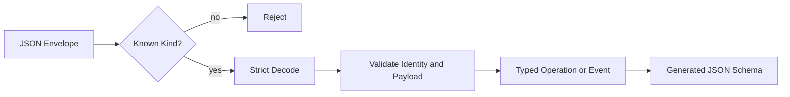

# Protocol 与稳定数据契约

简体中文 | [English](../../en/03-runtime-kernel/01-protocol.md)

## 学习目标

理解 Runtime Protocol 为什么必须独立，Tagged Union 与 Identity 如何消除歧义，
以及生成 Schema 如何检测 Drift。

## 前置知识

阅读[一次 Agent Turn 的完整生命周期](../02-codehelper-overview/05-turn-lifecycle.md)。

## 问题背景

CLI、ACP、VS Code、Persistence 和 Test 都要描述同一份工作。消息跨 Process
和语言后，共享 Go Struct 并不足够；契约必须拒绝 Unknown Shape、保留 Identity，并
显式演进。

## 核心概念

- Operation 请求 Transition，Event 记录 Observation。
- Kind + Typed Payload/Data 组成 Tagged Union。
- Thread、Turn、Operation、Event、Item ID 表达不同 Ownership。
- Cursor 为 Replay 提供顺序。
- Problem 提供 Machine Code、Retryable 和安全 Detail。
- Receipt 是证据，不是 Terminal Status。
- Readiness 提供 `ready`、`degraded` 或 `blocked`，以及 Reason、Impact 与 Repair
  Action。
- Session/Profile、Provider/Model、Tool Catalog、Lifecycle/Search、Checkpoint、Plan
  与 Turn Recovery 是共享 Host Contract，不是 VS Code Local State。

## CodeHelper 设计



`internal/runtime/protocol` 不依赖 Runtime 实现。Registry 将每个 Kind 映射为构造器；
Custom JSON Decode 严格拒绝 Unknown Field，再验证语义不变量。

Event 包含 Sequence、Operation、Thread、Turn 和 Item Identity。Sequence 服务 Cursor
Replay，其余 ID 保存因果关系。Tool、Approval、Input Item 与 Prompt Item 分离。

`FillOperationReferences` 只填充空值，不能覆盖 Client Identity。Workspace Identity
也使用版本化 Canonical Path。

## Envelope 与 Semantic Invariant

Validation 分两层：

| 层 | 示例 | 原因 |
| --- | --- | --- |
| Envelope | Version、ID、Kind、Timestamp、Payload/Data | 防止 Framing 歧义 |
| Semantic Payload | Required Reference、Finite Enum、Bounded Context、Identity Match | 防止合法 JSON 请求不可能工作 |

Decode 可以先构造 Typed Payload 再做 Semantic Validation，以返回精确 Problem；但
Runtime Transition 在 `Validate` 前绝不能接受它。

Event 必须保留来自 Operation 的因果 Reference。Runtime 可补齐缺失的内部 Item
Identity，但不能重写 Client 非空 Thread/Turn 来让 Invalid Message 看起来合法。

## Schema Generation

`schema.go` 将注册类型反射到 `docs/protocol/runtime-protocol.schema.json`。Drift Test
在内存重新生成并比较 Commit Artifact，因此新增协议必须同步 Code、Test、Schema
与 Client Type。

## Compatibility 与演进

Protocol Versioning 不等于接受任意 Extra JSON：

- 新增 Optional Field 仍需重新生成 Schema 并 Review Client；
- 新增 Kind 要求 Decoder/Projection 能理解或保留；
- Required Field、Enum Meaning、Identity Scope、Terminal Behavior 改变，即使 JSON
  Type 不变也属于 Compatibility Change；
- Host 可 Generic Display Unknown Event，但 Unknown Operation 必须拒绝，因为 Runtime
  不能猜测 Intent；
- Generated Compatibility Artifact 使用仓库命令更新，不能手改。

Stable Release 前 Compatibility Policy 仍可演进，但每次 Build 的 Committed Version/
Schema 都是 Authority。

## 代码地图

| 关注点 | 源码 |
| --- | --- |
| Shared Envelope | `message.go` |
| Operation 与 Payload | `operation.go` |
| Event 与 Data | `event.go` |
| Execution Evidence | `receipt.go` |
| Identity | `identity.go` |
| Codec 与 Strict Validation | `codec.go`、`validate.go` |
| Readiness | `readiness.go` |
| Machine Error | `problem.go` |
| Dynamic Tool | `dynamic.go` |
| Workspace Identity | `workspace_identity.go` |
| Session Profile/Lifecycle | `session_profile.go`、`session_lifecycle.go` |
| Provider/Model 与 Tool Catalog | `model_catalog.go`、`tool_catalog.go` |
| Checkpoint/Plan Intent | `checkpoint.go`、`workflow_intent.go` |
| Schema | `schema.go`、`schemagen` |

## 实现导读

`NewOperation`、`NewEvent` 创建 ID 并在返回前验证。Validation 检查 Version、Identity、
Timestamp、Kind/Payload 一致性和 Payload 语义。公开 Kind 列表返回副本，防止 Caller
修改全局 Protocol State。Fuzz Test 确保 Malformed JSON 不会 Panic。

Protocol 文件按 Contract Role 拆分，同时保持 Wire Schema 不变。提交的 JSON Schema
与生成的 VS Code Type 是行为边界；文件布局属于由 Hotspot Baseline 保护的实现细节。

Session Contract 有意区分 Durable Summary 与 Transient Search Match、Immutable
Checkpoint/Plan Artifact 与 Mutable Lifecycle State、Accepted Turn Identity 与
Terminal Receipt。Recovery Request 显式携带 Source Turn、Action、Guidance 与
Idempotency Identity，不携带从 UI 展示文本重建的请求或历史 Effect。

## 设计取舍与替代方案

Generic Map 灵活，但错误会推迟到执行深处。Protobuf 提供强契约，却增加 Toolchain 与
Migration。CodeHelper 使用 Closed Go Tagged Union + JSON Schema，在现有 JSON Host
中保持严格 Shape。

## 失败模式与安全边界

- Unknown Kind、Field、Version 或缺失 Payload 被拒绝。
- Kind/Payload 不匹配被拒绝。
- 空 Identity 或无效 Editor Context Fail Closed。
- Public Error 避免暴露 Raw Remote/Path Detail。
- JSON 可解析不代表新旧 Schema 兼容。

## 测试与验证

```bash
go test ./internal/runtime/protocol
make protocol-schema
git diff --exit-code -- docs/protocol/runtime-protocol.schema.json
```

## 动手实验

在 `message_test.go` 的本地实验中向合法 Operation 增加 Unknown Field，运行 Strict
Decode Test 后撤销实验；再把 Schema 中的 `turn.start` Required Field 映射回 Go Type。

## 复习问题

1. Cursor 与 Turn ID 为什么不能互换？
2. Kind Registry 为什么对 Caller 必须不可变？
3. 新增 Public Event 需要同步哪些 Artifact？
4. Optional JSON Field 为什么仍需 Compatibility Review？
5. Host 为什么可保留 Unknown Event，却不能提交 Unknown Operation？
6. Durable Session Summary 与 Search Match 为什么使用不同 Shape？
7. Recovery 为什么必须指定 Source Turn，而不是重新提交 Display Text？

## 延伸阅读

- [Application Runtime](./02-application-runtime.md)
- [Runtime Protocol Schema](../../../protocol/runtime-protocol.schema.json)

## 事实来源与验证

| 项目 | 值 |
| --- | --- |
| Catalog ID | `runtime-protocol` |
| 状态 | `verified` |
| 最后验证 | 2026-08-07 |
