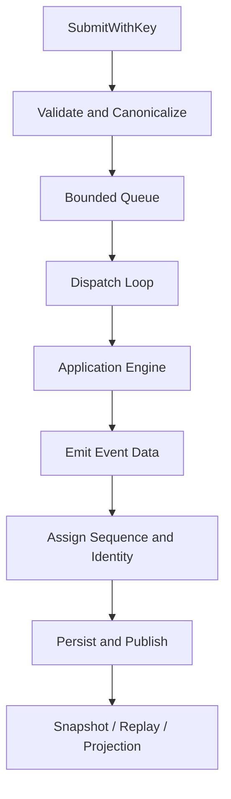

# Application Runtime 与状态投影

简体中文 | [English](../../en/03-runtime-kernel/02-application-runtime.md)

## 学习目标

理解 Operation Acceptance、Dispatch、Event Sequence、Subscriber Projection、
Active Turn Ownership，以及 App Runtime 与 Agent Engine 的边界。

## 前置知识

阅读 [Protocol 与稳定数据契约](./01-protocol.md)。

## 问题背景

Agent Engine 知道如何运行 Turn，但多个 Caller 还需要 Queue、Idempotency、
Cancellation、Replay、Pending Approval/Input 和一致的 Terminal Outcome。这些能力
如果放进 Host，会产生多套 Runtime。

## 核心概念

- **Acceptance** 在执行前校验并拥有 Operation。
- **Dispatch** 将 Operation Kind 映射到显式 Handler 和结构化 Outcome。
- **Projection** 从有序 Event 推导当前查询状态。
- **ActiveTurnRegistry** 使用 Lease 原子预留 Turn 与 Thread。
- **eventhub.Hub** 独占 Event Sequence、Append、Replay 与 Subscriber Fanout。
- **Pending Work** 表示可恢复的 Approval、Input 与 Operation 状态。

## 核心流程



## Acceptance 与 Idempotency

`SubmitWithKey` 拒绝 Closed Runtime、Malformed Operation、Queue Exhaustion 和
Conflict Reuse。相同 Operation ID/Caller Key 与相同 Canonical Payload 重复出现时为
No-op，避免 Transport 重连重复副作用。

Accepted 与 Committed Record 分开，使 Restart 能区分已进入 Runtime 和已完成 Lifecycle
的工作。

## Linearization Point 与 Backpressure

每项并发保证都需要明确 Linearization Point：

| 保证 | Linearization Point |
| --- | --- |
| Operation Accepted | Queue Send 前安装 Durable/In-memory Acceptance Record |
| Duplicate Suppressed | Runtime State Lock 下比较 Canonical Content |
| Event Ordered | Central Publish Path 分配 Sequence |
| Event Durable | Subscriber Publish 前 Event Store Append 成功 |
| Turn Active | Engine Goroutine 前绑定 Registry Lease 与 Control |
| Turn Terminal | Terminal Map 接受第一个 Terminal Kind |
| Runtime Closed | Drain Active Work 前关闭 Acceptance |

Bounded Operation Channel 是 Admission Backpressure，不是 Completion Queue。`Submit`
返回 `nil` 只代表 Accepted；完成状态来自 Event Replay/Read Model。

## Lock 与 Goroutine 边界

Runtime 将 General State 与 Active-turn Cancellation State 分开；执行 Engine、调用
Subscriber 或等待 External I/O 时不持有 Main Mutex。Dispatch Loop 拥有 Operation
Order；Turn 可异步运行，但所有 Event 都回到 Central Publish Path。

这样不会因 Model Latency 全局串行，同时保留单一 Event Order。Submit/Close Race Test
说明 Shutdown 是 State Machine 的一部分，不是 Process Afterthought。

## Dispatch 与 Active Turn

`operationDispatcher` 显式分发 Start、Cancel、Steer、Approval、Input、Compact、Fork
和 Revert。每个 Handler 返回携带可选 Events、可选 Async Turn Identity、强类型
`*protocol.Problem` 与显式 Commit Mode（`CommitNow`/`CommitDeferred`）的 Outcome；
只有 Dispatcher 执行同步 Commit/Reject 模板，`validateOperationOutcome` 按
Kind 与 Commit Mode 的组合严格校验；普通 Error 会被转换为 Problem，其中
`CodeInternal` 映射为 `CodeConflict`。Start 在 Terminal 发布前保持 Async。

`ActiveTurnRegistry` 在同一临界区预留 Thread 与 Turn；Lease 携带持久化的 Start
Operation ID。Release 必须携带匹配的 Lease Token，旧 Goroutine 无法释放后启动的
Turn。同一 Handle 绑定 Control、Cancel Provenance 与已应用的 Profile Revision，
但 Pending-work Phase 不再存放在这里：`EngineAdapter.TurnPhase` 读取权威 Turn
Kernel Snapshot。

## Terminal 与 Service Ownership

`TerminalPublisher` 是 Atomic Terminal Commit、Deterministic Outbox Projection 和
Restart Recovery 的唯一 Owner。Terminal Commit 在 Projection 前持久绑定 Frozen
Kernel State、Session Delta、Receipt、Terminal Event 与真实 Operation Receipt。

`SessionService` 拥有 Lifecycle、Profile 和 Tool Catalog；`ArtifactService` 拥有
Checkpoint、Plan、Turn Recovery 与 Artifact Persistence。Host 依赖的 Contract 位于
独立 `app/service` Package（`Session` 与 `Artifact[Recovery, Plan]` 接口），实现只是
Runtime Port 上的 Adapter，不包含 Host 逻辑。Runtime 嵌入两个 Service，Host 继续
使用原 Facade API，不产生重复转发方法。

## Event Projection

`eventhub.Hub` 独占单一排序路径：Sequence 分配、Append、Replay 与 Subscriber
Fanout。Runtime 将 `Events`、`EventsLimited`、`ReplayEvents`、`Snapshot` 与 `Close`
委托给 Hub。`Publish` 追加 Event 并 Fanout；`PublishStable` 额外通过 Identity
Store 按确定性 Event ID 去重，使 `TerminalPublisher` 的 Outbox Projection 跨重启
幂等。`Restore` 在恢复后对齐内存中的 Sequence。

Replay 按 Cursor 查询，不创建 Live Subscription；History Gap 明确返回 Recovery
Cursor。Slow Subscriber 被关闭并移除，不会阻塞排序路径。

## Thread 与 Engine 管理

`ThreadManager` 按 Thread 创建/恢复 `EngineAdapter`。Adapter 解析 Workspace/Editor
Context，将 Engine Event 转为 Protocol Event，并记录 Receipt。App 层不解析 Provider
Stream，也不授权 Tool。

## 代码地图

| 关注点 | 源码 |
| --- | --- |
| Queue/Acceptance/Dispatch | `runtime.go` |
| Operation Outcome/Handler | `operation_dispatch.go` |
| Active Turn Lease/Control | `active_turn_registry.go` |
| Event Sequence/Replay/Subscriber | `eventhub/hub.go` |
| Host 依赖 Service Contract | `service/contracts.go` |
| Atomic Terminal/Outbox Recovery | `terminal_publisher.go` |
| Session/Artifact Service | `service_facade.go`、`session_artifacts.go` |
| Engine Adapter | `application.go` |
| Pending State | `pendingwork.go` |
| Thread Ownership | `thread_manager.go` |
| Receipt | `receipt.go` |
| Durable Lifecycle | `lifecycle.go` |

## 设计取舍与替代方案

每个 Request 一个 Goroutine + Direct Callback 更简单，却没有 Total Event Order。中心
Acceptance/Sequence 路径提高确定性，有界 Queue 则显式表达 Backpressure。

Slow Subscriber 被移除可能丢失 Live UI Update，但 Replayable Event 允许恢复，也避免
一个 UI 阻塞执行。

## 失败模式与安全边界

- Queue Full 可 Retry，Closed Runtime 不可。
- Idempotency Conflict 在 Engine 执行前拒绝。
- Cursor Ahead、Gap、Replay Limit 使用不同 Machine Error。
- Plan Mode 拒绝 Idle Automatic Turn。
- Unknown Turn 的 Control Operation 被明确拒绝。
- Close 会取消 Active Work 并统计所有 Accepted Operation。

## 测试与验证

```bash
go test ./internal/runtime/app
```

重点阅读 `TestRuntimeConcurrentSubmitHasStrictSequenceAndUniqueTerminal`、
`TestRuntimeDropsSlowSubscriberDeterministically`、
`TestActiveTurnRegistryBindsControlAndCancelProvenance`、`TestOperationOutcomeContract`
和 Thread Manager Test。

## 动手实验

画出 Concurrent Submit Test 验证的三个不变量：Unique Sequence、One Terminal、
Complete Accounting；再分析 Dropped Subscriber 如何通过 `ReplayEvents` 追赶。

## 复习问题

1. Accepted 与 Committed Operation 为什么分开？
2. Event Sequence 为什么由 Runtime 而不是 Engine 分配？
3. 什么能力使 Subscriber Drop 可恢复？
4. `Submit` 线性化了什么，又没有承诺什么？
5. Subscriber Send/Engine Execution 为什么必须在 Main Lock 外？

## 延伸阅读

- [Agent Loop](./03-agent-loop.md)
- [Resume 与 Recovery](./06-resume-and-recovery.md)

## 事实来源与验证

| 项目 | 值 |
| --- | --- |
| Catalog ID | `runtime-app` |
| 状态 | `draft` |
| 最后验证 | 尚未验证 |
