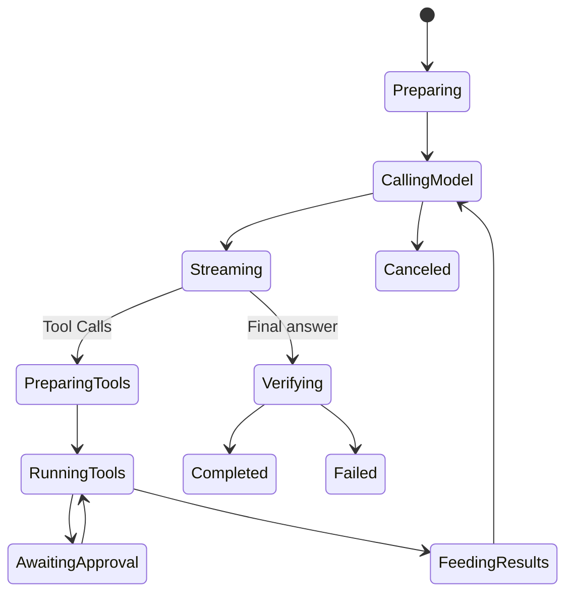

# 模型与工具执行循环

简体中文 | [English](../../en/03-runtime-kernel/03-agent-loop.md)

## 学习目标

追踪一次 Engine Step，理解 Sampling Snapshot 与 Tool Scheduling，并识别终止 Iterative
Turn 的 Gate。

## 前置知识

阅读 [Application Runtime](./02-application-runtime.md)。

## 问题背景

Agent Turn 不等于一次 Model Call。模型可能请求 Tool、消费 Result、修改计划、等待
Input 并再次 Sample。无界 Loop 会无限消耗，Stale Capability 也可能被误执行。

## State Machine



## Sampling Boundary

Turn 开始时 Engine 快照 Security Policy 与 Route Intent。Sample 前组装 Stable History
和 Volatile Context，并取得 Tool Catalog Snapshot。`ModelRequest` 只包含 Catalog
Budget 允许的 Tool Definition。

出现 Meaningful Stream Data 后不再盲目 Retry Provider，因为 Output/Tool Call 可能
已经影响外部状态。

## Tool Round Trip

Stream Fragment 被组装为完整 Tool Call，并绑定 Local Catalog Identity。Scheduler
根据 Descriptor/Resource 决定 Parallel 或 Serial，执行统一经过 Guard。

Batch 完成前不会把 Partial Result 作为完整 Tool Message 发布。Batch Settled 后，
Result 使用相同 Call ID 写入 History，下一 Sample 获得完整因果关系。

Recoverable Tool Failure 可以分类后反馈给模型；Security、Budget、Cancellation 与
Invariant Failure 必须终止，不能邀请模型绕过。

## 将一次 Iteration 视为 Transaction

每轮 Model/Tool Iteration 都有 Provisional 与 Committed 两侧：

```text
snapshot route/policy/catalog
  -> assemble request
  -> stream provisional output / complete tool calls
  -> validate/bind/schedule/execute
  -> append paired assistant call + tool result
  -> next sample / final verification
  -> commit coherent turn history at successful boundary
```

History Commit 前 Live Event 已可观察，这是有意设计：用户需要 Progress，但未来 Model
Context 绝不能含有无 Matching Result 的 Assistant Tool Call。Failed/Canceled Turn
丢弃 Incoherent Provisional History；Durable Protocol Event 仍保留为 Audit Fact。

这不是跨所有 External Effect 的 Database Transaction。File Write 使用 Guard/Journal，
Remote Effect 需要自己的 Idempotency/Reconciliation。

## State Scope

| Scope | 示例 |
| --- | --- |
| Turn | Security Snapshot、Route Intent、Workspace Gate、Budget、Trace |
| Sample | Volatile Context、Tool Definition、Provider Request、Usage Ordinal |
| Call | Catalog Binding、Argument、Resource Claim、Approval、Result |
| Thread | Committed History、Working Set、Evidence、Compaction Window |

Mid-turn Policy Reload 不应静默扩大 Authority，而 Tool Result 必须进入 Next Sample。
Scope 本身就是 Correctness 的一部分。

## Gate 与 Completion

- Max Steps 限制循环；
- Token/Cost Budget 限制消耗；
- Context Limit 触发 Compaction 或 Failure；
- Pre-sampling Gate 可要求 Plan；
- Workspace Turn Gate 串行化共享 Root 的 Writer；
- Verify Gate 在完成前检查 Change；
- Cancellation 传播到 Provider、Tool 和 Wait。

只有成功且一致的 Turn History 被 Commit；Failed History 可以 Rollback，防止后续
Turn 把不完整 Tool Exchange 当成事实。

## 代码地图

| 关注点 | 源码 |
| --- | --- |
| Loop/Sampling | `engine.go` |
| Scheduler | `scheduler.go` |
| Failure Class | `toolfailure.go` |
| Verification | `verify.go` |
| Compaction | `compaction.go` |
| Trace/Latency | `tracing.go` |
| Dynamic Context | `workingset.go` |

## 设计取舍与替代方案

Provider-side Agent Loop 会减少本地代码，却把 Tool Authority 与 Observability 移出
Runtime。所有 Tool 串行最确定，但浪费安全并发。CodeHelper 保持本地 Loop，并使用
Descriptor/Resource Scheduling。

## 失败模式与安全边界

- Unknown/Unadvertised Tool 不执行。
- Catalog 在 Sample 与 Execution 间变化时 Fail Closed。
- Tool Call Fragment 必须形成合法 JSON。
- Usage Emit 失败可以使 Turn 失败，避免少计。
- Verify Hard Failure 回滚 Journaled Change。
- Scheduler/Approval Wait 中取消会释放资源。
- Step/Budget Exhaustion 产生显式 Terminal Failure。

## 测试与验证

```bash
go test ./internal/runtime/agent/engine \
  -run 'Test(EngineExecutesToolAndFeedsResultOnce|ToolSchedulerSerialExcludesConcurrent|EngineBudgetAndFailedHistoryRollback|VerifyGateHardFailureFailsTurnAndRollsBack)'
```

## 动手实验

跟踪 `TestEngineExecutesToolAndFeedsResultOnce` 的第一条 ModelRequest、Tool Call、
Guard Result、第二条 ModelRequest 和 Final Text，确认 Call ID 配对 Assistant/Tool
Message。

## 复习问题

1. Meaningful Stream Data 为什么改变 Retry 安全性？
2. Batch Result 为什么要在 Batch Settled 后写入 History？
3. 哪些 Failure 可反馈给 Model，哪些必须终止？
4. Model-visible History Commit 前为什么可以有 Live Event？
5. 哪些 State 属于 Turn、Sample、Call、Thread Scope？

## 延伸阅读

- [Streaming、Cancellation 与 Error](./05-streaming-cancellation-errors.md)
- [Tool Guard 执行管线](../06-tools-and-execution/03-tool-guard-pipeline.md)

## 事实来源与验证

| 项目 | 值 |
| --- | --- |
| Catalog ID | `runtime-agent-loop` |
| 状态 | `verified` |
| 最后验证 | 2026-08-06 |
