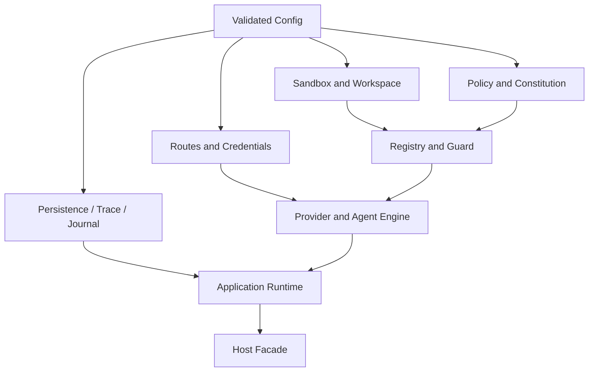

# 依赖构造与能力装配

简体中文 | [English](../../en/03-runtime-kernel/04-dependency-wiring.md)

## 学习目标

理解 Construction 为什么隔离、Config 如何成为 Runtime，以及 Turn 开始前 Wiring
必须建立哪些不变量。

## 前置知识

阅读[全局架构](../02-codehelper-overview/02-system-architecture.md)和
[Agent Loop](./03-agent-loop.md)。

## 问题背景

Provider、Credential、Route、Sandbox、Tool、Journal、Trace、MCP、Plugin、
Persistence 和 Context Budget 必须一致连接。每个 Host 分别构造会复制 Policy；
Agent Loop 内构造则混淆 Configuration 与 Behavior。

## Construction Flow



## Wiring 的职责

`internal/runtime/app/wire` 是 Composition Root，负责：

- 解析 Model Catalog Route 与 Credential Reference；
- 创建 Provider HTTP Client 或 Fixture；
- 构建 Tool Registry、Guard、Policy、Constitution、Sandbox；
- 组装 Stable Prompt Context 与 Partition Budget；
- 连接 Journal、Diagnostics、Verify、Trace、Usage 和 Store；
- 初始化 MCP、Skill、Plugin、Hook、Dynamic Tool；
- 构建 Child Runtime、Worktree 与 Background Executor；
- 选择 Persistent 或 In-memory Application Runtime。

## 组合根结构

`wire.NewExec` 是装配入口，不是 Service Locator 或业务 Workflow。它创建仅用于
构造期的 `buildState`，并执行封闭的 Module 序列：

```text
config -> provider -> platform -> persistence -> builtin tools
       -> extension contributors -> security -> orchestration
       -> agent -> runtime -> background services
```

每个 Module 实现 `buildModule` 契约（`Name()` 与 `Build`），只拥有一个构造边界，
并通过 `buildState` 仅向后续 Module 发布必要结果。Runtime、Engine 和 Session
Service 都不得持有 `buildState`。Module 失败时以 `moduleBuildError` 中止并带上
Module 名，已打开资源通过共享 Resource Stack 关闭。

Builtin 与 Extension Tool 共享同一个 `Registry` 实例。Plugin、Skill、Memory、
Task/Automation、Hook 和 MCP 实现 `extensionContributor` 契约（`ID()` 与
`Contribute`），在 `extension-tools` Module 中按固定顺序、ID 唯一执行，任何
Extension 都不修改 Agent Module。

构造与关闭共享 `assembly.ResourceStack`。`NewExec` 只注册一次资源关闭函数；
部分构造失败回滚与正常关闭都按注册逆序关闭同一 Stack。每项资源最多关闭一次，
单项关闭失败不会跳过后续资源，调用方会收到带资源标识的聚合错误。因此 Runtime
或 Scheduler 等后段构造失败也不会泄漏资源。

## Startup Invariant

Route/Capability/Config 无效、Workspace Identity 无法 Canonicalize、Required Sandbox
无法注入、Persistence Recovery 失败、Executor/Tool Identity 冲突时，Construction
直接失败，而不是创建部分可信 Runtime。

## Startup Ordering 与 Ownership Transfer

Construction 遵循 Dependency Order，而不是简单 Constructor List。上面的 Module
序列强制执行该顺序，每个编号步骤对应一个或一组 Module：

1. Validate Config 并 Canonicalize Workspace；
2. 打开 Durable Store，在 Acceptance 前 Recovery；
3. 解析 Model Metadata、Route、Limit、Credential Reference；
4. Probe Platform/Sandbox；
5. 构建 Policy、Permission、Constitution、Registry、Guard；
6. 初始化 Extension 并 Reconcile Catalog；
7. 连接 Context、Evidence、Diagnostics、Verify、Usage、Trace；
8. 创建 Thread/Engine Factory；
9. 创建 Application Runtime，最后才暴露 Host Facade。

每步成功后 Ownership 转移。后续步骤失败时，已打开 Store、Transport、Extension
Process、Background Manager 由共享 `ResourceStack` 按注册逆序 Close。即使 Turn
尚未开始，Constructor Failure 泄漏 Process 也违反 Runtime Contract。

## Capability Provenance

| Fact | 首选来源 |
| --- | --- |
| Model 支持 Tool/Vision | Catalog + Probe Observation |
| Credential Available | Execution Boundary 的 Reference Resolution |
| Strong Sandbox Available | Platform Backend Probe |
| Tool Executable | Registry Descriptor + Dependency Health |
| Extension Trusted | Manifest/Signature/Authority Receipt |
| Persistent State Ready | Open、Schema Check、Recovery 成功 |

Configuration 表达 Intent，不能制造 Environment Capability。

## 代码地图

| 关注点 | 源码 |
| --- | --- |
| 组合根与 Module 序列 | `runtime.go` |
| 构造期状态与 Module 契约 | `build_state.go` |
| config/provider/platform/persistence/builtin tools | `modules_core.go` |
| Extension Contributor | `modules_extensions.go` |
| Security Policy/Constitution/Guard | `modules_security.go` |
| Orchestration Tool 与 Subagent | `modules_orchestration.go` |
| Agent Engine/Runtime/Background | `modules_runtime.go` |
| 资源生命周期 | `assembly/resources.go` |
| Route/Budget | `route.go`、`routeset.go` |
| Provider | `model.go`、`model_catalog.go`、`model_probe.go` |
| Persistence | `persistent.go` |
| Sandbox Fact | `sandbox_info.go` |
| MCP/Extension | `mcp.go`、`extensions.go` |
| Child/Background | `childruntime.go`、`background_executors.go` |
| Task/Automation Contributor | `internal/adapter/extension/orchestration/contributor.go` |

## 实现导读

`NewExec` 执行封闭 Module 序列：Canonicalize Workspace，构建 Store/Observability，
加载 Constitution，合并 Policy，创建 Registry/Guard，组装 Prompt Context，再通过
Thread Manager 构造 Agent Engine。每步向 `buildState` 发布结果，Ownership 逐
Module 前移。Application Runtime 只接收 Engine Interface 与 Durable Facility；
Host 不获得 Provider、Guard 实例，也拿不到 `buildState`。

## 设计取舍与替代方案

DI Framework 可以自动化 Graph，却可能隐藏 Ordering 与 Security Decision。CodeHelper
使用显式 Go Construction，使 Reviewer 能追踪进入 Guard 的 Backend 和 Policy。
Composition Root 较大时的对策是封闭 Module 序列（`modules_*.go` 按 Module 归属）、
仅构造期存在的 `buildState` 和显式 `ResourceStack`，而不是把 Business Loop 移入
Wiring。

## 失败模式与安全边界

- Host 不能构造 Unguarded Registry Shortcut。
- Fixture 与 Live Route 必须显式。
- Sandbox Capability 来自 Backend Probe，而非 Config 声明。
- Secret Value 在 Provider Execution Boundary 解析。
- Child Runtime 的 Budget/Depth/Workspace 必须窄于 Parent Authority。

## 测试与验证

```bash
go test ./internal/runtime/app/wire
go test ./internal/host/cli -run TestCLIDoesNotDependOnExecutionImplementations
```

## 动手实验

从 CLI `exec` 只追踪 Constructor，直到 `wire.NewExec`。在 `defaultBuildModules`
中识别 Module 序列，记录 Route、Guard、Sandbox、Journal、Prompt Context 在哪里
接入；这条路径不应出现 Business Turn Step。

## 复习问题

1. Wiring 为什么可以依赖具体实现而 Host 不可以？
2. 哪些构造失败必须阻止 Runtime Startup？
3. Capability Probe 为什么优先于 Config Claim？
4. Host Facade 为什么最后暴露？
5. Construction 中途失败时必须关闭哪些 Resource？

## 延伸阅读

- [Application Runtime](./02-application-runtime.md)
- [Provider Adapter、Model Catalog 与 Wire ID](../04-model-and-provider/02-provider-and-catalog.md)

## 事实来源与验证

| 项目 | 值 |
| --- | --- |
| Catalog ID | `runtime-wiring` |
| 状态 | `draft` |
| 最后验证 | 尚未验证 |
