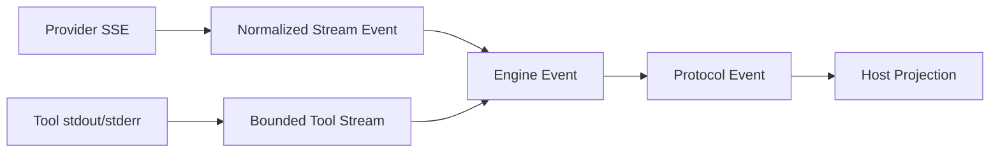

# Streaming、Cancellation 与 Error Taxonomy

简体中文 | [English](../../en/03-runtime-kernel/05-streaming-cancellation-errors.md)

## 学习目标

理解 Partial Output 如何保持可观察、Cancellation 如何传播，以及 Machine Error
Category 如何驱动 Retry 与 Terminal Behavior。

## 前置知识

阅读[模型与工具执行循环](./03-agent-loop.md)。

## 问题背景

长时间 Model/Tool Call 需要 Streaming，但 Partial Output 会改变 Retry 安全性。
Cancellation 必须停止 Provider、Scheduler、Approval Wait、Process Group 与 Runtime
Ownership；Free-form Error 则会迫使 Host 猜测能否 Retry。

## Streaming Layer



Provider Adapter 规范化 Vendor Fragment。Engine 组装 Tool Call Argument，同时转发
Text、Reasoning、Citation、Usage 与有界 Tool Output；Protocol Event 再增加 Durable
Identity 和 Ordering。

Tool Output 使用 Byte Cursor 和 Truncation Marker。Live Commentary 达到 Budget 后可
停止，但 Final Tool Result 仍包含完整或可检索内容。

## 各层 Delivery Guarantee

| Layer | Guarantee | Recovery |
| --- | --- | --- |
| Provider Fragment | 单 Stream 有序、Vendor-specific Terminal | Adapter 分类 Incomplete Stream |
| Engine Event | Normalized、Call-correlated、Bounded | Turn Fail/Cancel/Continue |
| Protocol Event | Runtime Sequence/Stable Identity | Cursor Replay |
| Host Projection | Disconnect/Slow Consumer 时可能漏 Live Data | Rebuild/Replay，不 Rerun |

Streaming 不是 Exactly-once Transport Delivery。Event ID/Reducer Idempotency 处理
Duplicate Observation，Runtime Sequence 保证顺序，唯一 Terminal Event 定义 Lifecycle。

## Cancellation Propagation

`app.Runtime` 为 Active Turn 保存 CancelFunc；`turn.cancel` 记录 Provenance 后调用。
Context 传播到 Engine、Provider Stream、Tool Scheduler、Guard、Approval/Input Wait
和 Process。每个 Blocking Boundary 都必须监听 `ctx.Done()`；Process 还要终止 Group，
防止 Child Process 存活。

Cancellation 产生 `turn.canceled`，不是任意 Failure 或缺失 Terminal Event。

Cancellation Ownership 分层：

- Host 通过 Operation 请求 Cancel；
- Runtime 拥有 Active Turn Lookup、Provenance、Terminal Event；
- Engine 停止 Sampling/Scheduling 并 Rollback Provisional History；
- Guard 释放 Approval Wait/Resource Claim；
- Provider 关闭 Stream/Request；
- Platform 终止 Process Group/PTY。

Lower-layer `context.Canceled` 是 Cause，不授权产生第二个 Terminal Outcome。

## Error Taxonomy

`protocol.Problem` 包含 Stable Machine Code、Safe Message、Retryable 与 Structured
Detail。Invalid Argument、Conflict、Unavailable、Resource Exhausted、Denied 与
Internal Failure 具有不同语义。

只有语义安全时才 Retry。Meaningful Stream 后停止 Provider Retry；Recoverable Tool
Failure 可以反馈给 Model，Security Denial 与 Invariant Failure 不允许模型绕过。

## Retry Decision Table

| Failure Point | 自动 Retry？ | 原因 |
| --- | --- | --- |
| Provider Connect Before Data | Transient 时有界 Retry | 尚无 Meaningful Output |
| Provider After Text/Tool Fragment | 不 Blind Retry | 已可能影响 State |
| Tool Precondition Before Effect | 可 Model Correction/Retry | 无 Side Effect |
| Tool Partial/Unknown Effect | 不自动 Retry | Duplicate Effect Risk |
| Policy/Sandbox Denial | 不 | Authority Boundary |
| Queue Exhaustion | Caller Backoff Retry | Operation 未接受 |
| Verification Failure | Repair/Revert Policy | Semantic Outcome Failure |
| Cancellation | 不 | Explicit Intent |

## 代码地图

| 关注点 | 源码 |
| --- | --- |
| Problem | `runtime/protocol/problem.go` |
| Provider Stream | `adapter/provider` |
| Engine Stream | `agent/engine/engine.go` |
| Tool Output | `agent/engine/toolstream.go` |
| Tool Failure | `agent/engine/toolfailure.go` |
| Cancellation | `runtime/app/runtime.go` |
| Process Cleanup | `platform/process` |

## 设计取舍与替代方案

完成后一次性输出容易 Replay，但长任务不可见；无限 Streaming 会耗尽 Memory/Log。
Bounded Stream + Final Result 将 Live UX 与完整证据分开。All Errors Retry 看似强韧，
却可能重复副作用；显式 Taxonomy 支持保守 Retry。

## 失败模式与安全边界

- Partial Provider Data 阻止 Blind Retry。
- Tool Stream Overflow 标记 Truncation。
- Subscriber Backpressure 不阻塞 Runtime。
- Scheduler/Approval 中取消会释放 Claim/Wait。
- Cancellation 后到达的 Approval 被拒绝。
- Raw Provider/File Error 在 Public Output 前 Sanitized。

## 测试与验证

```bash
go test ./internal/runtime/protocol -run TestCodeOfContextErrors
go test ./internal/runtime/app -run 'TestRuntime(CancelActuallyCancelsActiveTurn|DropsSlowSubscriberDeterministically)'
go test ./internal/runtime/agent/engine \
  -run 'Test(ToolOutputReachesTheHostWhileTheCallIsStillOpen|ToolSchedulerCancelDuringAdmit|EngineRetriesOnlyBeforeMeaningfulStreamData)'
```

## 动手实验

使用 `-v` 运行 `TestToolOutputReachesTheHostWhileTheCallIsStillOpen`，找出 Tool 尚未
完成但 Host 已收到 Chunk 的时刻；再比较 `context.Canceled` 的 Problem Mapping 与
Runtime Terminal Event。

## 复习问题

1. Partial Output 为什么改变 Retry 安全性？
2. Tool Stream Budget 与 Final Result 为什么分离？
3. Cancellation 除 Provider 外还必须释放什么？
4. Protocol Replay 为什么不同于 Execution Retry？
5. 哪个组件拥有权威 `turn.canceled`？

## 延伸阅读

- [Provider Failure 与 Retry](../04-model-and-provider/06-provider-failures.md)
- [Resume 与 Recovery](./06-resume-and-recovery.md)

## 事实来源与验证

| 项目 | 值 |
| --- | --- |
| Catalog ID | `runtime-stream-cancel-errors` |
| 状态 | `draft` |
| 最后验证 | 尚未验证 |
