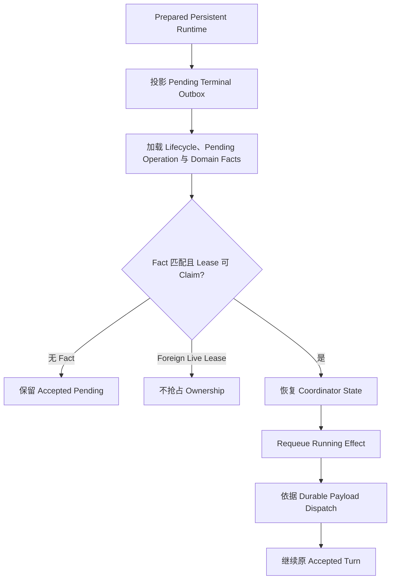

# Resume、Recovery 与幂等边界

## 学习目标

区分 Resume 与 Recovery，理解 Durable Lifecycle Reconstruction，并识别防止重复
副作用的 Idempotency Boundary。

## 前置知识

阅读 [Application Runtime](./02-application-runtime.md)和
[Streaming、Cancellation 与 Error](./05-streaming-cancellation-errors.md)。

## 问题背景

Client Disconnect 不等于 Turn Failure，Process Crash 也不是普通 Pause。Resume 连接
合法 Durable State；Recovery 则协调 Owner 消失或 Effect 中断的状态。混淆两者会
Replay Model/Tool Work 并重复副作用。

## Recovery Model



Persistent Assembly 先用恢复出的 Lifecycle State 准备 Runtime，再由
`Runtime.Start` 激活。`TerminalPublisher` 首先通过 Event Hub 以确定性 Event ID
（`PublishStable`）发布 Pending Terminal Outbox Entry。随后 Runtime Loop 启动，
`recoverPendingTurns` 仅重排存在匹配 Domain Facts 的已接受 `turn.start` Operation。
没有 Fact 的 Accepted Operation 不会仅因自身存在就触发 Sampling。

## Resume

Resume 选择已有 Session/Thread，重建 Coherent History，再提交新输入或重连 Event。
它不会重新运行已 Committed Engine Work。

History 只保留 Completed 且 Tool Pair 完整的 Exchange；Failed/Incomplete Fragment
被丢弃，避免后续 Model 看到无 Result 的 Tool Call。Revert 只移除 Target Turn。

## Recovery

Recovery 恢复 Accepted/Committed Operation、Pending Turn/Approval/Input、有序且
带 Digest 的 Turn Domain Facts/Frozen Kernel State、带 Payload Digest 与
Idempotency Key 的 Provider/Tool/Approval/Input/Verification/Journal Effect、
Terminal Outbox Projection/Item Identity、Receipt/Trace/Terminal Envelope 共享的 Frozen
Terminal Measurement、Last Cursor、Thread History/Snapshot
与 Workspace Journal，
以及每个 Thread 最新 Durable SessionDelta（随 Turn 的 Terminal Envelope 提交，
含 History、Usage、Cost、Working Set、Evidence、Failures、Compaction 与
Revision/Digest）。

Turn 状态以 `SessionDelta` 与 Digested `TerminalMeasurementSnapshot` 随 Terminal
Envelope 原子提交。Engine 在执行期间 Stage Delta，并且只在 Envelope Durable
Commit 后应用一次；Commit 失败时 Session Memory 保持不变。重启后 `ThreadManager`
从 `persist/state/turnstate` 恢复每个 Thread 的最新 Delta，使 Usage、Cost、Working
Set、Evidence、Failures 与 Compaction 计数和 Committed History 一起跨 Crash 存活。

Observation Journal 可通过 Correlated Evidence 帮助解释 Recovery，但不是
Continuation Source。Missing/Failed Observation Export 不能授权 Effect Dispatch、
合成 Domain Fact 或改变 Terminal Business Result。

`durableCoordinatorRuntime` Claim 已过期的 Active-turn Lease，从严格有序的 Domain
Facts 恢复每个 Coordinator，并在 Active 期间续租。Restore 先通过持久化
`EffectRequeued` Command 把每个 `EffectRunning` 改回 `EffectRequested`，再从 Durable
Payload 路由全部 Pending Effect。Engine 继续原 Turn，并在再次等待前恢复原始
Approval/Input Request ID。

这是有条件的 Continuation，不是 Blind Operation Replay。Fact 缺失、Sequence/Digest
非法、Effect Route 不可用、Lease 冲突或 Payload 不完整都会 Fail Closed；Live Foreign
Lease 永不被抢占。

## 四种不同的 “Re”

| 操作 | 是否重复执行 | 目的 |
| --- | --- | --- |
| Replay | 否 | 再次交付已记录 Event |
| Resume | 不重复已完成工作 | 从 Coherent Durable State 继续 |
| Retry | 是，受显式 Contract 约束 | 重做 Transient/Precondition-safe Attempt |
| Reconcile | 先检查再修复 | 处理不确定 External/Partial State |

把四者都称为 Resume 会隐藏 Duplicate-effect Risk。Owner 必须依据 Durable Record 与可证明
Effect 选择行为。

Turn-level Retry/Continue 是显式 Recovery Operation，不是自动 Provider Retry。Runtime
从 Durable History 重建 Source Turn 的 Model-visible Request，并创建新 Turn。Retry
保持原 Request；Continue 可追加有界 Guidance。两者都要求 Source 已 Terminal、
Target Session Idle、Active-thread Ownership 与新 Idempotency Key；不会复制或重放
历史 Tool、Command、Network 或 File Effect。

## Session Checkpoint 与 State-only Restore

Session Checkpoint 是由 Snapshot Metadata/CAS 支持的不可变 Artifact，绑定 Session、
Thread、Turn、Profile Revision、Model-visible History 与 Integrity Data；它不同于
Workflow Node Checkpoint。

Restore 只恢复 State。Runtime 选择已验证的 History/Profile Baseline 并发出 Durable
Restore Fact，不重新执行历史 Event/Effect。Fork 同样只恢复 State，再创建带 Parent
Session/Thread/Checkpoint Lineage 的新 Active Thread；该关系状态可跨进程重启恢复。

Structured Plan Artifact 复用相同 Ownership Discipline。在 Current Session、New
Session 或 Checkpoint Fork 中实施 Plan，都会在 Runtime 校验 Plan Identity、Source
Profile Revision、Target Profile Equivalence 与 Lineage 后创建新 Turn。

## Crash Window Matrix

| Crash Window | Durable Evidence | Safe Startup Action |
| --- | --- | --- |
| Acceptance 前 | 无 | Caller 正常 Submit |
| Accepted、首个 Domain Fact 前 | 仅 Acceptance Record | 保持 Pending，不 Sample |
| Domain Fact 已持久化、Effect Requested | State/Effect Payload | Claim Lease 并 Dispatch |
| Effect Running、无 Result Fact | `EffectStarted`/Idempotency Key | 持久化 `EffectRequeued` 后恢复 Route |
| Result 已产生、Fact Append 失败 | Retained Result Command | 重交同一 Result，不重跑 Effect |
| Tool Proposed、无 Result | Open Call/Pending Tool Effect | 恢复 Effect；Incomplete Pair 不进 Committed History |
| File Journaled、未 Commit | Before-image/Owner | Owner Dead 时 Restore |
| File Turn Committed | Commit/Settlement | 保留 Write |
| Remote Effect Outcome Unknown | Proof 不足 | Reconcile，不声称 Revert |
| Terminal Event Durable、Projection 缺失 | Authoritative Event | Rebuild Projection |

Recovery 采取保守策略，因为显式 Interrupted State 比静默重复 Effect 更安全。

## Workspace Journal

写入前 Journal 保存 Before-image 与 Process Ownership。Startup 时：

- Committed Turn：保留 Write 并 Settle；
- Abandoned In-progress Turn：恢复 Before-image；
- Owner 仍存活：不撤销其工作。

Journal 只声明能证明的 File Effect，不能声称回退任意 Network/External Side Effect。

## Idempotency Boundary

- Operation ID/Caller Key：Submission；
- Event ID/Sequence：Replay/Projection；
- Tool Call ID：Request/Result Pair；
- Task Attempt/Lease：Background Claim；
- Edit Plan/Journal Fingerprint：File Effect。

Idempotency 只在局部边界成立；一个 Key 不能使任意 Shell Command 自动幂等。

## 代码地图

| 关注点 | 源码 |
| --- | --- |
| Lifecycle Contract | `runtime/app/lifecycle.go` |
| Startup Activation/Pending Turn Dispatch | `runtime/app/runtime_start.go`、`runtime/app/runtime.go` |
| History | `runtime/app/reconstruct.go` |
| Persistent Assembly | `runtime/app/persistence/runtime.go` |
| Turn Lease/Coordinator Runtime | `runtime/app/wire/turn_coordinator.go` |
| Coordinator Restore/Effect Requeue | `runtime/agent/turnkernel/coordinator.go` |
| Durable Effect Result Retention | `runtime/agent/turnkernel/effect_dispatcher.go` |
| Session/Snapshot | `persist/session`、`persist/snapshot` |
| Checkpoint/Plan/Turn Recovery | `runtime/app/session_artifacts.go` |
| Thread Session State Restore | `runtime/app/thread_manager.go` |
| Terminal Turn State Store | `persist/state/turnstate` |
| Observation Evidence（非 Recovery Authority） | `observability/journal` |
| Workspace Recovery | `persist/workspacejournal` |

## 设计取舍与替代方案

Restart 后 Replay 所有 Accepted Operation 会重复 Provider Cost 与 Effect。CodeHelper
只继续具备合法 Domain Facts、可 Claim Lease 与受支持 Durable Effect Route 的 Turn。
Coordinator 恢复 State；Retained Result Protocol 与每个 Effect 的 Idempotency
Identity 防止一次 State Append 失败变成第二次 External Execution。

Event Sourcing 可重建 Logical State，却不能恢复 Half-written File；Journal 用
Effect-specific Before-image 补充。

## 失败模式与安全边界

- Recovery Failure 阻止 Persistent Runtime Startup。
- Incomplete Tool History 不进入 Model Context。
- Live Lease 被保留。
- Non-executable Interrupted Work 明确失败。
- Journal Restore 检查 Ownership/Fingerprint。
- External Side Effect 不被错误报告为 Reverted。
- Checkpoint Restore/Fork 不执行历史 Side Effect。
- Retry/Continue 拒绝 Non-terminal、Cross-thread、Busy 或 Stale Source。

## 测试与验证

```bash
go test ./internal/runtime/app -run TestReconstructThread
go test ./internal/runtime/app \
  -run 'Test(C5|C6|Phase4R|SessionCheckpoint|Restore|Fork|RecoverTurn|Plan)'
go test ./internal/runtime/app/wire -run TestPersistentRuntime
go test ./internal/runtime/agent/turnkernel
go test ./internal/persist/state/turnstate
go test ./internal/persist/workspacejournal \
  -run 'Test(TheNextProcessUndoesATurnAKilledProcessLeftHalfApplied|RecoveryKeepsTheWritesOfATurnThatAlreadyCommitted)'
```

## 动手实验

```bash
go test ./internal/host/cli -run TestExecPersistentResumeListTurns
```

再阅读 `persistent_test.go`，将用例分类为 Resume、Logical Recovery、Lease Recovery
或 Effect Recovery。

## 复习问题

1. 为什么没有 Domain Facts 的 Accepted Operation 必须保持 Pending？
2. Event 与 Workspace Journal 各能恢复什么？
3. Idempotency 为什么必须限定边界？
4. Replay、Resume、Retry、Reconcile 有何区别？
5. Remote Effect Outcome Unknown 时应该怎么做？
6. Checkpoint 为什么可恢复 History，却不能 Replay Event？
7. Continue 与恢复 Interrupted Process 有何不同？
8. 为什么 Restart 后 Dispatch Running Effect 前必须先持久化 `EffectRequeued`？

## 延伸阅读

- [为什么需要 Durable State](../08-state-observability/01-why-durable-state.md)
- [Checkpoint 与恢复](../09-task-orchestration/04-checkpoint-and-recovery.md)

## 事实来源与验证

| 项目 | 值 |
| --- | --- |
| Catalog ID | `runtime-resume-recovery` |
| 状态 | `verified` |
| 最后验证 | 2026-08-17 |
