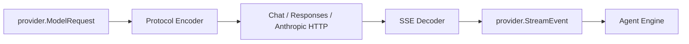

# Chat Completion 与 Responses 协议

简体中文 | [English](../../en/04-model-and-provider/01-wire-protocols.md)

## 学习目标

区分 CodeHelper Normalized Provider Contract 与 Vendor Wire Protocol，追踪 Chat、
Responses、Anthropic Stream 如何变为统一 Event。

## 前置知识

阅读 [Protocol 与稳定数据契约](../03-runtime-kernel/01-protocol.md)。

## 问题背景

不同 Provider 对 Message、Reasoning、Tool Call、Search、Usage 和 Stream Terminal
的表示不同。如果 Agent Engine 理解所有 Wire Format，Vendor Branch 会扩散到 Runtime。

## Normalization Boundary



`ModelRequest` 包含 Resolved Route、Normalized Message、Output Limit、Reasoning/Search
Option、Tool Definition 与 Cache Hint。`Provider.Stream` 返回统一 Text、Reasoning、
Tool Fragment、Search、Citation、Usage 与 Terminal Information。

Chat Completion 使用 choices/delta 和 Indexed Function Fragment；Responses 使用
Typed Output Item；Anthropic 使用 Content-block Lifecycle。Encoder 保持各协议要求的
History Shape，Decoder 输出同一 StreamEvent。

Tool History 必须按 Call ID 保持 Assistant Call 与 Tool Result 配对。Reasoning
Signature 只在 Route 支持时 Replay。

## Semantic Mapping Matrix

| Concept | OpenAI Chat | OpenAI Responses | Anthropic | Normalized |
| --- | --- | --- | --- | --- |
| Visible Text | Choice Delta | Output Text Item/Delta | Content Block Delta | Text Delta |
| Reasoning | Provider Detail | Reasoning Item | Thinking Block | Reasoning/Signature |
| Tool Proposal | Indexed Function Fragment | Function-call Item | Tool-use Block | Tool Fragment |
| Tool Result | Tool Message | Call-output Item | Tool-result Block | Tool Result Block |
| Search/Citation | Provider-specific | Search/Citation Item | Server-tool Result | Search/Citation |
| Usage | Final Stream Chunk | Completed Response | Start/Delta Usage | Normalized Usage |
| Terminal | Finish Reason + EOF | Response Completed | Message Stop | Message Stop |

EOF 本身并不总是 Success。每个 Decoder 都跟踪协议 Terminal Marker，并拒绝可能伪装成
完整响应的 Abrupt Stream。

## Lossless Core 与 Opaque Extension

Common Semantic 被 Normalized；`ContentProvider`/`ProviderData` 保留 Encrypted
Reasoning 等 Opaque Replay Artifact。Opaque Data 只可在 Compatible Route 原样返回，
不能被解释为 Runtime Authority。

Attachment 携带 Bytes/Media Type，而不是 Local Path。Encoder 获得 Content，不获得读取
任意 Workspace File 的权限。

## 代码地图

| 关注点 | 源码 |
| --- | --- |
| Normalized Type | `provider/types.go` |
| HTTP Encode/Retry | `provider/httpclient/client.go` |
| OpenAI Decode | `provider/openai/stream.go` |
| Anthropic Decode | `provider/anthropic/stream.go` |
| SSE | `provider/sse.go` |

## 设计取舍与替代方案

Lowest-common-denominator API 会丢失 Reasoning、Native Search 与 Cache Control；
暴露 Raw Payload 又会耦合 Engine。CodeHelper 使用 Rich Normalized Model，并通过
Capability Check 控制 Optional Feature。

## 失败模式与安全边界

- Protocol/Endpoint 不匹配在 Request 前失败。
- Unknown Stream Event 或 Malformed Tool Fragment Decode 失败。
- Tool History 不符合协议时拒绝。
- SSE/HTTP Size Limit 限制 Remote Input。
- Redirect/Debug Dump 不得泄漏 Credential。

## 测试与验证

```bash
go test ./internal/adapter/provider/...
```

## 动手实验

比较 OpenAI Chat 与 Responses 的 Normalization Test，列出不同 Wire Field 如何形成
相同 Text、Reasoning、Tool、Usage、Search 和 Citation Event。

## 复习问题

1. Agent Engine 为什么不应解析 Vendor SSE？
2. Lowest-common-denominator 会丢失哪些能力？
3. Tool History Encoding 为什么依赖 Protocol？
4. EOF 为什么不足以证明所有协议完成？
5. Provider-specific Data 何时应保持 Opaque？

## 延伸阅读

- [Provider 与 Catalog](./02-provider-and-catalog.md)
- [Streaming、Reasoning 与 Usage](./04-streaming-reasoning-and-usage.md)

## 事实来源与验证

| 项目 | 值 |
| --- | --- |
| Catalog ID | `model-wire-protocols` |
| 状态 | `draft` |
| 最后验证 | 尚未验证 |
