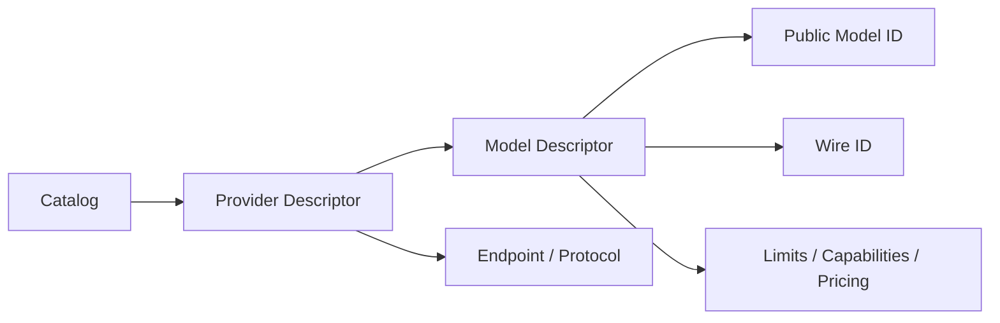

# Provider Adapter、Model Catalog 与 Wire ID

简体中文 | [English](../../en/04-model-and-provider/02-provider-and-catalog.md)

## 学习目标

理解 Provider/Model 分离、Catalog Validation，以及 Public Model ID 为什么可能不同于
Wire ID。

## 前置知识

阅读 [Chat Completion 与 Responses 协议](./01-wire-protocols.md)。

## 问题背景

一个 Provider 暴露多个 Model，同一 Model Family 可能从不同 Endpoint 服务，Alias
也可能变化，而 Persisted Session 需要稳定 Identity。单个 `model` String 无法表达。

## Catalog Model



Provider Descriptor 定义 Kind、Endpoint、Protocol、Credential Reference 与 Models；
Model Descriptor 定义 Wire ID、Context/Output Limit、Capability、Pricing 与 Alias。

Catalog Provider/Model ID 是本地稳定选择 Key；Wire ID 发送给 Remote API。Persisted
Route Evidence 同时记录 Selection 与 Actual Route，避免后续 Cost/Debug 从 Alias 猜测。

## Identity 与 Provenance 层次

| Field | 含义 | 记录原因 |
| --- | --- | --- |
| Provider ID | Local Service/Config Identity | Selection/Credential Boundary |
| Model ID | Provider 内 Stable Key | User Config/Route Lookup |
| Canonical ID | Cross-entry Model Identity | 不改变 Route 的比较 |
| Wire ID | Remote Request Exact Value | Reproducibility/Diagnostics |
| Provenance | Bundled/Config/CLI/Fixture | Trust/Drift Explanation |
| Metadata Provenance | Limit/Capability/Pricing 来源 | 不把 Guess 当 Fact |

Pricing 具有独立 `Known` Bit：Unknown Pricing 不等于 Zero Cost；Currency/Rate 只有在来源
已知时才有效。

## Immutability 与 Defensive Copy

Catalog 在 Insert 时 Normalize/Validate Provider，并在 Lookup 时返回 Copy。Caller 无法
修改 Shared Model Map 并静默改变其他 Turn Route。`ReadyRoute` 只能由 `Resolver`
创建，其内部 Ready State 防止 Partial Struct 冒充 Validated Route。

Probe Overlay 返回带调整 Capability 的 Route Copy，不重写 Bundled Catalog 或共享
Descriptor。

## Validation 与代码地图

Catalog 拒绝 Duplicate ID、缺失 Endpoint/Protocol、Invalid Limit、Capability/Limit
矛盾与无效 Credential Reference。Golden Test 检测 Built-in Route 的意外变化。

| 关注点 | 源码 |
| --- | --- |
| Descriptor | `model/catalog.go` |
| Capability | `model/capability.go` |
| Route | `model/route.go` |
| Purpose Route | `model/routeset.go` |
| Observation | `model/observation.go` |

## 设计取舍与替代方案

直接使用 Vendor Model Name 很简单，却让 Config/Persistence 依赖 Remote Naming。
Local Catalog 增加维护成本，但提供稳定 Identity、Validation、Pricing 与 Capability。

## 失败模式与安全边界

- Duplicate Provider/Model/Alias 被拒绝。
- Output Limit 不能超过 Context Limit。
- Endpoint/Credential Reference 属于安全敏感 Config。
- Runtime Observation 可收窄 Confidence，不能静默发明 Capability。

## 测试与验证

```bash
go test ./internal/adapter/model
make build
./bin/codehelper model list
```

## 动手实验

选择一个 Built-in Provider，记录 Public ID、Wire ID、Protocol、Endpoint、Limit、
Capability 与 Credential Reference，再跟踪 `Resolver.Resolve` 生成 `ReadyRoute`。

## 复习问题

1. Provider ID、Model ID、Wire ID 为什么分离？
2. 哪些 Catalog Field 安全敏感？
3. Golden Test 为什么要检测 Built-in Route Drift？
4. Unknown Pricing 为什么不同于 Zero Pricing？
5. Catalog Lookup 为什么返回 Defensive Copy？

## 延伸阅读

- [Capability 与 Routing](./03-capability-and-routing.md)

## 事实来源与验证

| 项目 | 值 |
| --- | --- |
| Catalog ID | `model-provider-catalog` |
| 状态 | `verified` |
| 最后验证 | 2026-08-06 |
