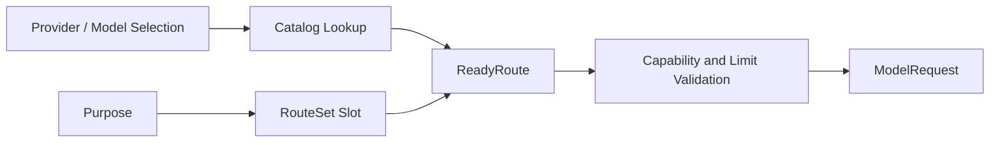

# Capability Negotiation 与 Route Resolution

## 学习目标

理解 Requested Behavior 如何根据 Model Capability 检查，以及不同 Agent Purpose 如何
选择显式 Route。

## 前置知识

阅读 [Provider Adapter、Model Catalog 与 Wire ID](./02-provider-and-catalog.md)。

## 问题背景与设计

发送 Unsupported Field 会在工作开始后得到 Remote 400；所有任务使用同一 Model 又会
浪费 Cost 或缺失 Vision、Reasoning、Search、Tool Call。

## Resolution Flow



`Resolver` 将 Selection 转为 Validated `ReadyRoute`；`RouteSet` 将 Plan、Act、Vision
等 Purpose 映射到 Route。Request 在网络前验证 Reasoning、Native Search、Tool Call、
Prompt Cache 和 Output Limit。

交互 Runtime 可以把同一 Provider 下已解析并标记为 `hot` 的 Model 交给 Session
Profile 选择。Engine 只在没有活动 Turn 时用新 Act Route 替换 RouteSet 的 Act 项，
保留显式 Purpose Slot 与 Lock；下一次 Turn 再冻结新的 Route。跨 Provider 选择需要
不同的凭据与 Endpoint Authority，仍属于 Runtime 重启边界。

## Capability Evidence

Capability 从 Catalog Declaration 开始，Runtime Observation 可以记录 Evidence 与
Confidence，但不能静默升级未知能力。Locked Turn 固定 Slot，避免 Mid-turn Config
Change 切换 Model Identity。

## Evidence Lattice

Capability Update 有意保持不对称：

```text
catalog true + negative probe  -> false  (tighten)
catalog false + positive probe -> false  (除非 Operator Trust Widening)
trusted positive observation   -> copied route 上 true
unknown capability name        -> reject
```

Negative Observation 可以立即阻止 Unsafe Request；Positive Probe 默认不能授予能力，
因为 Probe 可能命中不同 Deployment、Account Tier 或 Temporary Behavior。

`ForceCapabilities` 只用于让受控 Probe 越过 Local Validation 以学习 Remote Truth，不是
Ordinary Sampling Authority。

## Purpose Routing 不是 Complexity Router

Purpose Slot 是显式配置。Auto Resolve 在 Capability Filter 后仍要求 Unique Model ID
Match，不选择“最聪明”或最便宜 Model。Unwired Locked Purpose 会失败，而非静默退回 Act。

这使 Route Selection 可解释，并使 Usage/Cost 归因到实际 Purpose/Route。

## 代码地图

| 关注点 | 源码 |
| --- | --- |
| Capability | `model/capability.go` |
| Resolver | `model/route.go` |
| Purpose/RouteSet | `model/purpose.go`、`routeset.go` |
| Probe Overlay | `runtime/app/wire/probe_overlay.go` |
| Engine Route | `runtime/agent/engine/route_test.go` |

## 设计取舍与替代方案

“发送后看错误”会推迟 Failure；纯静态 Flag 又可能过时。CodeHelper 组合 Catalog Fact
与显式 Observation，未知能力默认不升级。

## 失败模式与安全边界

- Missing Provider/Model/Purpose Slot 在 Sample 前失败。
- Unsupported Feature 与超限 Output 被本地拒绝。
- Locked Turn 不静默切 Route。
- Fallback 必须保持 Required Capability 与 Endpoint/Credential Policy。

## 测试与验证

```bash
go test ./internal/adapter/model
go test ./internal/runtime/app/wire -run 'Test.*Route'
go test ./internal/runtime/agent/engine -run 'Test.*Route'
```

## 动手实验

阅读具有不同 Plan/Act Route 的 `RouteSet` Test，预测每个 Purpose 的结果；再在本地测试
中对 Non-reasoning Model 增加 Reasoning Request，观察 Local Validation。

## 复习问题

1. Capability Bit 为什么是可执行契约？
2. Turn 为什么要锁定 Route？
3. Runtime Observation 何时可以改变 Catalog Claim？
4. Positive Probe Evidence 为什么默认弱于 Negative Evidence？
5. Auto Routing 为什么要求 Unique Identity Match？

## 延伸阅读

- [Streaming、Reasoning 与 Usage](./04-streaming-reasoning-and-usage.md)

## 事实来源与验证

| 项目 | 值 |
| --- | --- |
| Catalog ID | `model-capability-routing` |
| 状态 | `draft` |
| 最后验证 | 尚未验证 |
