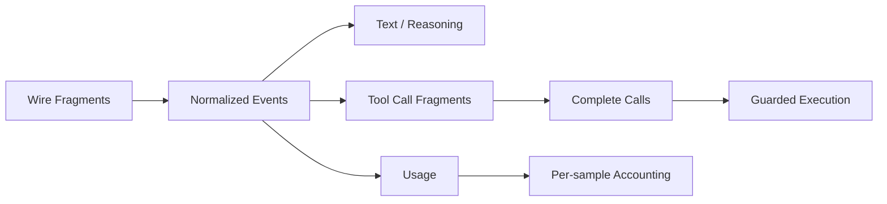

# Streaming、Reasoning、Tool Call 与 Usage

简体中文 | [English](../../en/04-model-and-provider/04-streaming-reasoning-and-usage.md)

## 学习目标

理解 Normalized Stream、Tool Call Assembly、Reasoning Separation，以及 Multi-sample
Usage/Cost 的正确计算。

## 前置知识

阅读 [Wire Protocol](./01-wire-protocols.md)和
[Streaming/Cancellation](../03-runtime-kernel/05-streaming-cancellation-errors.md)。

## Stream Semantics



Text 与 Reasoning 是不同 Block/Event；Reasoning Signature 是 Opaque Provider
Artifact。Tool Fragment 按 Index/ID 聚合，只有形成合法 Name/JSON Argument 后才执行。

## Fragment Assembly Invariant

Tool Streaming 是小型 State Machine：

1. 以 Protocol Index/ID 标识 Logical Call；
2. 按 Protocol Ordering 接收 ID/Name Fragment；
3. 追加 Argument Bytes，不解析 Partial JSON；
4. 要求 Terminal Stream Marker；
5. 验证完整 Name、Call ID、JSON Object；
6. Sample 后绑定 Local Catalog Identity；
7. 最后才提交 Guard/Scheduler。

Fragment 永远不可执行。两个 Interleaved Call 使用独立 Buffer；Abrupt EOF 不能把
Incomplete Buffer 提升为 Tool Call。

Reasoning Text、Visible Text、Opaque Signature/Provider Data、Tool Argument 保持独立
Content Block，避免 Replay 改变其 Role。

一个 Turn 可产生多个 Provider Sample，包括 Tool-side Model Call。Usage 在一个 Sample
内是 Cumulative，因此 Aggregation 保留每个 Sample 的最后报告，而不是累加所有 Delta。
Sample Index 与 Purpose 区分 Main Act、Vision 等调用。

Cost 使用实际 Sample Route；`CostKnown` 区分零价格和未知价格。Latency 分离 Queue、
Model、First Token、Tool、Approval 与 Verification。

Normalized Usage 保持子集不变量：

```text
CachedTokens    <= InputTokens
ReasoningTokens <= OutputTokens
TotalTokens      = InputTokens + OutputTokens
```

Cached/Reasoning Token 是 Breakdown，不是额外 Total。Anthropic Cache Read/Write 在
Adapter 归一化进入 Input Total。一个 Sample 内保留最新 Cumulative Report；跨 Sample
再汇总 Final Report。

Cost 使用该 Sample 的 Actual Route/Pricing Provenance，而非 Turn Default Model Name。

## 代码地图

| 关注点 | 源码 |
| --- | --- |
| StreamEvent/Usage | `provider/types.go` |
| Decoder | `provider/openai`、`provider/anthropic` |
| Engine | `agent/engine/engine.go` |
| Tool Sample | `agent/engine/toolsample.go` |
| Usage Store | `observability/usage` |
| Latency | `agent/engine/tracing.go` |

## 设计取舍与替代方案

Reasoning 与 Text 合并会泄漏 Opaque Material 并破坏 Replay；累加所有 Usage Event
会重复计算 Cumulative Report。显式 Block 与 Sample Identity 保留语义。

## 失败模式与安全边界

- Malformed Tool Fragment 在 Guard 前失败。
- Usage Emit/Store Failure 可使 Turn 失败，避免虚假账目。
- Unknown Pricing 不被当作 Free。
- Reasoning Signature 不被解释为 Authority。
- Stream 结束时 Tool Argument 不完整属于 Provider Failure。

## 测试与验证

```bash
go test ./internal/adapter/provider/openai ./internal/adapter/provider/anthropic
go test ./internal/runtime/agent/engine \
  -run 'Test(EngineAttachesCostToStreamingUsage|EngineNumbersUsageBySampleAcrossCalls|TurnReportsEveryLatencyPhase)'
```

## 动手实验

运行 OpenAI Stream Normalization Test，把每个 SSE Frame 映射到 Normalized Event、
Sample、Visible Output 与 Accounting Effect。

## 复习问题

1. Usage 为什么按 Sample Cumulative？
2. Unknown Price 为什么不同于 Zero Cost？
3. Reasoning Signature 为什么保持 Opaque？
4. Partial Tool Argument 为什么不可解析和执行？
5. 哪些 Usage Field 是 Subset 而非 Addition？

## 延伸阅读

- [Credential Lifecycle](./05-credential-lifecycle.md)
- [State/Observability 导航](../NAVIGATION.md)

## 事实来源与验证

| 项目 | 值 |
| --- | --- |
| Catalog ID | `model-stream-reasoning-usage` |
| 状态 | `draft` |
| 最后验证 | 尚未验证 |
