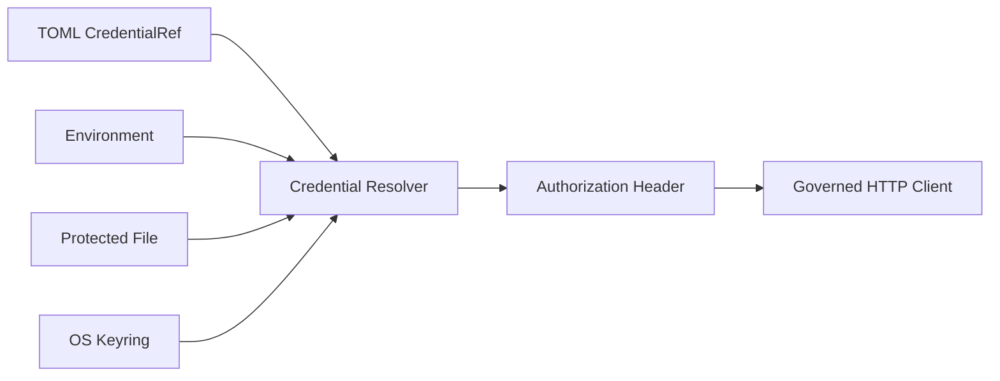

# Credential Reference 与 Secret Lifecycle

## 学习目标

理解 Config 为什么只保存 Reference、Secret Value 在哪里解析，以及如何避免 Credential
进入 Prompt、Event 和 Log。

## 前置知识

阅读 [Provider 与 Catalog](./02-provider-and-catalog.md)。

## Secret Flow



TOML 只包含 `kind` 与 `name`。Value 在 Provider HTTP 使用前解析，Prompt Context、
Event、Receipt 与 ModelRequest 不需要 Raw Secret。

## Reference Kinds

Reference Kind：

- `env`：读取显式命名 Environment Variable；
- `keyring`：按 Account 查询 OS Credential Service。
- `file`：Resolver 对 `CODEHELPER_SECRET_DIR` 下 Trusted/Injected Reference 提供的
  Lower-level Capability，并检查 Ownership、Permission、Traversal、Symlink 和 Open-time
  Identity。

当前 Model Catalog 只接受 `env`、`keyring` Provider Reference。`file` 是 Resolver
Capability，不是普通 Catalog Validation 自动开放的值；这防止 Config 将任意 Path
变成 Credential Source。

## 生命周期

CLI Auth Command 可以把 Env Value 写入 Keyring，但不会序列化到 TOML。

在 Web 中，Password Input 收集 Value，Runtime 按 Exact Workspace/Provider Identity
生成 OS Keyring Entry。data-dir 只保存带 Generation 的 Reference 和不含 Secret 的
Recovery Intent。浏览器状态只包含 Credential Status、Reference 和 Sanitized
Validation Metadata，不包含 Value。

切换分为 `prepared`、Keyring 写入、Config Generation CAS、`config_committed` 和
Provider Probe。当前 Runtime 不替换已冻结的 Route，而是返回 `restart_required`；
下次启动在 Runtime 构造前 Reconcile：未提交的新 Entry 作为 Orphan 删除，已提交的
Reference 保留，旧托管 Entry 只有在全引用扫描确认无人使用后才删除。用户自定义
Keyring Name 不会被自动删除。

Credential Validation 通过 Runtime Wiring 调用 Provider Model-list Endpoint。持久化
结果仅限 Validation Status、Timestamp 与 Sanitized Failure Category。Untrusted
Workspace 不能配置 Credential，也不能把 Validation 当作 Egress Bypass。

## 代码地图

Secret 应在 Tracked Source 外 Provision，使用时解析，Diagnostic 中 Redact，疑似泄漏后
Rotate，不再使用时 Delete/Revoke。Debug Dump 不得包含 Authorization。

## Exposure Window 与 Data Flow

Raw Value 应只在最短实际窗口存在：

```text
reference in validated route
  -> concurrency/rate admission 后 resolve
  -> set protocol-specific authorization header
  -> governed HTTP client send
  -> request scope 结束后丢弃
```

Raw Value 不得进入：

- `ModelRequest` JSON/Prompt Message；
- Operation/Event/Receipt/Trace；
- 面向用户的 Catalog/Route Description；
- Retry Diagnostic、Response Dump、Command Argument；
- 不显式拥有 Credential 的 Child Process Environment。
- Browser Snapshot、Client Evidence、Session Export 或 Release Evidence。

Redaction 是 Defense in Depth，不是“先记录 Secret”的许可。

## Rotation 与 Failure

Reference 允许不重写 Persisted Session 就 Rotation。新 Request 解析 Current Value；
In-flight Request 只保留 Request-scoped Header。Missing、Empty、Oversized、含 NUL、
Insecure、Open 期间变化的 Value 都在 Network I/O 前失败。

Error 可标识 Reference/Source，但不得包含 Secret Value，或可能含 Secret 的 Raw Keyring
Backend Message。

| 关注点 | 源码 |
| --- | --- |
| CredentialRef | `adapter/model/catalog.go` |
| Resolver | `provider/httpclient/credentials.go` |
| File Check | `credential_file_*.go` |
| Keyring | `security/keyring` |
| CLI | `host/cli/auth_cmd.go` |
| Web Credential Control | `security/credential`、`host/cli/web.go` |

## 设计取舍与替代方案

Env 适合 Automation 但可被 Child Process 继承；File 适合 Secret Injection 但需要
Permission/Symlink Check；Keyring 适合 Desktop 但依赖 OS/UI。统一 Reference 使部署
选择不污染 Provider Logic。

## 失败模式与安全边界

- Missing/Empty Value 在 Network 前失败。
- Unsafe File Type、Permission、Path 被拒绝。
- Secret 不能作为普通 Catalog Field。
- Log/Debug Dump Redact Sensitive Header。
- Model Context 不能请求 Raw Credential Resolution。

## 测试与验证

```bash
go test ./internal/adapter/provider/httpclient -run 'Test.*Credential'
go test ./internal/security/keyring
make secret-leak-test
cd web && npm test -- credentials
```

## 动手实验

用 Fake Value 创建临时 Env-reference Config，运行 `codehelper config show`，确认只显示
Reference/Provenance；不要发送 Provider Request，随后删除临时 Config。

## 复习问题

1. Credential Reference 为什么可以持久化？
2. Env、File、Keyring 的风险分别是什么？
3. Raw Value 最晚应在哪里解析？
4. Resolver Support 为什么不自动代表 Catalog Support？
5. Redaction 为什么不能成为记录 Secret 的理由？
6. Provider Validation 为什么必须通过 Runtime Wiring？

## 延伸阅读

- [安全手册](../../../zh-CN/security.md)
- [Provider Failure](./06-provider-failures.md)

## 事实来源与验证

| 项目 | 值 |
| --- | --- |
| Catalog ID | `model-credential-lifecycle` |
| 状态 | `draft` |
| 最后验证 | 尚未验证 |
