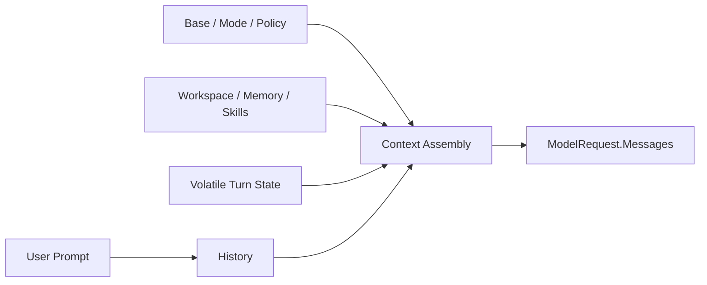

# Prompt、Message 与 Context

简体中文 | [English](../../en/05-context-engineering/01-prompt-message-context.md)

## 学习目标

区分 User Prompt、Normalized Message History 与 Assembled Context，理解 Context
为何是 Runtime 生成的受预算约束产品，而不是一段字符串。

## 前置知识

阅读 [Model、Context 与 Tool 如何协作](../02-codehelper-overview/06-model-context-and-tool.md)。

## 问题背景

把发给模型的所有字节都称作 Prompt，会掩盖所有权：用户提供意图，Runtime 提供
Policy/Evidence，Tool 提供 Observation，History 提供先前交互。拼成一段可变字符串后，
Injection、Truncation 与 Audit 都难以解释。

## 核心概念

- **Prompt**：Runtime 扩展前的当前用户请求。
- **Message**：Role 与 Typed Content Block 的规范表示。
- **History**：跨 Sample/Turn 保留的有序 Message。
- **Context**：一次 Sample 发送的完整、受限 Message 和 Tool Definition。
- **Partition**：拥有独立 Budget 与 Receipt 的 Context Source。



## Message Model

Provider Message 使用 system、user、assistant、tool Role 和 Typed Block。Tool Call 与
Result 通过 Call ID 配对；Reasoning/Signature 与 Visible Text 分离。

## Authority 不等于 Message Role

System-role Placement 是 Transport Mechanism，不是 Authority Proof：

| Source | Render Role | Authority Interpretation |
| --- | --- | --- |
| Runtime Base/Constitution | System | Runtime Enforced Constraint |
| Mode/Policy Summary | System | Current Governed State Description |
| Repository Instruction | System Partition | Untrusted Project Guidance |
| Skill/Memory | System Partition | Selected Extension/User Data |
| Repo Map/Working Set/Evidence | System Tail | 带 Provenance 的 Observation |
| User Prompt | User | Current Intent，不覆盖 Policy |
| Tool Result | Tool | Execution 产生的 Untrusted Observation |

Repository Text 即使为了 Provider Compatibility 放在 System Message 中，仍是 Repository
Data。真正 Authority 由 Prompt 外的 Policy、Guard、Sandbox 强制。

## Stored、Rendered 与 Sampled Context

- **Stored State**：History、Memory、World State、Working Set、Evidence；
- **Rendered Context**：从 State 组装的 Bounded Message；
- **Sampled Request**：Rendered Message + Route-specific Tool Definition/Option；
- **Receipt**：证明 Retained/Omitted/Truncated 的 Metadata。

Volatile Turn Context 用于 Sample，但不 Commit 到 Durable Conversation History。否则
每次 Sample 都会重复 Repo Map/Evidence，Compaction 还会把 Stale Observation 当成
Conversation。

## Stable Context Assembly

`promptcontext.Assemble` 按确定顺序生成 Base、Mode、Repository Instruction、Pinned
File、Skill、User Memory、Plan、Constitution、World State 与 Tool Prefix。Repository
Instruction 只从 Workspace 固定路径读取；Working File 经过 Canonicalization、排序和
Symlink Escape 检查。每个 Partition 同时产生 Message 与 Receipt。

## Volatile Tail

Engine 在每次 Sample 时将当前 Tool Catalog、Repo Map、Working Set、Evidence 与 Plan
放在 History 后。动态 Tail 不破坏可缓存稳定前缀，因此同一 Turn 内 Context 也可能变化。

## 代码地图

| 关注点 | 源码 |
| --- | --- |
| Message/Block | `adapter/provider/types.go` |
| 稳定组装 | `agent/promptcontext/context.go` |
| Turn Tail | `agent/promptcontext/turn.go` |
| World State | `agent/promptcontext/worldstate.go` |
| Fragment Marker | `agent/promptcontext/fragment.go` |

## 设计取舍

单一 System String 易打印却无法归因或单独预算；每个文件一个 Message 又增加协议开销。
CodeHelper 按语义所有者分区，并通过 Receipt 保留来源与裁剪事实。

## 失败模式与安全边界

- Workspace Path/Symlink Escape 被拒绝。
- 必需内容不可读或非 UTF-8 时组装失败。
- Repository Content 是 Untrusted Data，不获得更高 Authority。
- Empty、Omitted、Truncated 可区分。
- Skill/Constitution 有硬 Token 上限。
- Secret Value 不是合法 Context Source。

## 测试与验证

```bash
go test ./internal/runtime/agent/promptcontext \
  -run 'Test(AssembleStableOrderAndWorkspaceBoundaries|AssembleBudgetsAreDeterministicUTF8SafeAndReceipted|AssembleTurnRendersBothSectionsAsSystemMessages)'
```

## 动手实验

阅读 `TestAssembleStableOrderAndWorkspaceBoundaries`，画出 Message 顺序，并标注 User
Intent、Runtime Authority、Repository Data 与 Dynamic Evidence。

## 复习问题

1. Context 为什么不是 Prompt 的同义词？
2. Volatile Tail 为什么位于 History 之后？
3. Receipt 能证明哪些 Message 本身无法证明的事实？
4. System-role Rendering 为什么不自动授予 Authority？
5. Volatile Context 为什么 Sample 但不写入 Conversation History？

## 延伸阅读

- [Context Source、Priority 与 Lifecycle](./03-source-priority-lifecycle.md)

## 事实来源与验证

| 项目 | 值 |
| --- | --- |
| Catalog ID | `context-prompt-message` |
| 状态 | `draft` |
| 最后验证 | 尚未验证 |
