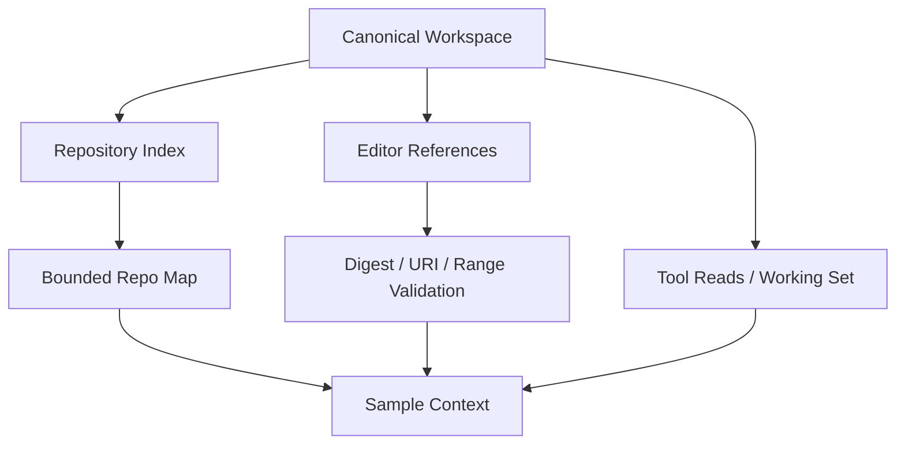

# Workspace、Repository Index 与 Editor Context

## 学习目标

理解 Workspace Identity、Repository 全局索引、Editor 显式焦点，以及防止 Context
Drift 与 Path Escape 的验证链路。

## 前置知识

阅读 [Prompt、Message 与 Context](./01-prompt-message-context.md)。

## Repository 的三种视图



Workspace 是 Authority Boundary；Index 给出全局结构，Editor Context 给出用户显式
焦点，Tool Observation 给出当前 Evidence。

## Repository Index 与 Map

`repoindex.Index` 增量记录 File、Language、Symbol 与 Snapshot Status；刷新变更文件、
删除已消失文件，并显式报告 Pending/Degraded/Truncated。

Symbol/Reference Query 优先使用语言级 Semantic Provider。结果记录 Semantic 或
Lexical Source、Provider Version、Confidence 和 Fallback Reason。Language Service
不可用时保留 Lexical Matching，但 Receipt 不会把降级结果标成 Semantic Answer。

`repomap.Build` 将全量索引压缩为 Build Manifest、Entry Point、Directory
Count/Language 和 Focused File Outline。限制内优先保留声明较多的目录，最终按路径展示。
`repocontext.Provider` 每 Turn 最多构建一次昂贵 Repo Map，但每个 Sample 都重新渲染
Working Set 与 Evidence。

## 三套 Freshness Clock

Repository Context 不存在唯一“当前时间”：

| View | Freshness Evidence | Update Cadence |
| --- | --- | --- |
| Index/Repo Map | Index Snapshot、Indexer Version、Status | Incremental Build、Map 每 Turn 一次 |
| Editor Context | Workspace Identity、Document Version、Digest | Host Capture、Turn Start Verify |
| Tool Observation | Call/Turn、Path、Digest、Result Metadata | Governed Execution 后立即 |

同一 Turn 内 Tool Read 可能比 Cached Repo Map 更新；Editor Selection 即使 Path 仍存在，
也可能因 Digest Drift 被拒绝。Consumer 必须选择与 Claim 对应的 Clock。

## Index State 是 Result 的一部分

- `pending`：尚无 Complete Build；
- `ready`：Snapshot Available；
- `degraded`：Store/Index Operation 失败；
- `truncated`：File Ceiling 阻止完整 Coverage；
- Disabled/Unavailable：Feature 有意缺失。

Repo Map 会渲染原因，而不是把 Absence 伪装成 Empty Repository。Unsupported/Rejected
File 即使无 Symbol，也可贡献 Path/Language Orientation。

## Editor Context 验证链

Editor Reference 含 Kind、Source、Workspace-relative Path、Canonical URI、Document
Version、Digest，以及可选 Range/Symbol/Diagnostic。Runtime：

1. 验证 Workspace Identity；
2. 在 Workspace 内解析 Canonical Path；
3. 验证 URI 属于该 Identity；
4. 有界读取 UTF-8；
5. 比较 SHA-256 Digest 检测 Drift；
6. 验证 Range；
7. 按单项与总量上限裁剪；
8. 以明确标注 Untrusted Data 的 JSON 注入。

Receipt 保留 Digest、Range、Diagnostic Count 和 Retained Bytes。

## 代码地图

| 关注点 | 源码 |
| --- | --- |
| Workspace Identity | `runtime/protocol/workspace_identity.go` |
| Editor Validation | `runtime/app/editor_context.go` |
| Incremental Index | `persist/repoindex` |
| Semantic Symbol/Reference | `adapter/lsp/semantic.go`、`platform/symbols/semantic.go` |
| Repo Map | `runtime/agent/repomap` |
| Per-sample Context | `runtime/agent/repocontext` |
| Working Set | `runtime/agent/workingset` |

## 设计取舍

发送完整索引成本过高；仅发送 Editor Selection 又缺少全局结构。CodeHelper 组合 Bounded
Map、Focused Content 和 On-demand Tool Read。新读取文件立即进入 Working Set，但 Outline
可能下一 Turn 才更新，这是避免每 Sample 扫描 Repository 的代价。

## 失败模式与安全边界

- Absolute/Traversal/Non-canonical/Symlink Escape Path 失败。
- Editor URI 与 Runtime Workspace 不匹配失败。
- Digest Drift 拒绝陈旧 Capture。
- Invalid Range、Binary、超大内容失败或显式裁剪。
- Disabled/Degraded Index 会说明缺失原因。
- Repository Text 不得覆盖 System Authority。

## 测试与验证

```bash
go test ./internal/runtime/app -run TestResolveEditorContext
go test ./internal/runtime/agent/repocontext ./internal/runtime/agent/repomap
go test ./internal/persist/repoindex
```

## 动手实验

运行 `TestResolveEditorContextRejectsDriftAndIdentityMismatch`，再追踪一个合法 Selection
从 Protocol Reference 到 Rendered JSON 与 Receipt 的过程。

## 复习问题

1. 为什么 Workspace URI 与 Runtime Path 都需要验证？
2. 为什么 Repo Map 每 Turn 缓存，而 Working Set 不缓存？
3. Digest 如何阻止陈旧 Editor Content 成为 Evidence？
4. 同一 Turn 内 Tool Read 为什么可能比 Repo Map 更新？
5. Pending、Degraded、Truncated、Empty 为什么必须区分？

## 延伸阅读

- [Context Source、Priority 与 Lifecycle](./03-source-priority-lifecycle.md)

## 事实来源与验证

| 项目 | 值 |
| --- | --- |
| Catalog ID | `context-workspace-index-editor` |
| 状态 | `draft` |
| 最后验证 | 尚未验证 |
