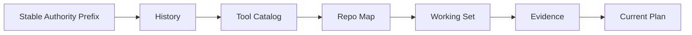

# Context Source、优先级与生命周期

## 学习目标

按 Authority、Stability 与 Lifetime 分类 Context，理解 Ordering、Digest Skip、
Working Set Decay 与 Evidence Priority。

## 前置知识

阅读前两章 Context Engineering 章节。

## Source Matrix

| Source | Authority | Lifetime | Refresh |
| --- | --- | --- | --- |
| Base System | Runtime | Session/Build | Startup |
| Mode/Policy/Constitution | Runtime/Operator | Turn/Session | Policy Change |
| Repository Instruction | Untrusted Repository Guidance | Session | Assembly |
| Pinned/Editor File | User-selected Data | Turn/Session | Capture/Digest |
| Skill/Memory | Extension/User Data | Session+ | Startup/Update |
| History | Prior Runtime Facts | Thread | Every Turn |
| Tool Catalog | Runtime Capability | Sample | Catalog Generation |
| Repo Map | Indexed Data | Turn | Once per Turn |
| Working Set/Evidence/Plan | Observed Task State | Sample | Every Sample |

Authority 与 Recency 相互独立：最新 Repository Text 不会高于 Constitution；较早的
Verified Evidence 可能比最新猜测更有价值。

## Ordering 与 Priority



## 生命周期机制

稳定来源位于前缀以复用 Cache，动态任务来源位于 Tail。Evidence 内 Reminders/Risks
优先于 Facts，使 Prefix-preserving Truncation 先保留义务，再保留可重复查询。

World State Section 具有稳定 ID/Digest；未变化时只发 Receipt，不重复注入 Body。
Skill/Constitution 使用 Fragment Marker，使 Compaction 删除旧副本后可注入当前版本。

Working Set 合并 Source Provenance，随 Turn 衰减，Critical Path 优先。Evidence 跟踪
Fact、Unverified/Blind Change、Open Diagnostic、Repeated Call 与 Stale Handle。

## Observation 与 Invalidation Rule

| Event | State Transition |
| --- | --- |
| Search/Read Result | 增加 Fact/Working Set Provenance |
| Prior Read 后 Write | Mark Changed/Unverified，非 Blind |
| 无 Prior Read 的 Write | Mark Changed/Unverified + Blind Risk |
| Path Verification Passed | 清除对应 Version 的 Unverified Risk |
| Later Write | Invalidate Earlier Verification |
| Diagnostic Open/Close | 增加/移除 Diagnostic Risk |
| Same Tool+Arguments Repeated | 增加 Next-turn Reminder |
| Handle Issued/Unconsumed | 增加 Reminder，之后 Expire |
| Fork | Clone Current State，不共享未来 Mutation |
| New Turn | Decay Working Set，Reset Turn-local Reminder |

Evidence 是 Observed Transition Ledger，不是 Free-form Model Summary。Unknown Fact Kind
和 Blank Path 被忽略，不允许变成看似可信但无法 Render 的 Claim。

## 压力下的 Priority

```text
authority > unresolved risk > task relevance > freshness > deterministic tie-break
```

它不是所有 Message 的单一 Global Sort，而是分别指导 Partition Order、Working Set
Selection、Evidence Rendering、Compaction。Receipt 暴露每个 Local Policy 在哪里移除
信息。

## 代码地图

| 关注点 | 源码 |
| --- | --- |
| Stable Partition | `promptcontext/context.go` |
| Volatile Partition | `promptcontext/turn.go` |
| Digest Section | `promptcontext/worldstate.go` |
| Fragment Lifecycle | `promptcontext/fragment.go` |
| Working Set | `agent/workingset` |
| Evidence | `agent/evidence` |

## 设计取舍

纯 Recency Ordering 会埋没强 Policy；纯 Authority Ordering 会隐藏当前 Task State。
CodeHelper 使用 Stable Authority Prefix 加 Dynamic Task Tail，并独立记录各 Partition。

## 失败模式与安全边界

- 自动加载的 Repository Instruction 仍是 Untrusted。
- Unknown Working Set Source 与 Blank Path 被忽略。
- 新 Write 会使旧 Verification Evidence 失效。
- Unchanged World State 不得重复注入。
- Compaction 移除 Stale Contextual Fragment。
- Empty 与 Disabled Section 在 Receipt 中可区分。

## 测试与验证

```bash
go test ./internal/runtime/agent/promptcontext
go test ./internal/runtime/agent/workingset ./internal/runtime/agent/evidence
```

## 动手实验

为一个成功 Turn 的每个 Context Section 标注 Authority、Lifetime 与 Refresh Point；
再运行 `TestWorldStateSectionsDigestSkip`，观察 Body 省略而 Receipt 保留。

## 复习问题

1. Context Recency 为什么不等于 Authority？
2. Risks 为什么排在 Facts 前？
3. Skill/Constitution 为什么需要 Fragment Marker？
4. 哪个 State Transition 会使先前 Passing Verification 失效？
5. Priority 为什么按 Partition 实现，而不是一个 Global Score？

## 延伸阅读

- [Token Budget、Compaction 与信息损失](./04-budget-and-compaction.md)

## 事实来源与验证

| 项目 | 值 |
| --- | --- |
| Catalog ID | `context-source-lifecycle` |
| 状态 | `draft` |
| 最后验证 | 尚未验证 |
