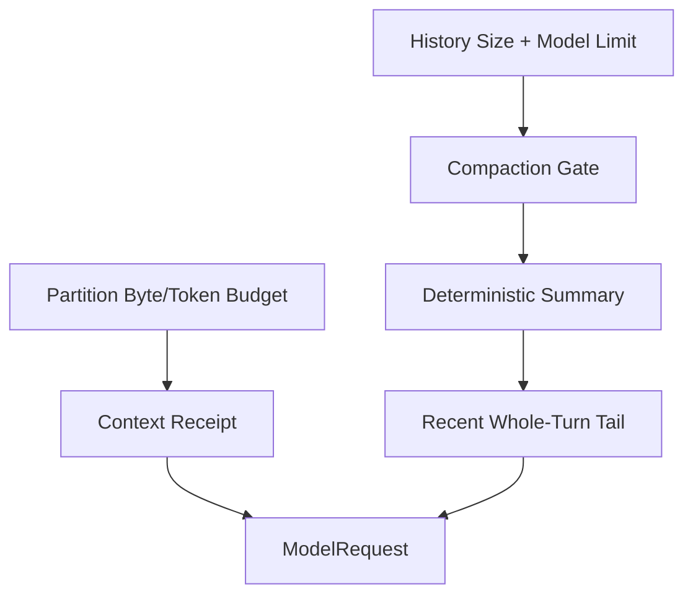

# Token Budget、Compaction 与信息损失

简体中文 | [English](../../en/05-context-engineering/04-budget-and-compaction.md)

## 学习目标

理解 Partition Budget、Context Window Check、Deterministic Compaction，以及 Receipt
如何显式呈现信息损失。

## 问题背景

任意截断字节可能切开 UTF-8、Tool Pair 或 List，并让“缺失”看起来像“完整”。让 Model
自行总结还可能凭空写出“测试已通过”等声明。

## 两层预算



Partition Budget 在 Assembly 时限制每个 Source。History Compaction 在 First Sample 前
或 Mid-turn 触发，并在检查 Context Capacity 时为 Model Output Token 预留空间。

## Capacity Accounting

Pre-sampling Decision 的概念公式：

```text
estimated_input_tokens
  + reserved_max_output_tokens
  <= selected_model_context_tokens
```

Input 包括 Stable Partition、History、Volatile Tail、Tool Definition 和 Protocol
Overhead Estimate。即使没有精确 Vendor Tokenizer，Partition Byte Ceiling 仍提供
Deterministic Local Bound 与 UTF-8-safe Retention。

Token Estimate 是带 Method 的 Evidence，不是精确 Provider Bill；Actual Usage 由 Provider
返回并单独记录。

## 三类信息损失

| Mechanism | Scope | Recoverability |
| --- | --- | --- |
| Partition Truncation | 单次 Assembly 的一个 Source | 可重新读取 Original Source |
| Tool/Repo Map Selection | Rank/Count 排除 Entry | 可按需 Search/Read |
| History Compaction | Old Whole-turn Group 被替换 | Durable Event 保留，Model 只见 Summary |

每类需要独立 Receipt；单一 `truncated=true` 无法说明删除了 Bytes、Entry 还是 Causal
History。

Compaction 是 Model-context Loss，不一定删除 Durable Data。Audit/Reconstruction 仍可
保留不再进入 Next Sample 的 Event。

## Deterministic Summary

Compaction 不调用 Model，而从 Observed Goal、Open Todo、Failure、Change、Critical
Path、Lookup Fact 与 Bounded Digest 构造 Summary。保留优先级为：

```text
goals -> todos -> failures -> changes -> critical paths -> facts -> digest
```

放不下时从尾部整节删除；Digest 可删除最旧的独立行。即使预算极小，Marker 与
Truncation Notice 仍保留。Previous Summary 作为 Carried Content 继续存在，避免二次
Compaction 将其压平为含义不明的一行。

## Turn Integrity 与 Receipt

Cut 发生在 Whole-turn Group 边界，保持 Assistant Tool Call 与 Tool Result 配对。
Skill/Constitution Fragment 从旧 History 删除并重新注入；Recent Tail 原样保留。

Compaction Receipt 报告 Original/Retained Byte 与 Message、Removed Turn、Retained
Section、Truncation Reason、Working Set、Critical Path 和 Prompt Context Receipt。

## 代码地图

| 关注点 | 源码 |
| --- | --- |
| Partition Retain | `promptcontext/context.go` |
| Summary Render | `agent/compact/compact.go` |
| Cut/Replacement | `agent/engine/engine.go`、`compaction.go` |
| Thread Compact | `runtime/app/compact_window.go` |

## 设计取舍

Model-generated Summary 流畅但不是可信 Evidence，且增加成本；直接删除最旧 Message
可重复，却会破坏 Tool Pair 并丢失 Goal。结构化 Observed-state Summary 优先正确性。

## 失败模式与安全边界

- Retained Text 保持合法 UTF-8。
- Truncation 必须有 Notice/Receipt。
- Tool Pair 与 Whole Turn 保持原子性。
- Tiny Budget 保留 Wrapper/Provenance，而非静默空 Context。
- Context Limit 包含 Requested Output Capacity。
- Summary 不得发明 Verification。

## 测试与验证

```bash
go test ./internal/runtime/agent/compact
go test ./internal/runtime/agent/engine -run 'TestEngineCompact|TestEngineCompaction'
go test ./internal/runtime/app -run 'TestCompact(Window|Fork)'
```

## 动手实验

运行 `TestRenderDropsCheapestSectionsFirst` 并逐步缩小 Budget，记录消失顺序，确认
Goal/Todo 比可重复的 Fact/Digest 更晚丢失。

## 复习问题

1. Model 自我总结为什么不能作为 Evidence？
2. Cut 为什么必须保留完整 Tool Exchange？
3. Partition Truncation 与 History Compaction 有何区别？
4. Sampling 前为什么必须预留 Output Capacity？
5. 哪类信息损失可通过 Reread、Replay 恢复，或无法恢复？

## 延伸阅读

- [Memory、Snapshot 与 Recovery](./05-memory-and-snapshot.md)

## 事实来源与验证

| 项目 | 值 |
| --- | --- |
| Catalog ID | `context-budget-compaction` |
| 状态 | `verified` |
| 最后验证 | 2026-08-06 |
