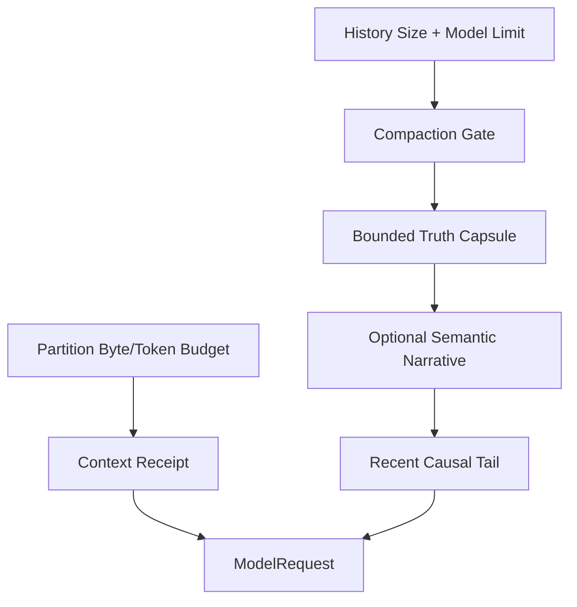

# Token Budget、Compaction 与信息损失

## 学习目标

理解 Partition Budget、Context Window Check、Deterministic Compaction，以及 Receipt
如何显式呈现信息损失。

## 前置知识

阅读 [Context Source、优先级与生命周期](./03-source-priority-lifecycle.md)。

## 问题背景

任意截断字节可能切开 UTF-8、Tool Pair 或 List，并让“缺失”看起来像“完整”。让 Model
自行总结还可能凭空写出“测试已通过”等声明。

## 三层 Context 与分级预算



Partition Budget 在 Assembly 时限制每个 Source。History Compaction 在 First Sample 前
或 Mid-turn 触发，并在检查 Context Capacity 时为 Model Output Token 预留空间。

## Capacity Accounting

Pre-sampling Decision 的概念公式：

```text
estimated_input_tokens
  + reserved_max_output_tokens
  <= selected_model_context_tokens
```

Input 包括 Stable Partition、History、Volatile Tail、Tool Definition 和 Protocol
Overhead Estimate。即使没有精确 Vendor Tokenizer，Partition Byte Ceiling 仍提供
Deterministic Local Bound 与 UTF-8-safe Retention。

Token Estimate 是带 Method 的 Evidence，不是精确 Provider Bill；Actual Usage 由 Provider
返回并单独记录。

## 三类信息损失

| Mechanism | Scope | Recoverability |
| --- | --- | --- |
| Partition Truncation | 单次 Assembly 的一个 Source | 可重新读取 Original Source |
| Tool/Repo Map Selection | Rank/Count 排除 Entry | 可按需 Search/Read |
| History Compaction | Old Whole-turn Group 被替换 | Durable Event 保留，Model 只见 Summary |

每类需要独立 Receipt；单一 `truncated=true` 无法说明删除了 Bytes、Entry 还是 Causal
History。

Compaction 是 Model-context Loss，不一定删除 Durable Data。Audit/Reconstruction 仍可
保留不再进入 Next Sample 的 Event。

模型可见顺序固定为 Stable Prefix、Truth Capsule、非权威 Narrative、Recent Raw Tail、
Dynamic World State 和 Continuation。预算按 Mandatory Truth、未闭合因果组、其他
Truth、Additional Tail、Narrative 的顺序分配，Narrative 永远不能挤占 Authority。

`prepare`、`compact`、`emergency` 默认分别位于模型 Hard Limit 的 55%、65% 和 85%。
Emergency 路径跳过 Narrative，并限制继续扩大 Context 的工具调用。

## Truth Retention 与 Admission

确定性 Compaction 从 Observed Goal、Open Todo、Failure、Change、Critical Path、
Lookup Fact 与 Content Handle 构造 Truth。Entity 分成：

```text
mandatory -> protected by kind quota -> refreshable by rank -> omission
```

Goal、Open Todo、Pending Input、未验证 Change 和开放 Diagnostic 属于 Mandatory。
Mandatory 放不下时在状态或副作用提交前拒绝；Protected/Refreshable 超预算时按稳定
顺序淘汰，并用有界聚合 Omission 解释。每次压缩重新读取当前 Owner Snapshot，不再把
前代 Capsule 永久并集。

写工具在 Guard 执行前预留 Mandatory 容量；`update_plan` 在替换 Plan 前执行同一
Canonical Admission。Authority Digest 只覆盖 Mandatory Entity，Narrative、Tail 或
可刷新 Fact 的变化不能伪造 Authority 等价。

## Semantic Narrative

Narrative 只表达方案选择原因、偏好、约束关系和未决方向。输入是有界、可持久化的
Artifact，每个 Excerpt 有稳定 Message ID 和 Digest；输出必须是严格 JSON，并为每项
引用已知 Source ID。它不能声明测试、修改、审批或权限事实。

`post_turn` 在业务 Terminal 提交后维护 Context；`inline` 在安全 Sample 边界通过
`generate_narrative` 和 `commit_context_rebase` Durable Effect 执行。两者都通过
`summary` Route，禁用 Tool 与 Native Search。Provider、解析、Timeout 或 Staleness
失败只产生 `fallback=truth_tail`。

## Turn Integrity

Cut 发生在 Causal Group 边界，保持 Assistant Tool Call 与 Tool Result 配对。
Skill/Constitution Fragment 从旧 History 删除并重新注入；Recent Tail 原样保留。

## Receipts

Compaction Receipt 报告 Original/Retained Byte 与 Message、Removed Turn、Retained
Section、Truncation Reason、Working Set、Critical Path 和 Prompt Context Receipt。

## 代码地图

| 关注点 | 源码 |
| --- | --- |
| Partition Retain | `prompt/context.go` |
| Truth/Retention | `agent/compact/truth.go`、`retention.go` |
| Narrative Artifact | `agent/compact/narrative.go` |
| Cut/Replacement | `agent/engine/history_recovery.go` |
| Narrative Effect | `agent/engine/narrative.go`、`agent/turnkernel` |
| Thread Compact | `persist/history/compact.go` |

## 设计取舍

Model-generated Narrative 流畅但不是可信 Evidence；纯结构化事实可靠，却不能完整保留
设计动机。CodeHelper 将两者分层，并保留近期原始因果历史，而不是让任一层替代其他层。

## 失败模式与安全边界

- Retained Text 保持合法 UTF-8。
- Truncation 必须有 Notice/Receipt。
- Tool Pair 与 Whole Turn 保持原子性。
- Tiny Budget 保留 Wrapper/Provenance，而非静默空 Context。
- Context Limit 包含 Requested Output Capacity。
- Narrative 不得发明 Verification，也不能改变 Authority Digest。
- Context Rebase 提交失败时不能继续在旧 Window 上采样。

## 测试与验证

```bash
go test ./internal/runtime/agent/context
go test ./internal/runtime/agent/engine -run 'TestEngineCompact|TestEngineCompaction'
go test ./internal/runtime/agent/turnkernel -run TestContextCompaction
go test ./internal/runtime/app -run 'TestCompact(Window|Fork)'
```

## 动手实验

运行 `TestRenderDropsCheapestSectionsFirst` 并逐步缩小 Budget，记录消失顺序，确认
Goal/Todo 比可重复的 Fact/Digest 更晚丢失。

## 复习问题

1. Model 自我总结为什么不能作为 Evidence？
2. Cut 为什么必须保留完整 Tool Exchange？
3. Partition Truncation 与 History Compaction 有何区别？
4. Sampling 前为什么必须预留 Output Capacity？
5. 哪类信息损失可通过 Reread、Replay 恢复，或无法恢复？

## 延伸阅读

- [Memory、Snapshot 与 Recovery](./05-memory-and-snapshot.md)

## 事实来源与验证

| 项目 | 值 |
| --- | --- |
| Catalog ID | `context-budget-compaction` |
| 状态 | `draft` |
| 最后验证 | 尚未验证 |
